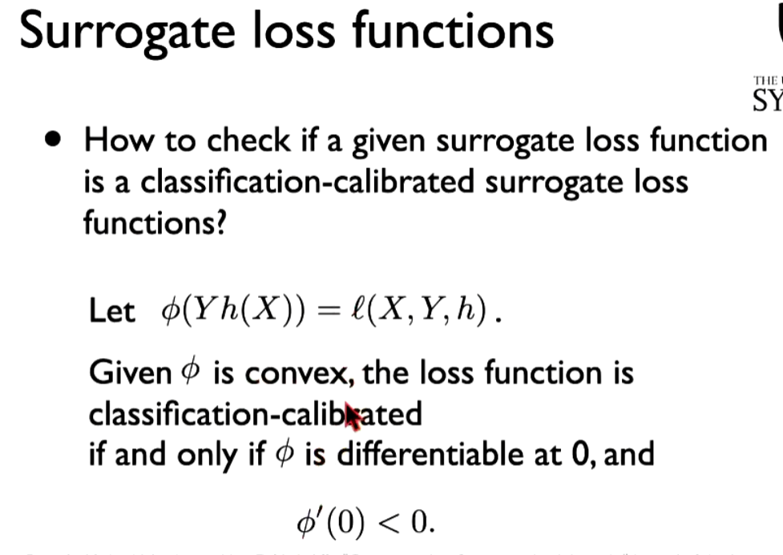
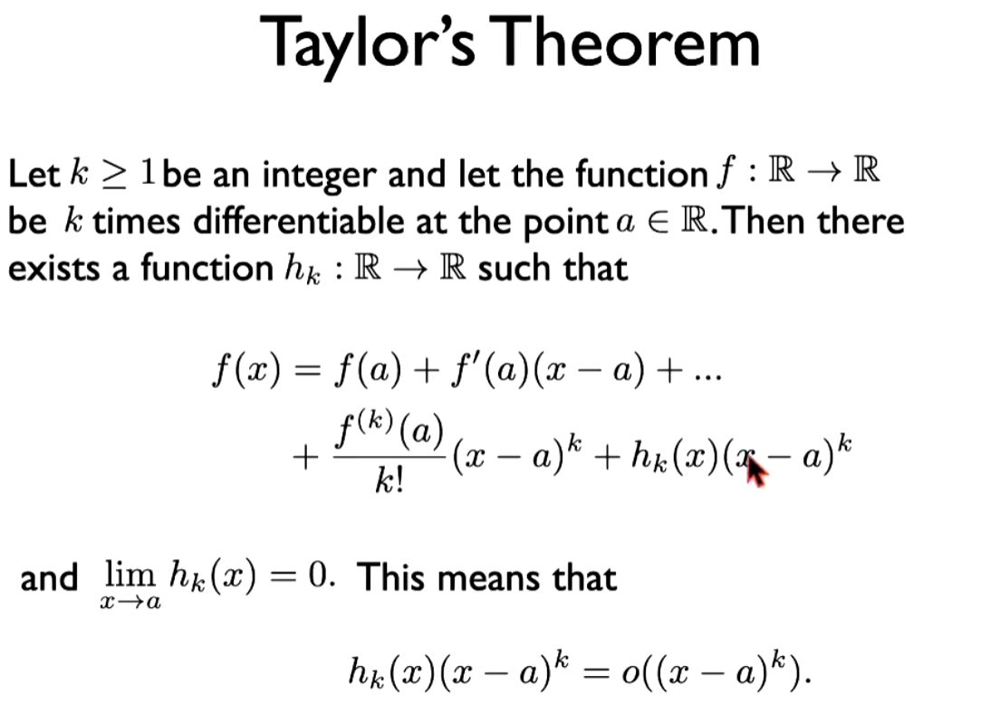
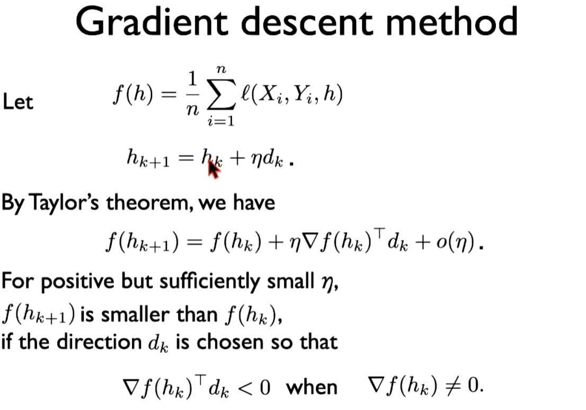
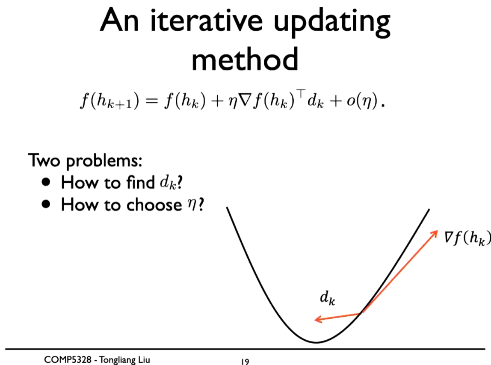
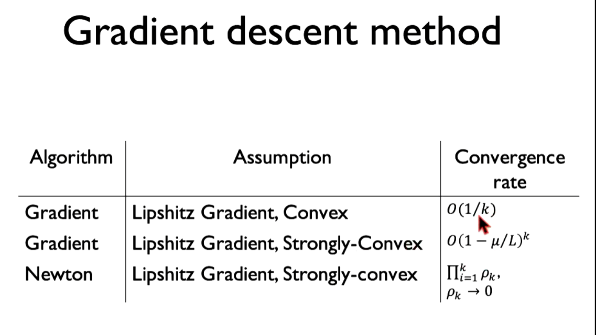
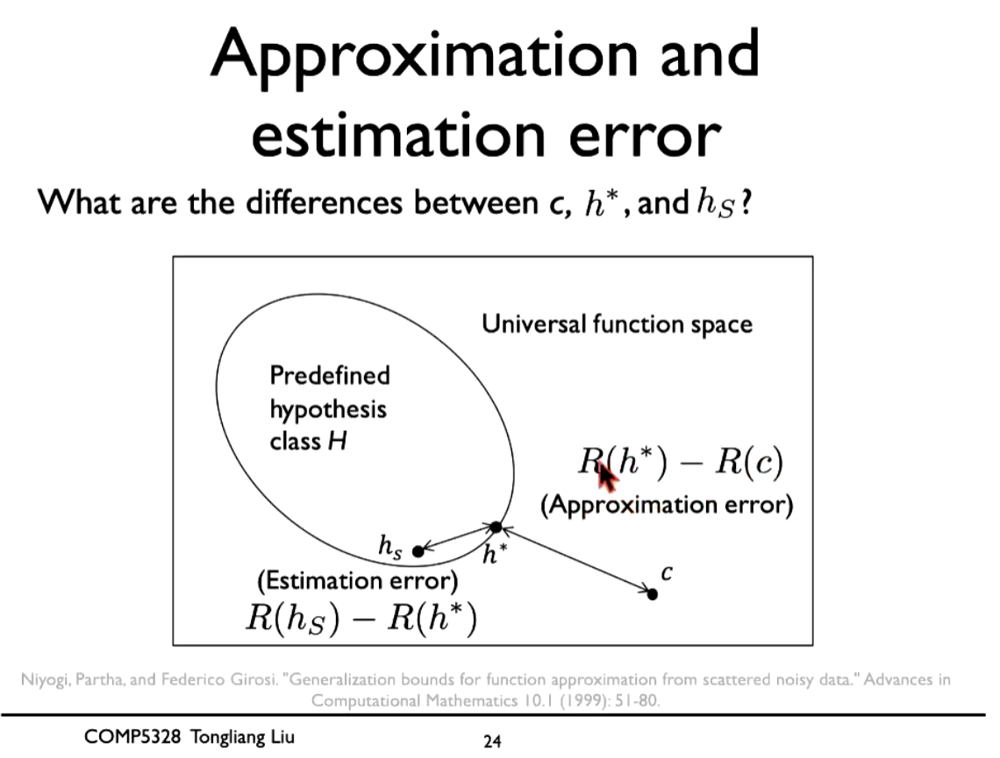
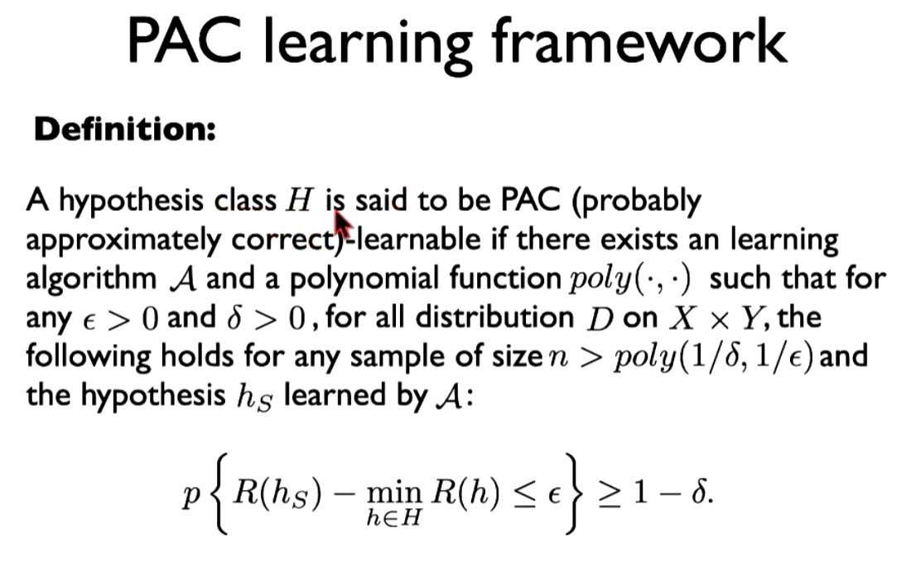
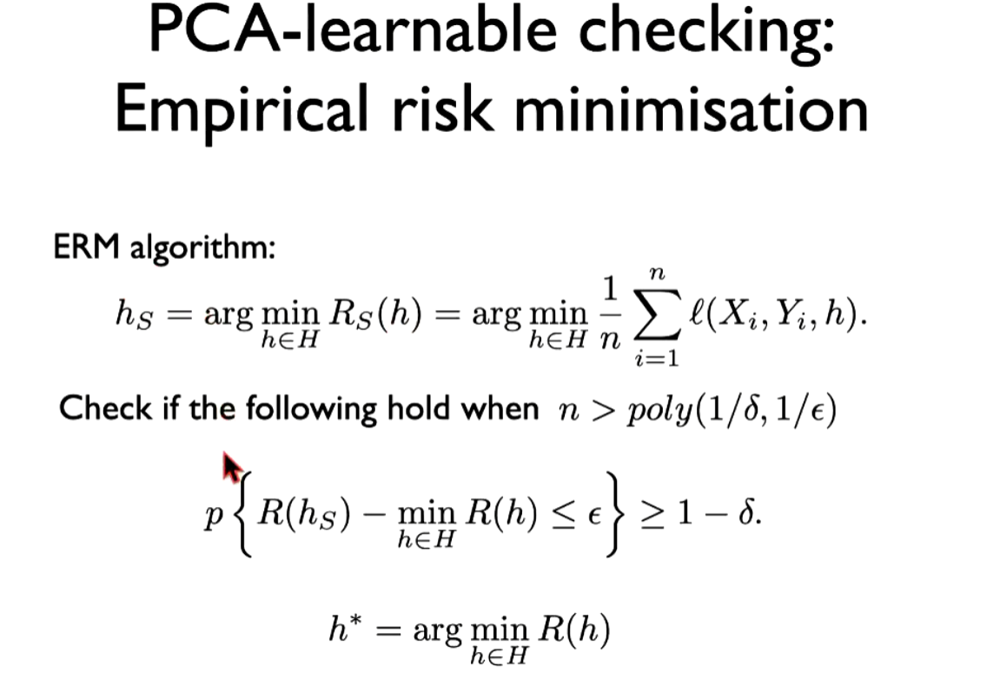

# w13

## 1. vocab

1、 cardinality基数

2、 empirical risk实际上的

3、 

## 2. 存在疑问

1、 surrogate loss functions 之间的区别？

2、 什么叫surrogate loss function is calibrated or not？

3、 convex or ？ differentiable怎么解释？

> convex means it is easy to find a global minimizer, if not convex or not
>
>
> 此外还可以用hessian matrix 去检查是否是convex

4、 怎么由taylor's theorem 推导出这个公式？

5、 因此how to find dk and eta 就成了一个问题， 也就是我们经常用到的gradient descend

6、 解释这里的upper bounded?

7、 解释这个图，有什么实际作用？应该怎么用？

8、 PAC， 这里存在笔误，应该是h*，同时请您解释这里的实际应用意义？

9 、