# w13

# 1. vocab

1、 cardinality基数

2、 empirical risk实际上的

3、 

# 2. 答疑

## 1、 surrogate loss functions 之间的区别？我们本质的希望就是当预测和结果差异越大时候给予更大的惩罚

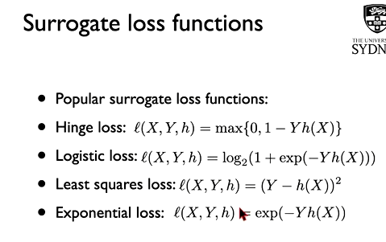

**解答：**

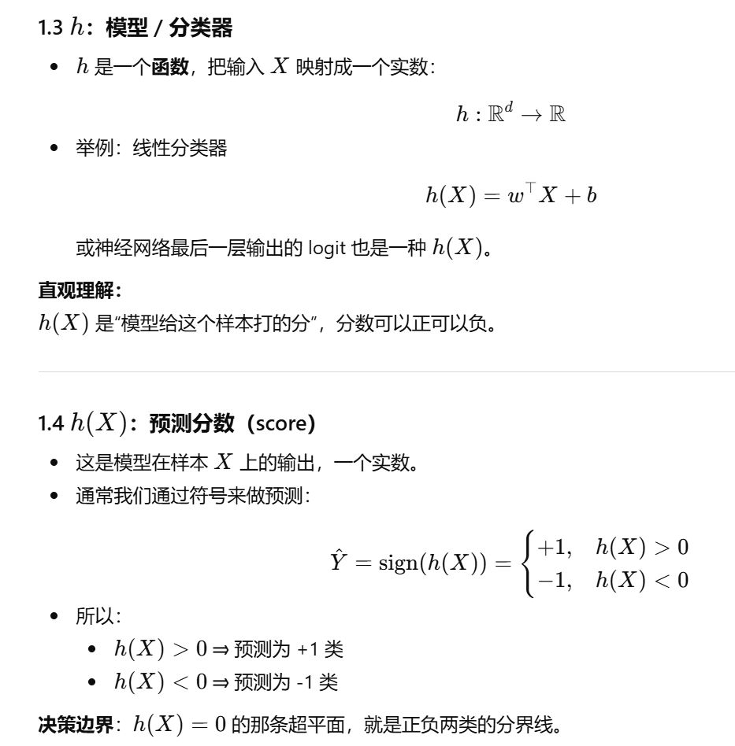

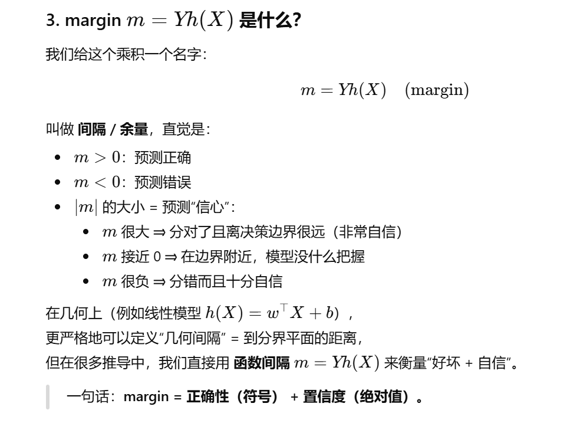

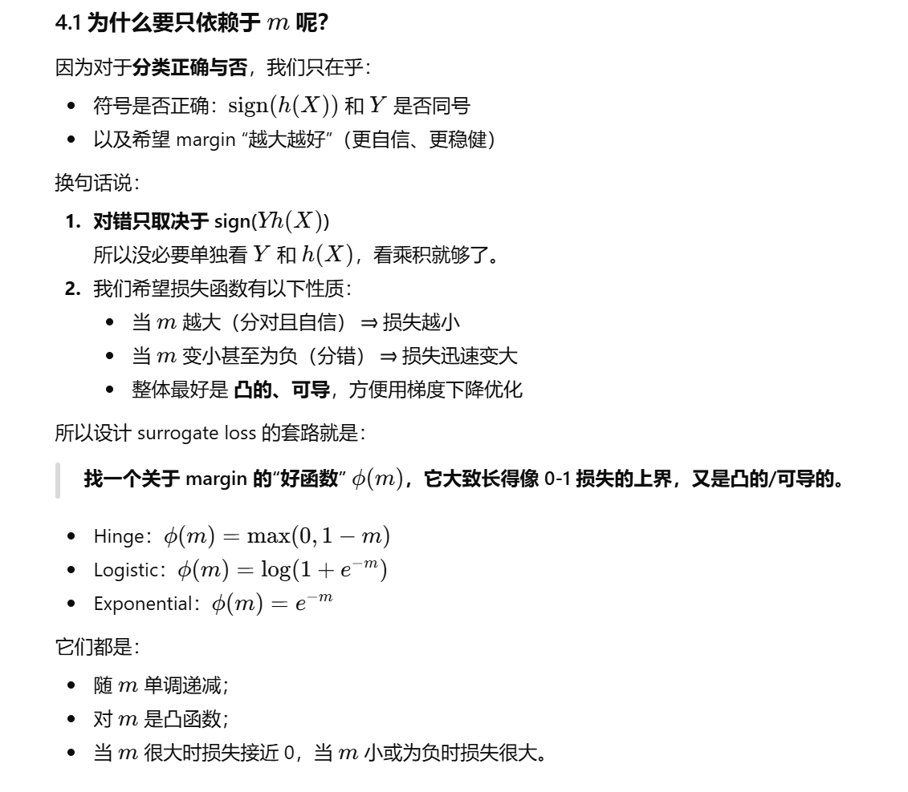

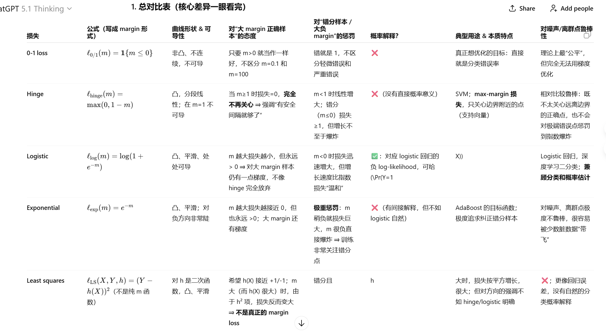

这里logistic推导的时候会出现KL散度，因为是要用真实值-预测值，又因为概率分布的和为1，所以就可以推导出满足KL散度>=0（变换符号，不等式性质把log拿出来可以推导）

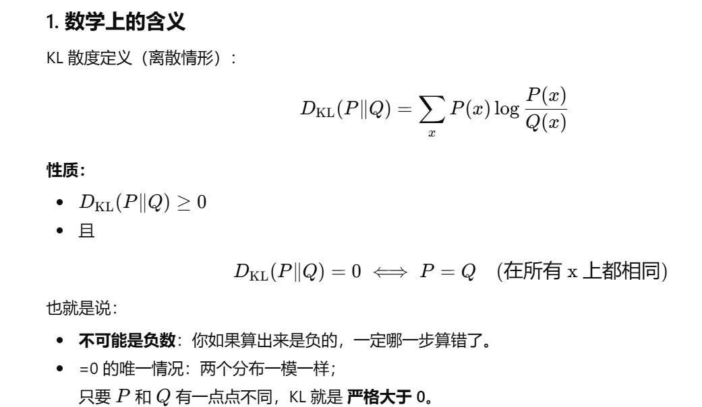

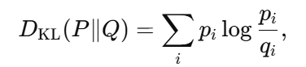

## 2、 什么叫surrogate loss function is calibrated or not？ concave function凹函数

**解答：**

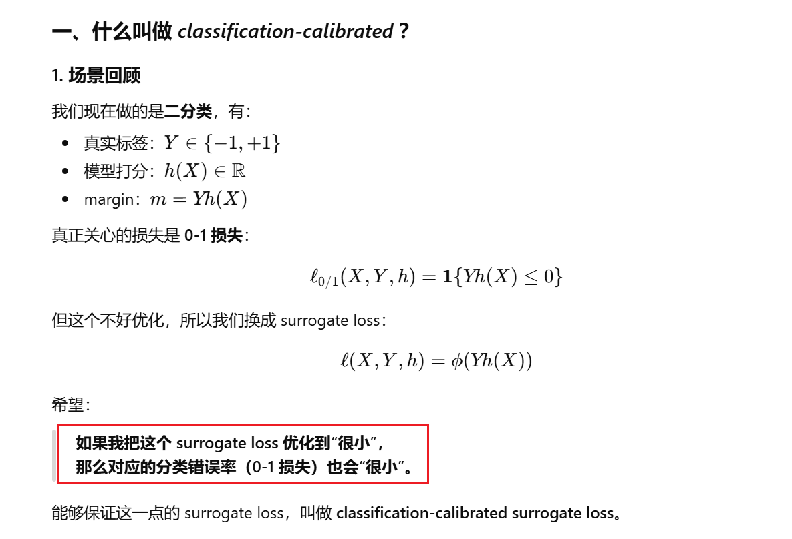

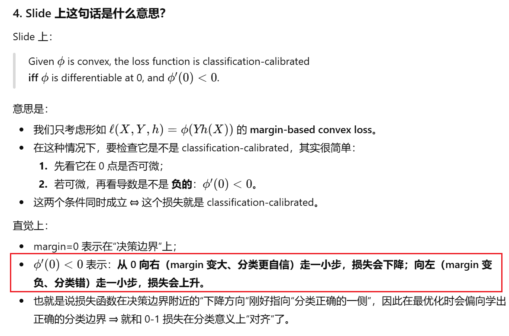

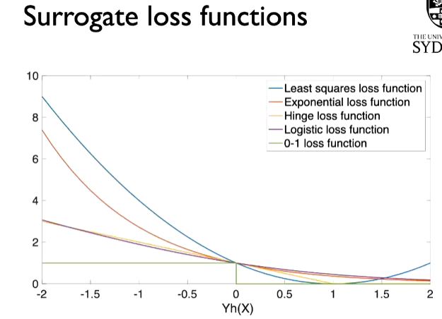

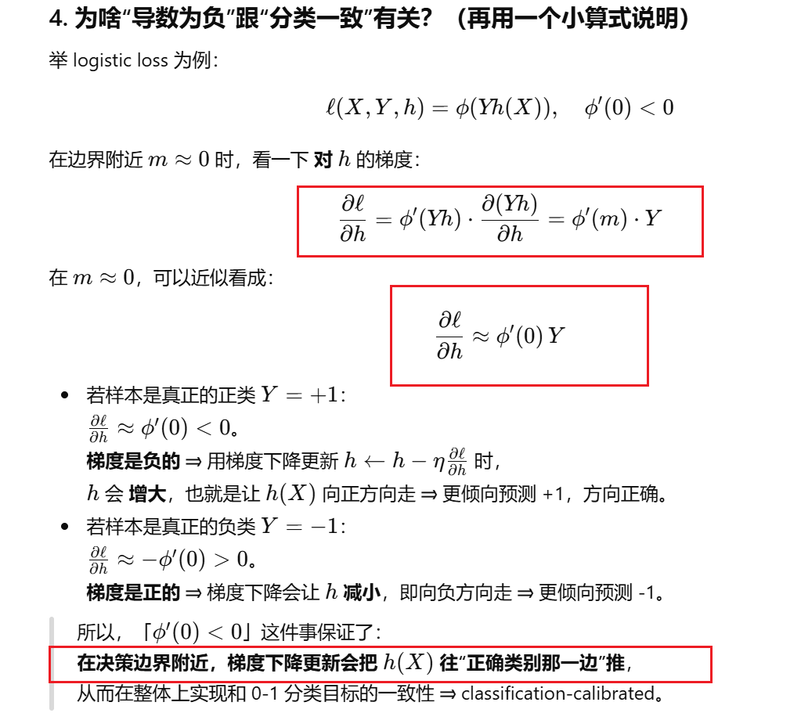

## 3、 convex or ？ differentiable怎么解释？即可微，可以求得导数。

> convex means it is easy to find a global minimizer, if not convex or not
>
>
> 此外还可以用hessian matrix 去检查是否是convex

## 4、 怎么由taylor's theorem 推导出这个公式？

先直接说一句话版的直觉：

> **泰勒展开 = 用“在某点的各阶导数”拼出来的多项式，去近似原函数在那点附近的值。**
>  一阶是切线，二阶像抛物线，三阶更像……阶数越高，越“贴”着原函数。

下面我分层展开讲：先说直觉，再给出严格定理，再看几个经典例子。

### 1. 什么是泰勒公式：

### 一、从切线说起：为什么会有泰勒展开？

假设有个函数 $f(x)$，在点 $x=a$ 附近，我们想估计 $f(x)$ 的值。

#### 1. 0 阶近似：常数函数

最粗糙的想法：在 $a$ 附近，直接用

$f(x)\approx f(a)$

这相当于拿一个“水平线”去近似函数——完全不管函数有没有斜率、弯曲。

#### 2. 一阶近似：切线（线性近似）

如果 $f$ 在 $a$ 处可导，我们知道导数 $f'(a)$ 是切线的斜率，于是可以用切线来近似：

$f(x)\approx f(a)+f'(a)(x-a)$

这就叫 **一阶泰勒展开 / 一阶近似**。

#### 3. 二阶近似：考虑弯曲（曲率）

函数不仅有斜率，还有“弯曲程度”，也就是二阶导数 $f''(a)$。再进一层：

$f(x)\approx f(a)+f'(a)(x-a)+\dfrac{f''(a)}{2!}(x-a)^2$

这一项 $\dfrac{f''(a)}{2!}(x-a)^2$ 补偿了函数的“弯曲”，使近似更贴。

#### 4. 更高阶……

同理，三阶、四阶……都可以用更高阶的导数来修正误差，得到一个 $n$ 阶多项式去逼近函数。

---

### 二、泰勒定理（单变量）的严谨表述

**假设：**

$f(x)$ 在点 $a$ 的某个邻域内 $n+1$ 次可导。

那么 **泰勒定理（带 Lagrange 余项形式）** 说：

$f(x)=\sum_{k=0}^{n}\dfrac{f^{(k)}(a)}{k!}(x-a)^k+R_n(x)$

其中 $\sum_{k=0}^{n}\dfrac{f^{(k)}(a)}{k!}(x-a)^k$ 称为 $n$ 阶泰勒多项式 $T_n(x)$。

余项（误差）可以写成：

$R_n(x)=\dfrac{f^{(n+1)}(\xi)}{(n+1)!}(x-a)^{n+1}$

这里 $\xi$ 是介于 $a$ 和 $x$ 之间的某个点（一般不知道是谁，只知道它“在中间”）。这就是 **Lagrange 型余项**。

**解释：**

- 前面那一大串多项式，就是在 $x=a$ 点处，用函数值、导数、二阶导数……一直到 $n$ 阶导数拼起来的“最佳多项式逼近”。
- $R_n(x)$ 告诉你：“这个逼近误差大约是 $(x-a)^{\,n+1}$ 量级”。

---

### 三、Peano 形式：小 $o$ 记号的泰勒展开

有时我们不关心余项的具体形式，只关心它 **“比 $(x-a)^n$ 小得多”**。  
这时可以写成 **Peano 形式**：

如果 $f$ 在 $a$ 附近 $n$ 次可导，则

$f(x)=\sum_{k=0}^{n}\dfrac{f^{(k)}(a)}{k!}(x-a)^k+o\big((x-a)^n\big),\ x\to a.$

这句话的意思是：

当 $x\to a$ 时，

$\dfrac{R_n(x)}{(x-a)^n}\to 0$

也就是说，余项 $R_n(x)$ 相比 $(x-a)^n$ 来说“可以忽略不计”。

---

### 四、泰勒级数（无限展开）与收敛

上面是 **有限阶** 的泰勒公式。  
如果函数非常好（例如解析函数），我们可以把 $n$ 趋向无穷大：

$f(x)\sim \sum_{k=0}^{\infty}\dfrac{f^{(k)}(a)}{k!}(x-a)^k$

当这个无穷级数 **收敛** 且和确实等于 $f(x)$ 时，我们就说：

> 函数 $f$ 在点 $a$ 附近，可以用它的 **泰勒级数** 表示。

特别地，当 $a=0$ 时，叫 **Maclaurin 展开（麦克劳林展开）**：

$f(x)=\sum_{k=0}^{\infty}\dfrac{f^{(k)}(0)}{k!}x^k$

⚠️ 一个重要提醒：

- 并不是所有函数的泰勒级数都等于函数本身。
- 比如有些函数泰勒级数在某个区间之外发散；
- 或者即使收敛，对应的极限函数也不等于原函数（病态例子）。

---

### 五、几个经典的泰勒展开例子（Maclaurin）

#### 1. $e^x$

因为

$\dfrac{d}{dx}e^x=e^x,\quad e^0=1,$

所以所有阶导数在 $0$ 点的值都为 $1$：

$f^{(k)}(0)=1.$

因此：

$e^x=1+x+\dfrac{x^2}{2!}+\dfrac{x^3}{3!}+\cdots=\sum_{k=0}^{\infty}\dfrac{x^k}{k!}$

在 $x$ 很小时，

$e^x\approx 1+x,\quad e^x\approx 1+x+\dfrac{x^2}{2}$

这在数值上非常常用（比如推导复利公式、误差估计等）。

---

#### 2. $\sin x$ 和 $\cos x$

对 $\sin x$ 反复求导：

$\sin x,\ \cos x,\ -\sin x,\ -\cos x,\ \sin x,\ \dots$

在 $x=0$ 的值是：

$\sin 0=0$

$\cos 0=1$

$-\sin 0=0$

$-\cos 0=-1$

……

所以

$\sin x=x-\dfrac{x^3}{3!}+\dfrac{x^5}{5!}-\dfrac{x^7}{7!}+\cdots$

类似的，对 $\cos x$：

$\cos x=1-\dfrac{x^2}{2!}+\dfrac{x^4}{4!}-\dfrac{x^6}{6!}+\cdots$

这两个级数对所有实数 $x$ 都收敛，而且确实等于原函数。

---

#### 3. $\ln(1+x)$ 在 0 点的展开

先写出导数：

$f(x)=\ln(1+x),\quad f'(x)=\dfrac{1}{1+x},\quad f''(x)=-\dfrac{1}{(1+x)^2},\dots$

在 $x=0$ 处：

$f(0)=0,\quad f'(0)=1,\quad f''(0)=-1,\quad f^{(3)}(0)=2!,\quad f^{(4)}(0)=-3!,\dots$

最后的结果是（可以记住形式）：

$\ln(1+x)=x-\dfrac{x^2}{2}+\dfrac{x^3}{3}-\dfrac{x^4}{4}+\cdots,\ |x|<1.$

注意这里有 **收敛半径**：只在 $|x|<1$ 内这个级数收敛并等于 $\ln(1+x)$（在边界 $x=1$ 是条件收敛，$x=-1$ 发散）。

---

#### 4. $\dfrac{1}{1-x}$ 的展开（几何级数）

这是最简单的一个：

$\dfrac{1}{1-x}=1+x+x^2+x^3+x^4+\cdots,\ |x|<1.$

这是许多其他展开的“母体”。

---

### 六、泰勒展开能帮你做什么？

- **近似计算：**  
  比如算 $\sin(0.1)$、$e^{0.01}$ 时，用前两三项就足够精确。

- **推导极限：**  
  例如：
  
  $\displaystyle \lim_{x\to 0}\dfrac{\sin x}{x}=1$
  
  用 $\sin x=x-\dfrac{x^3}{6}+o(x^3)$ 很快就能看出来。

- **分析函数的局部行为：**  
  泰勒多项式就像“局部模型”，可以看出函数在一点附近的增长、弯曲情况。

- **数值分析 & 优化：**  
  牛顿法、各种迭代算法、许多数值方法都是用泰勒展开做误差分析和收敛速度分析的。

---

### 七、一个简单的“误差有多大”的例子

比如只用一阶近似来算 $\sin x$：

$\sin x=x-\dfrac{x^3}{3!}+R_3(x)$

泰勒定理告诉你：

$R_3(x)=\dfrac{\sin^{(4)}(\xi)}{4!}x^4=\dfrac{\sin(\xi)}{4!}x^4$

因为 $|\sin(\xi)|\le 1$，所以：

$|R_3(x)|\le \dfrac{|x|^4}{4!}=\dfrac{|x|^4}{24}$

这就给出了一个 **明确的误差上界**。

### 2. 公式推导

### 1. 把目标函数写成 $f(h)$

slide 上：

$f(h) = \frac{1}{n}\sum_{i=1}^n \ell(X_i, Y_i, h)$

- $h$：模型参数（可以是一维，也可以是向量 $\mathbb{R}^d$）
- $\ell(X_i, Y_i, h)$：第 $i$ 个样本在参数 $h$ 下的 loss
- $f(h)$：整个训练集上的平均 loss，也叫**经验风险**，我们想**最小化**它

迭代形式：

$h_{k+1} = h_k + \eta d_k$

- 第 $k$ 轮的参数是 $h_k$
- $d_k$：我们选定的“移动方向”（direction）
- $\eta > 0$：步长（learning rate）
- $h_{k+1}$：往 $d_k$ 方向走了一小步后的新参数

**关键问题：**  
往哪走 $d_k$，能保证 $f(h_{k+1}) < f(h_k)$ ？

---

### 2. 用一维的 Taylor 定理“降维打击”

虽然 $h$ 本身可以是向量，但我们这次只沿着一条线走（方向 $d_k$），  
所以可以把多元问题变成一元问题。

定义一个一元函数：

$g(t) = f(h_k + t d_k),\quad t \in \mathbb{R}$

含义：

- 当 $t = 0$ 时：在原来的点 $h_k$，所以 $g(0) = f(h_k)$
- 当 $t = \eta$ 时：走了 $\eta d_k$ 一步，正好是 $h_{k+1}$，所以 $g(\eta) = f(h_{k+1})$

现在 $g:\mathbb{R} \to \mathbb{R}$ 是一维函数，就可以用一维的 Taylor 定理（一阶）：

对 $g(t)$ 在 $t=0$ 展开（只取一阶）：

$g(\eta) = g(0) + g'(0)\,\eta + o(\eta)$

把 $g$ 换回原来的写法：

$f(h_{k+1}) = f(h_k + \eta d_k) = f(h_k) + g'(0)\,\eta + o(\eta) \quad \text{(★)}$

所以关键是算清楚 $g'(0)$ 是啥。

---

### 3. 计算 $g'(0)$：把一维导数变成梯度内积

$g(t) = f(h_k + t d_k)$

对 $t$ 求导，用链式法则（多元微积分）：

$g'(t) = \nabla f(h_k + t d_k)^\top d_k$

- $\nabla f(\cdot)$：$f$ 的梯度向量（所有偏导组成的向量）
- “梯度转置乘以方向 $d_k$”就是**方向导数**

特别地，当 $t = 0$ 时：

$g'(0) = \nabla f(h_k)^\top d_k$

把它代回 (★) 式：

$f(h_{k+1}) = f(h_k) + \eta\,\nabla f(h_k)^\top d_k + o(\eta)$

这就是 slide 上那句：

> By Taylor’s theorem, we have  
> $f(h_{k+1}) = f(h_k) + \eta \nabla f(h_k)^\top d_k + o(\eta)$.

---

### 4. 什么时候 $f(h_{k+1}) < f(h_k)$ 呢？

看这个式子：

$f(h_{k+1}) = f(h_k) + \eta\,\nabla f(h_k)^\top d_k + o(\eta)$

对于足够小的正步长 $\eta > 0$，  
那个 $o(\eta)$ 项可以看成“比 $\eta$ 还小一阶的误差”，直觉上它 $\to 0$ 的速度比 $\eta$ 快。

于是近似上：

$f(h_{k+1}) \approx f(h_k) + \eta\,\nabla f(h_k)^\top d_k$

要让 $f(h_{k+1}) < f(h_k)$，只要：

$\eta\,\nabla f(h_k)^\top d_k < 0$

因为 $\eta > 0$，等价于：

$\nabla f(h_k)^\top d_k < 0$

这就是 slide 上写的：

> if the direction $d_k$ is chosen so that  
> $\nabla f(h_k)^\top d_k < 0$ when $\nabla f(h_k) \neq 0$.

**几何意义：**

- $\nabla f(h_k)$ 是“最陡上升方向”；
- $\nabla f(h_k)^\top d_k < 0$ 表示 $d_k$ 和梯度夹角大于 $90^\circ$，也就是朝“下坡方向”走；

那么走一个足够小的步长，就一定能让 $f$ 降下来。

---

### 5. 梯度下降是怎么从这里“选”出来的？

“最陡下降方向”就是让 $\nabla f(h_k)^\top d_k$ 尽可能小（负得最多）的那个方向。

在单位长度约束 $\|d_k\| = 1$ 下，内积 $\nabla f(h_k)^\top d_k$ 的最小值是：

$\min_{\|d_k\| = 1} \nabla f(h_k)^\top d_k$

根据线性代数，这个最小值在

$d_k = -\frac{\nabla f(h_k)}{\|\nabla f(h_k)\|}$

处取得，此时：

$\nabla f(h_k)^\top d_k = -\|\nabla f(h_k)\| < 0$

如果我们不强制单位长度，直接取

$d_k = -\nabla f(h_k)$

那就更简单了，此时：

$\nabla f(h_k)^\top d_k = \nabla f(h_k)^\top (-\nabla f(h_k)) = -\|\nabla f(h_k)\|^2 < 0$

代回更新式：

$h_{k+1} = h_k + \eta d_k = h_k - \eta \nabla f(h_k)$

这就是最经典的**梯度下降更新公式**。

直观翻译：

- 梯度指向“上坡”最陡的方向；
- 负梯度指向“下坡”最陡的方向；
- Taylor 展开告诉我们：往这个方向走一小步，函数值一定减少。

---

### 6. 一句话串起来整个推导

- 把参数更新写成 $h_{k+1} = h_k + \eta d_k$；
- 定义一维函数 $g(t) = f(h_k + t d_k)$，对 $t$ 在 $0$ 点做一阶 Taylor 展开；
- 用链式法则得到 $g'(0) = \nabla f(h_k)^\top d_k$；
- 得到近似式 $f(h_{k+1}) = f(h_k) + \eta \nabla f(h_k)^\top d_k + o(\eta)$；
- 要让 $f$ 下降，就选满足 $\nabla f(h_k)^\top d_k < 0$ 的方向；
- 选**最陡下降方向** $d_k = -\nabla f(h_k)$，就得到

$h_{k+1} = h_k - \eta \nabla f(h_k)$

这就是**梯度下降**。

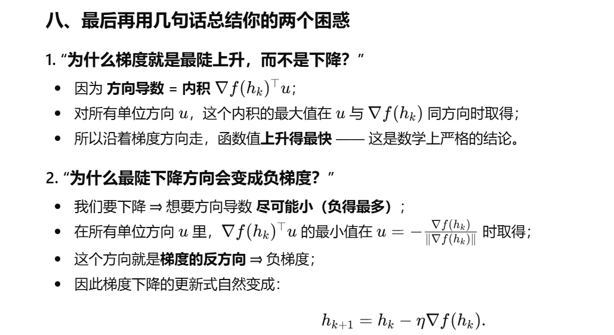

### 3. 最快下降或者上升方向

### 1、什么是“最陡上升/下降方向”？——方向导数的概念

先引入一个概念：**方向导数**。

在点 $h_k$，沿着**单位方向向量** $u$ 的“坡度”定义为：

$D_u f(h_k) = \lim_{t \to 0^+} \dfrac{f(h_k + t u) - f(h_k)}{t} = \nabla f(h_k)^\top u$

你可以这样理解：

- $D_u f(h_k)$ = 沿着方向 $u$ 每走“单位距离”，函数 $f$ 上升（或下降）的**速度**。

只看单位向量 $u$，就能比较不同方向的坡度大小：

- $D_u f(h_k) > 0$：沿 $u$ 走是**上坡**
- $D_u f(h_k) < 0$：沿 $u$ 走是**下坡**
- $|D_u f(h_k)|$ 越大，坡越陡

所以：

- “**最陡上升方向**”就是：在所有单位向量 $u$ 里，让 $D_u f(h_k)$ **最大的**那个方向。
- “**最陡下降方向**”就是：在所有单位向量 $u$ 里，让 $D_u f(h_k)$ **最小的**那个方向。

---

### 2、为什么梯度就是“最陡上升方向”？

#### 1. 利用内积公式

对任意**单位向量** $u$，有：

$D_u f(h_k) = \nabla f(h_k)^\top u$

设 $v = \nabla f(h_k)$。内积可以写成几何形式：

$v^\top u = \|v\|\,\|u\|\cos\theta$

其中 $\theta$ 是 $v$ 与 $u$ 的夹角，且 $\|u\| = 1$，所以：

$v^\top u = \|v\|\cos\theta$

- 当 $\theta = 0^\circ$（同方向）：$\cos\theta = 1$，得到**最大值** $\|v\|$
- 当 $\theta = 180^\circ$：$\cos\theta = -1$，得到**最小值** $-\|v\|$
- 当 $\theta$ 在中间时，值介于 $-\|v\|$ 和 $\|v\|$ 之间

所以，在**所有单位向量** $u$ 里面：

$\max_{\|u\| = 1} v^\top u = \|v\| \quad \text{在}\ u = \dfrac{v}{\|v\|}\ \text{时取得}$

翻译成我们的记号：

$\max_{\|u\| = 1} \nabla f(h_k)^\top u = \|\nabla f(h_k)\| \quad \text{在}\ u = \dfrac{\nabla f(h_k)}{\|\nabla f(h_k)\|}\ \text{时取得}$

而这个 $u$ 恰好就是“**梯度方向的单位向量**”。

因此：

- 梯度方向（$\nabla f(h_k)$）对应的单位向量，使方向导数 $D_u f(h_k)$ **最大**
- ⇒ 上升最快 ⇒ **最陡上坡**

这就是“**梯度是最陡上升方向**”的严格理由。

---

### 3、那最陡下降方向呢？为什么是负梯度？

同样地，在所有单位向量中，内积的**最小值**是：

$\min_{\|u\| = 1} v^\top u = -\|v\| \quad \text{在}\ u = -\dfrac{v}{\|v\|}\ \text{时取得}$

代回我们的问题，就是：

$\min_{\|u\| = 1} \nabla f(h_k)^\top u = -\|\nabla f(h_k)\| \quad \text{在}\ u = -\dfrac{\nabla f(h_k)}{\|\nabla f(h_k)\|}\ \text{时取得}$

翻译一下：

- 若只看单位向量，沿着 $-\nabla f(h_k)$ 方向走，是**下降最快（最陡下坡）**的方向。

这就是“**负梯度是最陡下降方向**”。

---

### 4、回到你问的那段线性代数推导

#### 1. 设 $v = \nabla f(h_k)$，找最陡下降方向

我们想在所有长度为 1 的方向里找到“下降最快”的方向 $d_k$，等价于：

$\min_{\|d_k\| = 1} \nabla f(h_k)^\top d_k$

上面已经用内积几何公式说明过：这个最小值在

$d_k = -\dfrac{\nabla f(h_k)}{\|\nabla f(h_k)\|}$

处取得，此时：

$\nabla f(h_k)^\top d_k = \nabla f(h_k)^\top\left(-\dfrac{\nabla f(h_k)}{\|\nabla f(h_k)\|}\right) = -\|\nabla f(h_k)\| < 0$

这说明：在单位向量里，$d_k$ 取**负梯度方向**是最陡下降。

#### 2. 如果不要求长度为 1，直接取 $d_k = -\nabla f(h_k)$

有时候我们懒得管 $\|d_k\| = 1$ 这个约束，那就直接选

$d_k = -\nabla f(h_k)$

这时：

$\nabla f(h_k)^\top d_k = \nabla f(h_k)^\top(-\nabla f(h_k)) = -\|\nabla f(h_k)\|^2 < 0$

仍然是一个负数，而且负得挺大（与梯度的**平方**成正比）。  
所以它也是一个合法的下降方向。

然后带回更新式：

$h_{k+1} = h_k + \eta d_k = h_k + \eta(-\nabla f(h_k)) = h_k - \eta \nabla f(h_k)$

这就是标准的**梯度下降更新公式**：

> 梯度下降 = 沿着“最陡下降方向（负梯度）”走一小步。

---

### 5、为什么说“夹角大于 $90^\circ$ ⇒ 朝下坡走”？

再回顾一下内积的几何意义：

$\nabla f(h_k)^\top d_k = \|\nabla f(h_k)\|\,\|d_k\|\cos\theta$

若：

- $\theta < 90^\circ$，$\cos\theta > 0$，内积 $> 0$ ⇒ **上坡**
- $\theta = 90^\circ$，$\cos\theta = 0$，内积 $= 0$ ⇒ 在这个方向上“一阶不变”（局部是**平的**）
- $\theta > 90^\circ$，$\cos\theta < 0$，内积 $< 0$ ⇒ **下坡**

而我们有近似：

$f(h_k + \eta d_k) \approx f(h_k) + \eta\,\nabla f(h_k)^\top d_k$

所以只要让 $\theta > 90^\circ$（即 $\nabla f(h_k)^\top d_k < 0$），  
对足够小的 $\eta > 0$，就能保证 $f$ 减小 —— 也就是你看到的那句话：

> “$\nabla f(h_k)^\top d_k < 0$ 表示 $d_k$ 和梯度夹角大于 $90^\circ$ ⇒ 朝‘下坡方向’走；  
> 那么走一个足够小的步长，就一定能让 $f$ 降下来。”

5、 因此how to find dk and eta 就成了一个问题， 也就是我们经常用到的gradient descend

## 6、 解释这里的upper bounded?

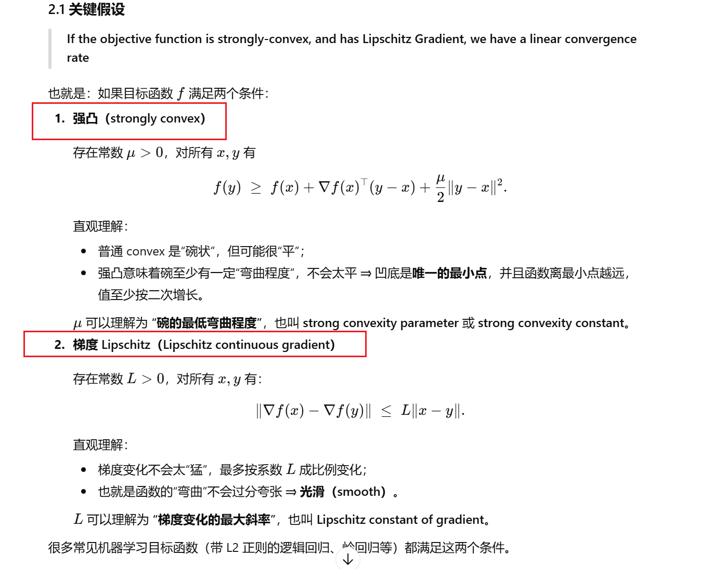

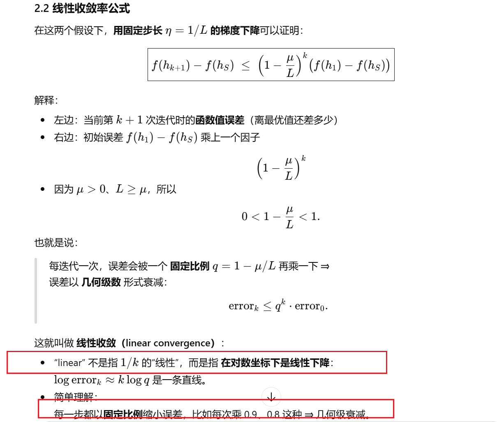

## 7、 解释这个图，有什么实际作用？应该怎么用？

学习误差可以分成两部分：近似误差（approximation error）和估计误差（estimation error）。

### 1. 三个主角：$c$、$h^*$、$h_S$ 都是谁？

#### 1.1 真实世界的“老师” $c$（concept / true function）

在最外层的 Universal function space（所有可能的函数空间）里，有一个“真实函数”：

$c: X \to Y$

它代表“真实世界是怎么从特征 $X$ 产生标签 $Y$ 的”。  
比如：真实的“是否得病的判定规则”、真实的房价函数等。

- 图上右边那个点 $c$ 就是它。
- 可以粗糙地理解为：Bayes 最优分类器 / 真实生成机制。

---

#### 1.2 我们可选模型的集合：假设空间 $H$

我们不可能在“所有函数”里找模型，只能事先选一个**假设空间**：

$H = \{\,h_\theta : \theta \in \Theta\,\}$

比如：

- “所有线性函数（线性分类器、线性回归）”；
- “所有深度为 3 的神经网络”；
- 等等。

这个 $H$ 是 “Universal function space” 中的一个子集，图里画成左边那个椭圆 “Predefined hypothesis class $H$”。

> 选择 $H$ 就是选择模型容量 / 复杂度。

---

#### 1.3 在 $H$ 里最好的那个：$h^*$

我们考虑的是**真实风险**（population risk）：

$R(h) = \mathbb{E}_{(X,Y)\sim D}[\ell(h(X), Y)]$

- $D$ 是真实数据分布；
- $\ell$ 是损失函数（0-1 loss、logistic loss 等）。

如果我们什么都不顾，只看 $H$ 里谁的真实风险最小，那么：

$h^* = \arg\min_{h \in H} R(h)$

$h^*$ 是在你选定的模型族 $H$ 里，理论上**最好**（最小化真实风险）的那个模型。  
它在图里是椭圆里面靠右边的那个点。

注意：

- 要算 $R(h)$ 需要知道真实分布 $D$，现实中我们做不到；
- 所以 $h^*$ 是一个**理论上的最佳模型**，我们实际看不到它，只能靠估计。

---

#### 1.4 用有限样本学出来的：$h_S$

我们手里只有一个训练集：

$S = \{(X_i, Y_i)\}_{i=1}^n$

实际训练时做的是**经验风险最小化 (ERM)**：

$h_S = \arg\min_{h \in H} \frac{1}{n}\sum_{i=1}^n \ell(h(X_i), Y_i)$

- $h_S$ 是“在样本 $S$ 上表现最好的那个模型”。

因为样本有限、带噪声、还有优化算法的不完美等原因，  
$h_S$ 一般 $\neq h^*$。

图里，$h_S$ 是椭圆里面靠左的那个点。

---

### 2. 两种误差：近似误差 & 估计误差

#### 2.1 近似误差（Approximation error）

图上写的是：

$R(h^*) - R(c)\quad (\text{Approximation error})$

含义：

- $R(c)$：真实 “完美老师” 的风险（通常是 Bayes 风险）；
- $R(h^*)$：在你选的 $H$ 里能做到的最小风险。

差值 $R(h^*) - R(c)$ 表示：

> 就算你有无限数据、无限算力，把 $H$ 里最好的模型选出来，  
> 它与真实世界最理想的 $c$ 之间仍然存在的“最低差距”。

这差距完全来自于**模型族 $H$ 不够强**，  
即：用 $H$ 这个函数类去逼近 $c$ 的误差 ⇒ 叫 Approximation error（逼近误差 / 近似误差）。

- 如果 $H$ 选得太简单（只允许线性），但真实函数 $c$ 非线性很复杂 ⇒ 近似误差大（偏差大）。
- 如果 $H$ 足够大（比如包含了真实函数） ⇒ 可以做到 $R(h^*) \approx R(c)$，近似误差趋近 0。

---

#### 2.2 估计误差（Estimation error）

图上写的是：

$R(h_S) - R(h^*)\quad (\text{Estimation error})$

含义：

- $R(h_S)$：你真正训练出来的模型在真实分布上的风险；
- $R(h^*)$：同一假设空间 $H$ 里理论最优模型的风险。

差值 $R(h_S) - R(h^*)$ 表示：

> 因为数据有限、存在噪声、以及我们只做了经验风险最小化，  
> 造成“学出来的 $h_S$”没有达到“理论最好 $h^*$”的那部分差距。

这就是**估计误差 / 统计误差**：

- 样本越少 ⇒ 波动越大 ⇒ 容易 overfit / underfit ⇒ 估计误差大；
- 样本趋向于无穷大 ⇒ 经验风险越来越接近真实风险 ⇒ $h_S$ 越接近 $h^*$ ⇒ 估计误差趋近 0。

图中箭头：

- 从 $h^*$ 指到 $h_S$ 的箭头，对应差值 $R(h_S) - R(h^*)$，标注为 Estimation error。

---

### 3. 三者关系：总风险 = 近似误差 + 估计误差

我们真正关心的是：  
**最终训练出来的模型 $h_S$ 跟真实老师 $c$ 差多少？**

这是：

$R(h_S) - R(c)$

把它拆开：

$R(h_S) - R(c)
= \big(R(h_S) - R(h^*)\big) + \big(R(h^*) - R(c)\big)$

也就是：

$R(h_S) - R(c)
= \underbrace{R(h_S) - R(h^*)}_{\text{Estimation error}}
+ \underbrace{R(h^*) - R(c)}_{\text{Approximation error}}$

这就是这张图想表达的核心：

> 模型最终的“泛化误差”可以拆成两部分：
>
> - 来自“模型族不够强”的 **近似误差**；
> - 来自“数据有限 / 学习不完美”的 **估计误差**。

---

### 4. 和 Bias–Variance / 模型复杂度 的关系

这张图其实对应的是我们常说的“偏差–方差（bias–variance）权衡”的几何版：

- $H$ 很小（模型过于简单）：
  - Approximation error 大：因为最好的 $h^*$ 也学不好 $c$ ⇒ 偏差大；
  - 但参数少，不容易过拟合 ⇒ Estimation error 较小。

- $H$ 很大（模型非常复杂）：
  - 可以更好地逼近真实函数 ⇒ Approximation error 变小；
  - 但参数多、自由度高 ⇒ 更容易在有限样本上过拟合 ⇒ Estimation error 增大。

所以我们在选模型时，要在**两种误差之间做平衡**，  
不能一味只追求“模型越复杂越好”。

---

### 5. 再用一句大白话总结图上的 $c$、$h^*$、$h_S$

- $c$：真实世界的“完美老师”（Bayes 最优），在整个函数空间里最优。
- $h^*$：在你选的模型家族 $H$ 里，“如果你有无限数据、会神级优化”，理论上能找到的最好的模型。
- $h_S$：现实中，拿到有限训练集 $S$，用算法训练出来的那个模型。

对应的两支箭：

- 右边 $R(h^*) - R(c)$：$H$ 不够强导致的“天花板差距” ⇒ **近似误差**。
- 左边 $R(h_S) - R(h^*)$：数据有限 + 训练不完美导致的“没摸到天花板” ⇒ **估计误差**。

## 8、 PAC， 这里存在笔误，应该是h*，同时请您解释这里的实际应用意义？和VC dimension

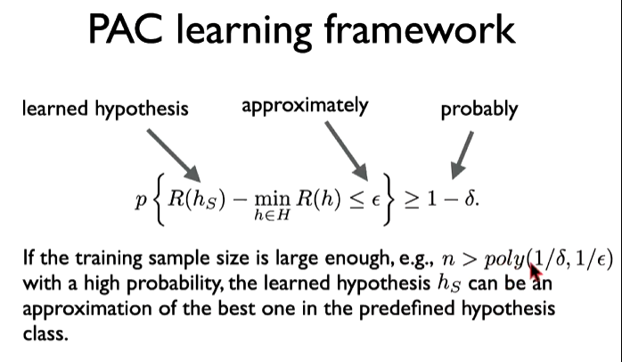

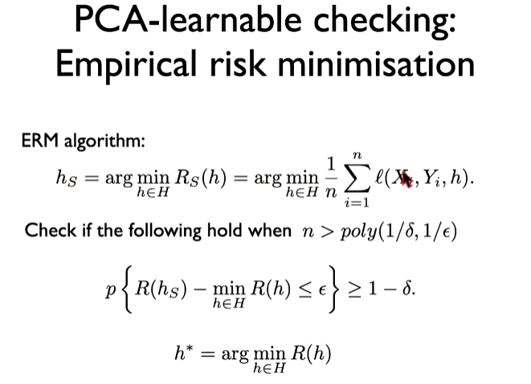

### 0. 先回顾几个符号

- **假设空间 $H$**：你事先选好的模型类  
  例如所有线性分类器、所有深度为 3 的神经网络等。

---

**真实风险（population risk）**

$R(h) = \mathbb{E}_{(X,Y)\sim D}[\ell(h(X), Y)]$

- 在真实分布 $D$ 下，模型 $h$ 的“真实平均损失 / 错误率”。

---

**经验风险**

$R_S(h) = \frac{1}{n}\sum_{i=1}^n \ell(h(X_i), Y_i)$

- 在训练样本 $S$ 上的平均损失。

---

**最优假设 $h^*$：**

$h^* = \arg\min_{h\in H} R(h)$

- 在假设空间 $H$ 里，真实风险最小的那个**理论最优模型**。

---

**学出来的模型 $h_S$：**

- 学习算法 $A$ 在样本 $S$ 上输出的假设，例如 ERM：

$h_S = \arg\min_{h\in H} R_S(h)$

下面 PAC 的所有式子都围绕这几个角色转。

---

### 1. 第一页：PAC 学习的正式定义

> A hypothesis class $H$ is said to be PAC-learnable if …

翻译＋拆解：

一个假设类 $H$ 被称为 PAC（probably approximately correct）可学习，  
如果存在一个学习算法 $A$ 和一个多项式函数 $\text{poly}(\cdot,\cdot)$，  
使得对任意精度要求 $\varepsilon > 0$ 和置信度参数 $\delta > 0$，  
对所有在 $X\times Y$ 上的分布 $D$，  
当样本量 $n$ 大于某个多项式 $\text{poly}(1/\delta, 1/\varepsilon)$ 时，  
算法 $A$ 在该样本上学到的假设 $h_S$ 满足：

$\Pr\left\{\,R(h_S) - \min_{h\in H} R(h) \le \varepsilon\,\right\} \ge 1 - \delta.$

下面逐块解释：

---

#### 1.1 $\varepsilon$：accuracy（精度）

$R(h_S) - \min_{h\in H} R(h) \le \varepsilon$

而 $\min_{h\in H} R(h) = R(h^*)$，是**在 $H$ 里能做到的最小真实风险**。

左边是“学出来的 $h_S$ 与 $H$ 里最优的 $h^*$ 的差距”，  
要求它 $\le \varepsilon$，表示：

> 我们希望学出来的 $h_S$ 在真实风险上不比最优的 $h^*$ 差太多，最多差 $\varepsilon$。

所以 $\varepsilon$ 就是**允许的误差上限 / 近似程度**。

---

#### 1.2 $\delta$：confidence（置信度）

$\Pr\{\dots\} \ge 1 - \delta$

这里的概率是对训练样本 $S$ 的抽样随机性而言的：

- 每次从分布 $D$ 中采样一个训练集 $S$；
- 用算法 $A$ 训练，得到 $h_S$；
- 不同的 $S$ 会得到不同的 $h_S$。

要求“上面那个误差 $\le \varepsilon$”这件事，**发生的概率至少为 $1-\delta$**。

所以：

- $\delta$ 表示“允许失败的概率上限”，  
- $1-\delta$ 就是“成功的概率（置信度）”。

---

#### 1.3 “for any distribution $D$” 的含义

> for all distributions $D$ on $X\times Y$

意思是：

- 不管真实世界的数据分布 $D$ 是什么样，
- 只要数据是从 $D$ 独立同分布采样的，

只要样本量足够大，该算法都能保证上面不等式成立。

这是 PAC 理论里的一个很强的要求：**分布无关（distribution-free）**。

---

#### 1.4 样本量条件：$n > \text{poly}(1/\delta, 1/\varepsilon)$

这里的 $\text{poly}(\cdot,\cdot)$ 是一个多项式函数，比如

$\text{poly}(1/\delta, 1/\varepsilon) = C \cdot \frac{1}{\varepsilon^2} \log \frac{1}{\delta}$

之类（具体形式要靠理论推导）。

要点是：

- 所需样本量 $n$ 只需要是关于 $1/\varepsilon, 1/\delta$ 的**多项式级别**，而不是指数级；
- 这说明：随着你要求的精度更高（$\varepsilon$ 更小），或置信度更高（$\delta$ 更小），
  所需样本量增加，但增加得“不是太离谱”（多项式增长）。

---

#### 小结：这一页在说什么？

PAC-learnable 意味着：

> 存在某个算法 $A$ 和多项式级的样本复杂度，  
> 使得：只要样本数 $n$ 足够大（多项式级），  
> 就可以以高概率（$\ge 1-\delta$）学到一个真实风险不比最优 $h^*$ 差太多（$\le \varepsilon$）的模型。

---

### 2. 第二页：用 ERM 检查 PAC-learnable

标题：ERM algorithm: PAC-learnable checking（slides 里写成 PCA 是笔误）

#### 2.1 ERM 算法写出来

$h_S = \arg\min_{h\in H} R_S(h)
= \arg\min_{h\in H} \frac{1}{n}\sum_{i=1}^n \ell(X_i, Y_i, h).$

这就是我们熟悉的**经验风险最小化（ERM）**。

---

#### 2.2 要检查什么？

> Check if the following hold when $n > \text{poly}(1/\delta, 1/\varepsilon)$

即：  
**使用 ERM 作为算法 $A$，看看它是否满足 PAC 条件：**

$\Pr\left\{\,R(h_S) - \min_{h\in H} R(h) \le \varepsilon\,\right\} \ge 1 - \delta.$

如果能证明上面这个式子，对所有分布 $D$、所有 $\varepsilon,\delta$ 都成立  
（只要 $n$ 大于某个多项式），那就可以说：

> “假设空间 $H$ 在 ERM 算法下是 PAC-learnable 的”。

下面的小字：

$h^* = \arg\min_{h\in H} R(h)$

就是明确告诉你：右边的 $\min_{h\in H} R(h)$ 实际上就是 $R(h^*)$，  
所以更整洁的写法是：

$\Pr\{\,R(h_S) - R(h^*) \le \varepsilon\,\} \ge 1 - \delta.$

你说“这里的 $h$ 应该是 $h^*$”就是在纠正这个点。

---

### 3. 第三页：把 “PAC” 三个词拆开解释

PAC = Probably Approximately Correct

第三张 slide 把公式拆成三个部分配上箭头：

$\Pr\{R(h_S) - \min_{h\in H} R(h) \le \varepsilon\}
\;\;\underbrace{\Longrightarrow}_{\text{learned hypothesis, approximately}}\;\;
\ge \underbrace{1-\delta}_{\text{probably}}$

然后文字解释（意译）：

> If the training sample size is large enough, e.g., $n > \text{poly}(1/\delta, 1/\varepsilon)$,  
> with a high probability, the learned hypothesis $h_S$ can be an approximation of the best one in the predefined hypothesis class.

拆开来：

- **learned hypothesis**：指的是左边式子里的 $h_S$，是训练算法真正学出来的模型；
- **approximately**：  
  $R(h_S) - \min_{h\in H} R(h) \le \varepsilon$  
  表示 $h_S$ 和最优 $h^*$ 在真实风险上只差一个很小的 $\varepsilon$，  
  即“大致正确 / 近似最优”；
- **probably**：  
  $\Pr(\cdots) \ge 1 - \delta$  
  表示这个好事情发生的概率至少是 $1-\delta$，即“很可能 / 以高概率”。

所以一句人话就是：

> 当样本够多时（$n > \text{poly}(1/\delta, 1/\varepsilon)$），  
> 我们学出来的假设 $h_S$ 会以至少 $1-\delta$ 的概率，  
> 在真实错误率上不比 $H$ 里最好模型 $h^*$ 差超过 $\varepsilon$。  
> —— 这就是 “Probably Approximately Correct”。

---

### 4. 再和前面讲过的 $h_S, h^*, c$ 联系一下

之前那张 “Approximation & Estimation error” 的图里，我们有：

- $c$：真实函数（Bayes 最优）
- $h^*$：在 $H$ 中真实风险最小
- $h_S$：训练出来的模型

误差分解：

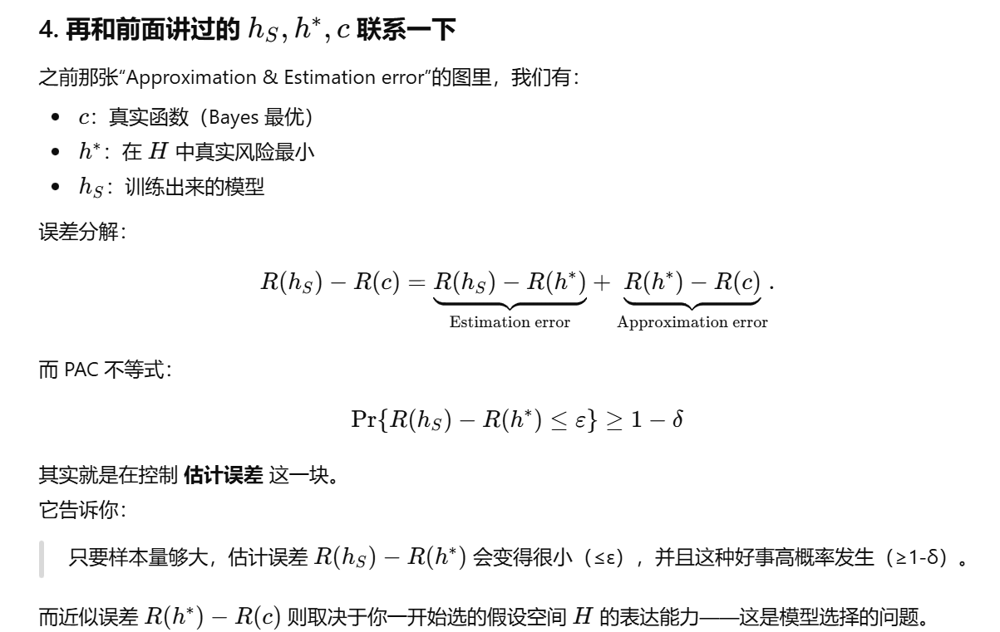

而 PAC 不等式：

$\Pr\{\,R(h_S) - R(h^*) \le \varepsilon\,\} \ge 1 - \delta$

其实就是在**控制估计误差**这一块。它告诉你：

> 只要样本量够大，估计误差 $R(h_S) - R(h^*)$ 会变得很小（$\le \varepsilon$），  
> 并且这种好事高概率发生（$\ge 1-\delta$）。

而近似误差 $R(h^*) - R(c)$ 则取决于你一开始选的假设空间 $H$ 的表达能力——这是**模型选择**的问题。

---

### 5. 一句总结这三张 slide

**定义：**  
PAC-learnable 意味着：

> 存在学习算法 $A$，只要样本量 $n$ 是关于 $1/\varepsilon, 1/\delta$ 的多项式级，  
> 就能在任意分布 $D$ 下，以概率至少 $1-\delta$，  
> 学到一个真实风险不比 $H$ 中最优模型 $h^*$ 差超过 $\varepsilon$ 的假设 $h_S$。

PAC 三个词的含义：

- **Probably（概率上）**：$\Pr(\cdots) \ge 1 - \delta$
- **Approximately（近似地）**：$R(h_S) - R(h^*) \le \varepsilon$
- **Correct（正确）**：这里的“正确”指的是**相对于最优 $h^*$ 的小错误率**。

## 9. generalization error bound

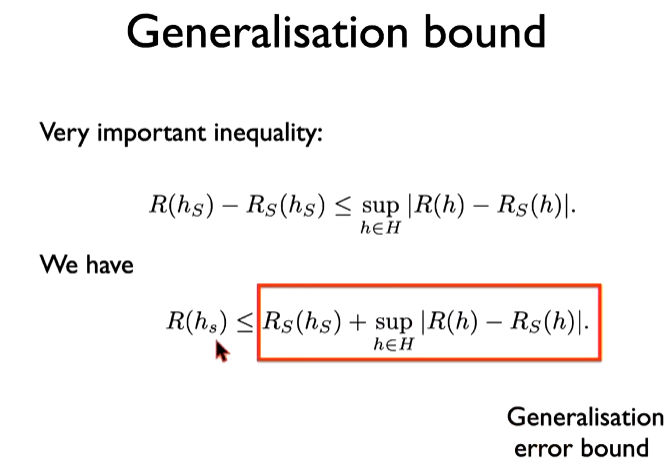

### 1. 先把符号再说一遍

- $H$：假设空间（所有可能的模型）

- $h_S$：在训练集 $S$ 上学出来的模型（比如 ERM 得到的）

- 真实风险（test / population risk）  
  $$
  R(h) = \mathbb{E}_{(X,Y)\sim D}\big[\ell(h(X), Y)\big]
  $$
  在真实分布 $D$ 下，模型 $h$ 的“真实平均损失 / 错误率”。

- 经验风险（training risk）  
  $$
  R_S(h) = \frac{1}{n}\sum_{i=1}^n \ell\big(h(X_i), Y_i\big)
  $$
  在训练样本 $S$ 上的平均损失。

我们关心的是：**学出来的 $h_S$，在真实分布上的误差 $R(h_S)$ 能不能被“训练误差 + 一些修正项”控制住。**

---

### 2. “Very important inequality” 的推导

Slide 上第一行：

$R(h_S) - R_S(h_S) \le \sup_{h\in H} \big| R(h) - R_S(h) \big|.$

这个不等式其实是一个非常简单的“取最大值”逻辑，分两步：

#### 第一步：对任意 $h\in H$ 都成立

对任意 $h\in H$，都有
$$
\big|R(h) - R_S(h)\big| \le \sup_{h'\in H} \big|R(h') - R_S(h')\big|.
$$

原因很朴素：

- 右边是“对所有 $h'\in H$ 的绝对差的最大值”；
- 左边只是其中某一个 $h$ 的绝对差；

**个体永远 ≤ 全部里最大的那个** ⇒ 不等式永远成立。

#### 第二步：把 $h$ 取成我们关心的 $h_S$

令 $h = h_S$，就得到
$$
\big|R(h_S) - R_S(h_S)\big| \le \sup_{h\in H} \big|R(h) - R_S(h)\big|.
$$

再注意到：
$$
R(h_S) - R_S(h_S) \le \big|R(h_S) - R_S(h_S)\big|
$$
因为去掉绝对值只会变大或不变，不会变小。

于是连在一起：
$$
R(h_S) - R_S(h_S)
\;\le\; \big|R(h_S) - R_S(h_S)\big|
\;\le\; \sup_{h\in H} \big|R(h) - R_S(h)\big|.
$$

这就是 slide 第一行的那条 **“very important inequality”**。

---

### 3. 第二行红框式子怎么来的？

从第一行：
$$
R(h_S) - R_S(h_S)
\le \sup_{h\in H} \big|R(h) - R_S(h)\big|.
$$

两边都**加上** $R_S(h_S)$，得到：
$$
R(h_S) \le R_S(h_S) + \sup_{h\in H} \big|R(h) - R_S(h)\big|.
$$

这就是 slide 里红框的那句：
$$
R(h_S) \le R_S(h_S) + \sup_{h\in H} \big|R(h) - R_S(h)\big|.
$$

---

### 4. 这句话到底在说什么？（泛化误差上界）

把这条不等式翻成“大白话”：

> **学出来的模型在“测试集”（真实分布）上的真实误差**  
> $\le$  
> **该模型在训练集上的误差**  
> $+$  
> **整个假设空间里“训练误差和真实误差的最大偏差”**。

逐项解释：

- 左边：$R(h_S)$  
  你训练出来的模型，在真实分布上的错误率（这是我们真正关心但直接看不到的）。

- 第一个右边项：$R_S(h_S)$  
  在训练集上的错误率（我们可以直接算出来的 training error）。

- 第二个右边项：$\sup_{h\in H} \big|R(h) - R_S(h)\big|$  
  是一个**“复杂度 / 泛化偏差”项**，它衡量的是：

  > 在整个假设空间 $H$ 里，训练误差和真实误差之间的最坏偏差有多大。

  直觉上：

  - 如果 $H$ 很简单、样本很多 ⇒ 这项会很小（训练误差和真实误差几乎一致）；
  - 如果 $H$ 很复杂、样本少 ⇒ 这项可能很大（容易严重过拟合）。

所以这条不等式给了一个很清晰的结构：

> **Generalisation error bound（泛化误差上界）  
> = 训练误差 + 模型复杂度 / 样本量引起的修正项。**

接下来各种 VC 维、Rademacher complexity、covering number 的理论，做的就是：  
**如何具体地上界**这个“坏家伙”
$$
\sup_{h\in H} \big|R(h) - R_S(h)\big|.
$$

一旦我们能在高概率意义下写出类似：
$$
\sup_{h\in H} \big|R(h) - R_S(h)\big|
\le \text{某个关于 }(n,\ \text{VCdim}(H),\ \delta)\text{ 的上界},
$$
代入刚才的式子，就得到 **PAC 型的泛化界**。

---

### 5. 和 PAC 条件的联系（顺手串一下）

之前 PAC 里出现过的目标式子是：
$$
\Pr\big\{\,R(h_S) - R(h^*) \le \varepsilon\,\big\} \ge 1 - \delta,
$$
其中 $h^* = \arg\min_{h\in H} R(h)$。

而这里我们有：
$$
R(h_S) \le R_S(h_S) + \sup_{h\in H} \big|R(h) - R_S(h)\big|.
$$

再加上一条类似的：
$$
R(h^*) \ge R_S(h^*) - \sup_{h\in H} \big|R(h) - R_S(h)\big|,
$$
就可以把
$$
R(h_S) - R(h^*)
$$
写成“**训练误差之差 + 两个 sup 项**”。

接下来用概率工具（Hoeffding 不等式、VC 维等）去控制这些 sup 项，就能推导出：

- 以高概率（$\ge 1-\delta$），
- $R(h_S)$ 不会比 $R(h^*)$ 大太多（$\le \varepsilon$），

这正是 PAC 泛化理论的典型套路。

## 10. VC dimension

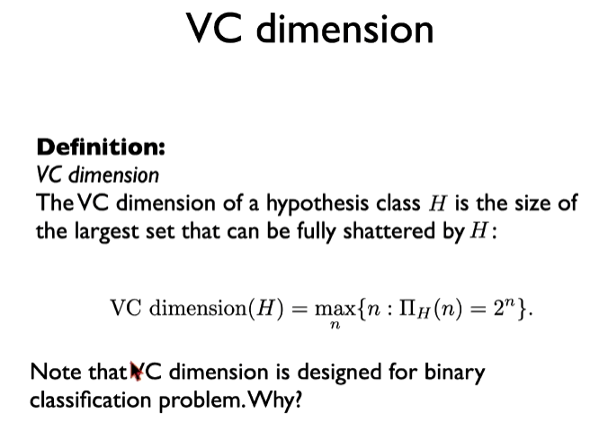

### 1. “打碎 (shatter)” 到底是什么意思？

你说的：

> “打碎的意思就是能否正确分类对吧？”

一半对，一半需要加条件：

- 是的，**“能正确分类”**是其中一部分；
- 但更严格的是：**对这 $n$ 个点的任意一种 0/1 标记方式，都要能找到某个 $h\in H$ 把它们全部分对**。

也就是说：

给定一个点集 $S = \{x_1,\dots,x_n\}$，  
若对每一个标签向量 $(y_1,\dots,y_n)\in\{0,1\}^n$，  
都存在某个 $h\in H$ 使得
$$h(x_i) = y_i,\quad i=1,\dots,n,$$
那么就说：**“$H$ 打碎了集合 $S$”**。

⚠️ 注意两点：

- “任意标法 + 都能实现” 才叫打碎；  
  不是只要有一种划分能分对就叫打碎。
- 对于每一种标签，只要求“存在一个” $h$ 能实现，  
  不需要很多个；所以**不是在数“有多少个假设”**。

---

### 2. VC 维到底在量什么？（不是“有多少个假设”）

你说：

> “VC 维度就是看 H 假设集里面有多少可以把所有点分开的假设？”

这里稍微有误解。VC 维**不是**数“多少个假设”，  
而是看：**最多能打碎多少个点**。

#### 2.1 正式定义再说一遍（更直白）

设 $H$ 是一个二分类假设类。

对每个 $n$，我们问：是否存在某个点集 $S\subset X$，$|S|=n$，使得 $S$ 被 $H$ 打碎？

- 如果存在，那么说明：对这 $n$ 个点，$H$ 可以实现所有 $2^n$ 种 0/1 标签方式。

于是定义：
$$\mathrm{VCdim}(H) = \max\{\,n:\ \exists\ S\subset X,\ |S|=n,\ \text{被 }H\text{打碎}\,\}.$$

所以：

- VC 维是一个整数；
- 它是在问：  
  **“这个假设类最厉害的时候，最多能在多少个点上实现任意分类？”**

不是在数 “有多少个 $h$”，而是在数  
**“能被完全自由划分的点数上限”**。

#### 2.2 一个图形例子再加深一下直觉

**例子：二维平面上的线性分类器**

- 输入 $X=\mathbb{R}^2$，
- $H$ = 所有直线划分（线性分类器）。

结论：$\mathrm{VCdim}(H)=3$。

**为什么？**

- 可以打碎任意 3 个不共线的点：  
  任意给这 3 个点标 0/1，都可以画一条直线正确分开（你可以在脑子里画几种情况试一下）。

- 不能打碎某些 4 个点：  
  当 4 个点是凸四边形的顶点时，有一种标法是 “1,0,1,0（隔一个标 1）”，  
  这时候没有任何一条直线能做到同时把两个 1 和两个 0 分在两侧。

所以：

- 3 个点可以被打碎；
- 4 个点里存在一种配置不能被完全打碎；

因此 $\mathrm{VCdim}(H) = 3$。

直观含义：

> “二维线性分类器最灵活的程度，就是能在 3 个点上实现任意划分模式。”

点数越大 ⇒ 表示这个假设类的**区分能力 / 复杂度**越强。

---

### 3. VC 维和 PAC 的关系：为什么它这么重要？

现在来回答你最关心的：

> “VC 的意义和 PAC 的关系是什么？”

#### 3.1 前面你学过的一条泛化不等式

我们已经有过：
$$
R(h_S) \le R_S(h_S) + \sup_{h\in H} |R(h) - R_S(h)|.
$$

- 左边：学出来的模型在真实分布上的误差；
- 第一项：训练误差；
- 第二项：泛化差距（训练误差 vs 真实误差的最坏偏差）。

PAC 要求的是：
$$
\Pr\{\,R(h_S) - R(h^*) \le \varepsilon\,\} \ge 1 - \delta,
$$
其中 $h^* = \arg\min_{h\in H} R(h)$。

要证明这类东西，本质是想**控制那个 sup 项**：
$$
\sup_{h\in H} |R(h) - R_S(h)|.
$$

**VC 维出场的地方就在这里。**

---

#### 3.2 如果 $H$ 是有限集合：用 $|H|$

最简单情况：假设 $H$ 只有有限个假设，$|H|<\infty$。

用 Hoeffding 不等式 + union bound 可以得到：
$$
\Pr\Big\{\sup_{h\in H}|R(h)-R_S(h)| > \varepsilon\Big\}
\le 2|H|\exp(-2n\varepsilon^2).
$$

于是可以推出：只要
$$
n \gtrsim \frac{1}{\varepsilon^2}\Big(\log|H| + \log\frac{1}{\delta}\Big),
$$
就有
$$
\Pr\Big\{\sup_{h\in H}|R(h)-R_S(h)| \le \varepsilon\Big\} \ge 1 - \delta.
$$

**问题：** 大多数有趣的假设类（线性分类器、神经网络）都是无限的，$|H|=\infty$，  
上面这个界没法用了——这时就要用 **VC 维来取代 $\log|H|$**。

---

#### 3.3 当 $H$ 是无限时：用 VC 维控制 sup 差距

经典结果（只看量纲，忽略常数），对 0-1 损失有：

若 $\mathrm{VCdim}(H) = d < \infty$，则对任意 $\delta>0$，只要样本数 $n$ 足够大，以概率至少 $1-\delta$，  
对所有 $h\in H$ 都有
$$
|R(h) - R_S(h)| \le C\sqrt{\frac{d\log n + \log(1/\delta)}{n}},
$$
其中 $C$ 是某个常数。

你不用死记公式，只要抓住核心点：

- 当 VC 维 $d$ 有限时，  
  $\sup_{h\in H}|R(h)-R_S(h)|$ 会随 $n$ 增大而收缩；
- 收缩速度大约是 $O\big(\sqrt{\frac{d}{n}}\big)$；
- **VC 维越大 ⇒ 需要的 $n$ 越多才能让差距变小。**

把这个上界代回：
$$
R(h_S) \le R_S(h_S) + O\Big(\sqrt{\frac{d}{n}}\Big),
$$
再和 $h^*$ 结合，就可以推出 PAC 型的结论：
$$
\Pr\{\,R(h_S) - R(h^*) \le \varepsilon\,\} \ge 1 - \delta,
$$
只要
$$
n \gtrsim \frac{1}{\varepsilon^2}\Big(d\log\frac{1}{\varepsilon} + \log\frac{1}{\delta}\Big).
$$

这就是：  
**VC 维 → 控制 sup 泛化差距 → 得到 PAC sample complexity。**

---

#### 3.4 终极结论：VC 维 & PAC（统计学习基本定理）

有一个非常重要的结论（非正式版）：

> 一个二分类假设类 $H$（用 ERM 学习）  
> **是分布无关 PAC 可学习的，当且仅当它的 VC 维是有限的。**

也就是说：

- 如果 $\mathrm{VCdim}(H) = d < \infty$：  
  可以给出样本复杂度上界 $n = \mathrm{poly}(d, 1/\varepsilon, \log(1/\delta))$，  
  存在 PAC 学习算法（ERM 就可以）。

- 如果 $\mathrm{VCdim}(H) = \infty$：  
  对于某些分布 $D$，无论你给多少样本，都能构造出“坏情况”，  
  不存在统一的（分布无关的）PAC sample complexity 上界，  
  这个 $H$ 就不是分布无关 PAC-learnable。

所以：

> **VC 维是“PAC 学习可行性”的一个必要且充分的复杂度指标。**  
> 只要 VC 维有限，该类就 PAC 可学；  
> VC 维无限，就不是分布无关 PAC 可学。

---

### 4. 用一句话串起来

- **Shatter（打碎）**：在一组 $n$ 个点上，假设类 $H$ 能对这 $n$ 个点的**任何** 0/1 标记，找到某个 $h$ 完全分对。

- **VC 维**：$H$ 最多能在多少个点上做到这种“任意标都能实现”的能力 ⇒ 衡量**模型复杂度 / 表达能力**。

- **和 PAC 的关系**：  
  泛化界里的关键项 $\sup_{h\in H}|R-R_S|$ 可以用 VC 维给出上界；  
  VC 维有限 ⇒ 估计误差随样本量下降 ⇒ 能给出  
  $n = \mathrm{poly}(\mathrm{VCdim}(H), 1/\varepsilon, 1/\delta)$ 的 PAC 样本复杂度；  
  经典定理：二分类下，$H$ 分布无关 PAC 可学习 $\Leftrightarrow$ $H$ 的 VC 维有限。

### 1. PAC 里那个 $\sup$ 是怎么来的？

我们前面已经有这个“关键不等式”：

$R(h_S) \le R_S(h_S) + \sup_{h\in H}\big|R(h) - R_S(h)\big|.$

- $R(h_S)$：我们学出来的模型在真实分布上的误差（看不见）
- $R_S(h_S)$：训练误差（看得见）
- $\sup_{h\in H}\big|R(h) - R_S(h)\big|$：在整个假设类 $H$ 里，训练误差和真实误差的**最大偏差**  
  （也就是 uniform convergence 里需要控制的那一项）

只要我们能在高概率下让这个 $\sup$ 足够小（比如 $\le \varepsilon$），就有大致的关系：

$R(h_S) \approx R_S(h_S)$ 且这个关系对所有 $h\in H$ 同时成立。

然后再配合 ERM（经验风险最小化）等，就能推出：

$\Pr\{\,R(h_S) - R(h^*) \le \varepsilon\,\} \ge 1 - \delta$

这就是 PAC 那个式子。

✅ 总结：**PAC 理论的核心任务之一，就是找到一个上界**
$$
\sup_{h\in H}\big|R(h) - R_S(h)\big|
$$
用样本量 $n$、假设类 $H$ 的某个复杂度量（比如 VC 维）、以及置信度参数 $\delta$ 表示出来。

---

### 2. 如果 $H$ 有限，怎么做？（先看简单情况）

假设 $H$ 是有限的，$|H| < \infty$。

对**单个** $h$，用 Hoeffding 不等式（或类似的 concentration inequality）可得：

$\Pr\big\{\big|R(h) - R_S(h)\big| > \varepsilon\big\} \le 2\exp(-2n\varepsilon^2).$

但我们要的是：

$\Pr\left\{\sup_{h\in H}\big|R(h) - R_S(h)\big| > \varepsilon\right\}
= \Pr\left\{\exists\,h\in H\ \text{s.t.}\ \big|R(h) - R_S(h)\big| > \varepsilon\right\}.$

把“存在 $h$”展开成关于各个 $h$ 的并集事件 ⇒ 用 union bound：

$\Pr\left\{\sup_{h\in H}\big|R(h) - R_S(h)\big| > \varepsilon\right\}
\le \sum_{h\in H} \Pr\big\{\big|R(h) - R_S(h)\big| > \varepsilon\big\}
\le 2|H|\exp(-2n\varepsilon^2).$

于是得到：只要 $n$ 足够大，

$\sup_{h\in H}\big|R(h) - R_S(h)\big| \le \varepsilon$

发生的概率至少是 $1-\delta$，只要你把

$\delta = 2|H|\exp(-2n\varepsilon^2)$

反解出来。

**关键：**这里 $\sup$ 的概率上界里出现的是 $|H|$。

✅ 当 $H$ 有限时，以高概率有

$\sup_{h\in H}\big|R(h) - R_S(h)\big|
\;\lesssim\; \sqrt{\dfrac{\log|H| + \log(1/\delta)}{n}}.$

所以在有限情形下，可以用 $|H|$ 来“代表”这个 $\sup$ 的复杂度。

---

### 3. 当 $H$ 无限时，$|H| = \infty$ 这个界就炸了……

如果 $H$ 是无限个假设（比如所有线性分类器、所有神经网络），  
那么上面那个式子里的

$2|H|\exp(-2n\varepsilon^2)$

就永远是 $\infty$，一点用都没有 —— union bound 直接失效。

**问题：**我们还是想控制

$\sup_{h\in H}\big|R(h) - R_S(h)\big|,$

但不能用 $|H|$ 了，那用啥？

**答案：**不要直接数“有多少个假设”，而是数：

> 在一个固定的有限训练样本上，这些无限多的假设，实际上能产生多少种不同的标签模式？

这就引出了 growth function $\Pi_H(n)$ 和 VC dimension。

---

### 4. Growth function 和 VC dimension 是怎么上来的？

#### 4.1 Growth function $\Pi_H(n)$：在 $n$ 个点上可能的“标签模式”个数

给定训练集大小 $n$：

1. 先从输入空间 $X$ 里选一组 $n$ 个点 $S = \{x_1,\dots,x_n\}$；
2. 对每个 $h\in H$，它在这些点上给出一个 0/1 标签串  
   $(h(x_1),\dots,h(x_n)) \in \{0,1\}^n$；
3. 这些标签串的**不同种数**，记为 $|H_S|$；

然后在所有大小为 $n$ 的集合 $S$ 中取最大：

$\Pi_H(n) = \max_{|S|=n} |H_S|.$

直觉：

- $\Pi_H(n)$ = “$H$ 在任意 $n$ 个样本上，**最多**可以产生多少种不同的划分方式”。
- 如果 $H$ 非常强，能打碎某组 $n$ 个点 ⇒  
  对这组点能实现所有 $2^n$ 种标签 ⇒ $\Pi_H(n) = 2^n$；
- 如果 $H$ 能力有限，$\Pi_H(n)$ 就会 $< 2^n$。

---

#### 4.2 VC 维：看 $\Pi_H(n)$ 在小 $n$ 时是否能达到 $2^n$

VC 维定义（等价形式）：

$\mathrm{VCdim}(H) = \max\{\,n : \Pi_H(n) = 2^n\,\}.$

如果 $\mathrm{VCdim}(H) = d$，那么：

- 对于 $n \le d$，存在某组点可以被打碎 ⇒ $\Pi_H(n) = 2^n$；
- 对于 $n > d$，再也不能打碎任何大小为 $n$ 的集合 ⇒ $\Pi_H(n) < 2^n$。

**Sauer 引理（Sauer's lemma）** 告诉我们：

当 $\mathrm{VCdim}(H) = d < \infty$ 时，growth function 有上界：
$$
\Pi_H(n) \le \sum_{i=0}^d \binom{n}{i} \;\le\; \left(\frac{en}{d}\right)^d,\quad (n\ge d).
$$

你不需要记住具体形式，只要抓住关键点：

> 只要 VC 维有限，$\Pi_H(n)$ 就从“指数级 $2^n$”被压成了“多项式级 $n^d$”。

这一步非常关键：

- 原来 $H$ 是无穷的；
- 但在 $n$ 个样本上，它能产生的**不同标签模式**实际上最多也就 $O(n^d)$ 这么多，而不是“无限那么多”。

---

### 5. 回到 $\sup$：为什么 VC 维可以“替代”它？

我们要控制的是：

$\sup_{h\in H}\big|R(h) - R_S(h)\big|.$

在有限 $H$ 的情况下，我们是：

- 对每个 $h$ 用 Hoeffding 控制 $|R(h) - R_S(h)|$；
- 然后对所有 $h\in H$ 用 union bound。

在无限 $H$ 的情况下，我们的 trick 是：

- 在 $n$ 个样本点上，虽然 $H$ 有无限个函数，  
  但真正不同的**标签模式**最多只有 $\Pi_H(n)$ 种；
- 对于泛化误差，我们只关心“在样本上的输出模式不同不不同”，  
  因为：一样的模式 ⇒ 一样的经验误差。

所以可以这样做：

1. 把所有 $h\in H$ 按“在样本上的标签模式”分成有限多个 equivalence classes；
2. 每个等价类只需要代表一个函数，用 Hoeffding 控制它；
3. 等价类的数量 $\le \Pi_H(n)$；
4. 然后对这 $\Pi_H(n)$ 个“代表模式”做 union bound。

于是得到类似的东西：

$\Pr\left\{\sup_{h\in H}\big|R(h) - R_S(h)\big| > \varepsilon\right\}
\le 2\,\Pi_H(n)\,\exp(-2n\varepsilon^2).$

再把 $\Pi_H(n)$ 用 Sauer 引理换成 “VCdim $d$ + $n$” 的函数：

$\Pi_H(n) \le \left(\dfrac{en}{d}\right)^d,$

就得到一个只含有 $d = \mathrm{VCdim}(H)$ 的上界：

$\Pr\left\{\sup_{h\in H}\big|R(h) - R_S(h)\big| > \varepsilon\right\}
\le 2\left(\dfrac{en}{d}\right)^d \exp(-2n\varepsilon^2).$

把右边和 $\delta$ 关联起来，就可以解出一个形式为

$\sup_{h\in H}\big|R(h) - R_S(h)\big|
\;\lesssim\; \sqrt{\dfrac{d\log\frac{en}{d} + \log\frac{1}{\delta}}{n}}$

的上界（以概率至少 $1-\delta$）。

这就是你原文里那句话的本质：

> 我们最终得到的 $\sup$ 上界，只依赖于样本量 $n$、VC 维 $d$、置信度 $\delta$，  
> 不再直接写成一个“对所有 $h\in H$ 的抽象 sup”。

不是把 $\sup$ 直接“换成” VC 维，而是：

- 在控制 $\sup$ 的概率上界时，  
- 出现了 growth function $\Pi_H(n)$，再由它引出 VC 维 $d$，
- 所以 PAC sample complexity 只要看 $\mathrm{VCdim}(H)$ 就够了。

---

### 6. 从 PAC 角度看 VC 维的真正意义

现在可以总结 VC 维的“意义”了。

#### 6.1 它是一个“容量 / 复杂度”的量，决定需要多少样本

在 0-1 损失的二分类里，有一个典型结论（略掉常数）：

若 $\mathrm{VCdim}(H) = d < \infty$，那么只要
$$
n \gtrsim \frac{1}{\varepsilon^2}\Big(d\log\frac{1}{\varepsilon} + \log\frac{1}{\delta}\Big),
$$
ERM 这样的算法就能保证
$$
\Pr\{\,R(h_S) - R(h^*) \le \varepsilon\,\} \ge 1 - \delta.
$$

也就是说：

- 给定误差要求 $\varepsilon$ 和置信度 $1-\delta$，
- 所需样本量 $n$ 是 VC 维 $d$ 的多项式函数。

从 PAC 的角度看：

- VC 维越大 ⇒ 模型越复杂 ⇒ 想达到同样的 $\varepsilon,\delta$，必须要**更多样本**；
- VC 维越小 ⇒ 模型简单 ⇒ **更少样本**就够 PAC 学习。

---

#### 6.2 基本定理：PAC 可学 $\Leftrightarrow$ VC 维有限（在二分类下）

对 0-1 二分类，有一个非常重要的“基本定理”：

对假设类 $H$，以下两件事等价：

1. $H$ 的 VC 维有限；
2. $H$ 是分布无关 PAC-learnable（存在某种算法，例如 ERM，使得 PAC 条件成立）。

这说明：

> 在 PAC 框架下，VC 维是判定“能不能学 + 样本要多少”的关键参数。  
> 它比“参数个数”更本质。

---

### 7. 用一句话把 “VC dimension & PAC & sup” 串起来

- PAC 里我们想控制：
  $$
  R(h_S) \le R_S(h_S) + \sup_{h\in H}\big|R(h) - R_S(h)\big|.
  $$

- 对有限 $H$，$\sup$ 的高概率上界用 $\log|H|$ 控制；
- 对无限 $H$，就用 VC 维：

  1. 用 VC 维 $\Rightarrow$ 得到 growth function $\Pi_H(n)$ 的上界；
  2. 把 $\Pi_H(n)$ 放到 union bound 里控制 $\sup$；
  3. 得到一个只依赖于 $n, d=\mathrm{VCdim}(H), \delta$ 的上界；
  4. 再用这个上界 + ERM 推出：
     $$
     \Pr\{\,R(h_S) - R(h^*) \le \varepsilon\,\} \ge 1 - \delta,
     $$
     且所需样本量 $n$ 是 $d, 1/\varepsilon, \log(1/\delta)$ 的多项式函数。

**所以：**VC dimension 的真正意义是：

> 它是一个刻画假设类复杂度的量，  
> 能控制“经验风险和真实风险的最坏差距”，  
> 从而决定 PAC 学习中的样本复杂度和泛化能力。

### 四、VC 维的意义再总结一下（结合你的两句疑问）

你现在主要有两个困惑：

1. “严格来说没有无限的维度？”
    → 从数学上看，有些假设类就是能打碎任意多点 ⇒ VC 维 = ∞ 是完全正常的。
2. “最多就是 2^n 次方 VC 维度？”
    → 2^n 是在 n 个点上的**所有标签模式数**，不是 VC 维。
    VC 维是“最大 n，使得 H 在某组 n 点上能实现所有 2^n 种标记”，
    所以 VCdim(H) 是 n，不是 2^n。

**VC 维真正的意义（和 PAC 的关系）可以压缩成一句话：**

> 在 PAC 理论里，我们想控制
>  sup⁡h∈H∣R(h)−RS(h)∣\sup_{h\in H}|R(h)-R_S(h)|suph∈H​∣R(h)−RS​(h)∣ 这类“训练误差和真实误差的最大差距”；
>  对无限的假设类 H，这个差距能不能随样本数 n 变小、变多快，
>  关键就由 **VC 维** 决定。
>
> VC 维越小 ⇒ 泛化更容易（少量数据就够）；
>  VC 维越大 ⇒ 需要更多样本去控制过拟合；
>  VC 维无限 ⇒ 在分布无关的意义下，这个类不是 PAC 可学的。

对神经网络来说：

- **固定结构**：VC 维有限，通常随参数数目 W 增长，大约是 O(Wlog⁡W)O(W\log W)O(WlogW) 量级 ⇒ 只要样本数足够大，理论上 PAC 可学；
- **不限制结构大小的“大网络类”**：VC 维可以变成 ∞ ⇒ 如果你什么都不限制（层数随便加、宽度随便加），从“理论最坏情况”的角度，它就不是分布无关 PAC 可学的。