# w4-w11

# 1. vocab

1、 Frobenius 

# 2. 答疑

## 1. dictionary learning

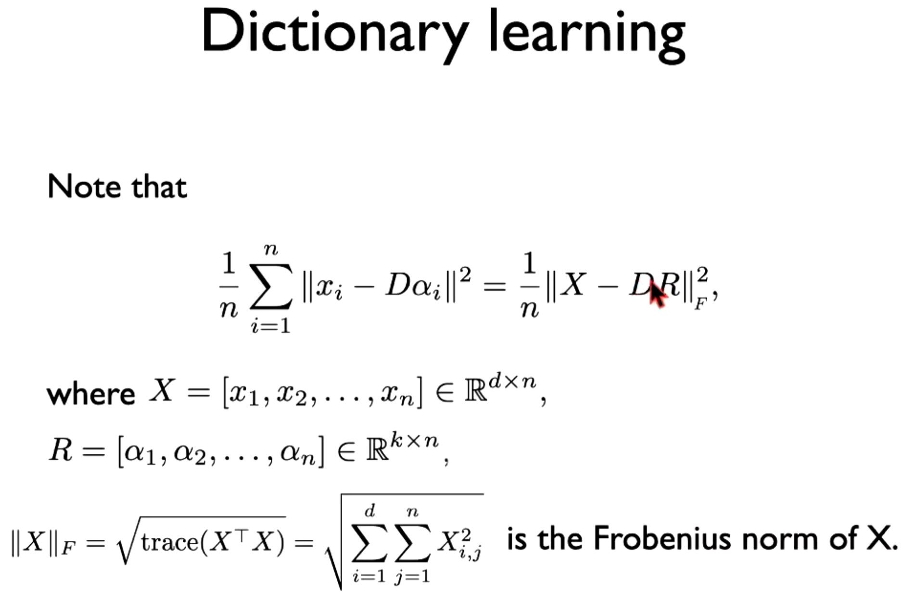

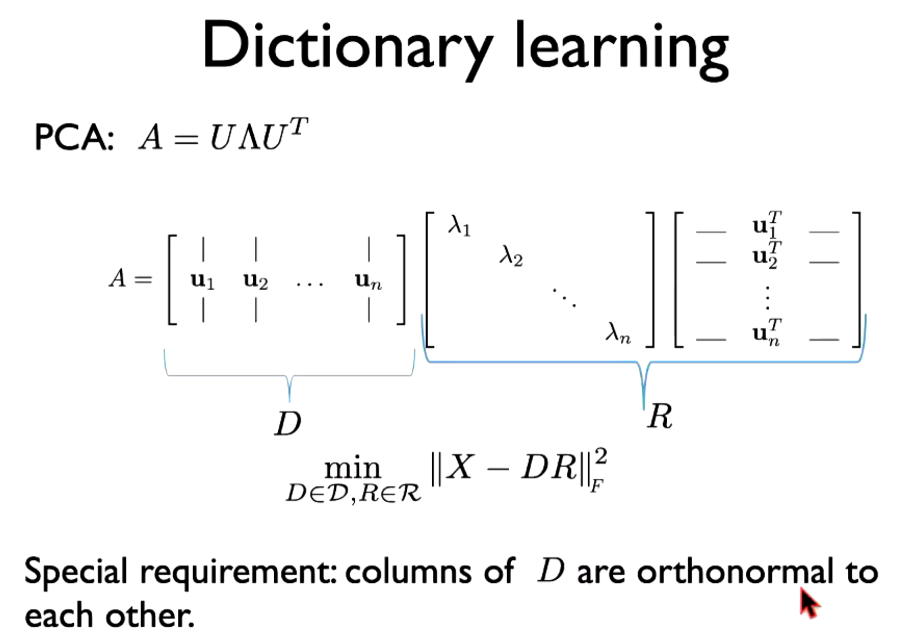

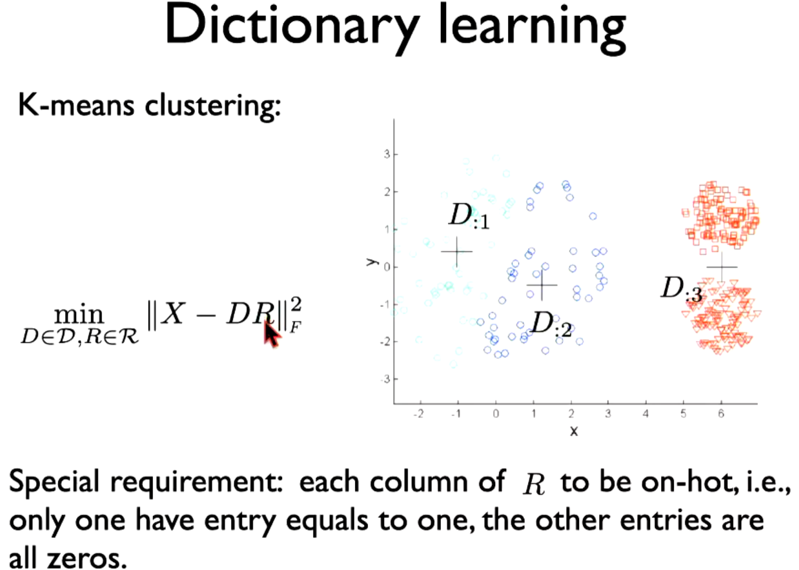

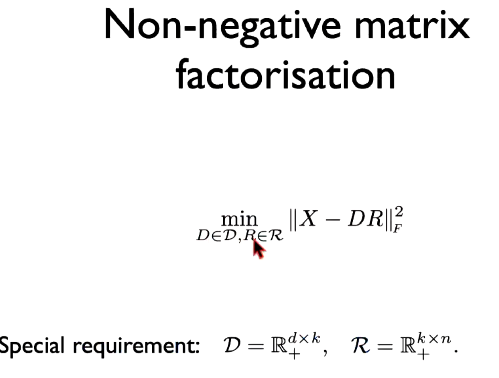

用 **字典 D** 和 **系数 R** 去近似数据矩阵 X，
 不同任务（PCA / K-means / NMF）只是在 D、R 上加了不同的 **special requirement（特殊约束）**。”

| 方法                        | 对 D 的约束                       | 对 R 的约束                   | 含义                 |
| --------------------------- | --------------------------------- | ----------------------------- | -------------------- |
| **PCA**                     | 列向量正交、单位长度 (D^\top D=I) | 一般无特殊约束（线性投影）    | 用正交基做低维表示   |
| **K-means**                 | 无特殊要求                        | 每列 one-hot（只有一个 1）    | 每点选一个中心       |
| **NMF**                     | 所有元素 ≥ 0                      | 所有元素 ≥ 0                  | 非负加和的“部件表示” |
| **一般字典学习 / 稀疏编码** | 列向量单位范数等                  | 稀疏（L1 正则或限制非零个数） | 每点用少量原子组合   |

### 1. Frobenius 范数在这里的作用到底是什么？

#### 1.1 先记住定义（一句话）

对一个矩阵 $M \in \mathbb{R}^{d \times n}$，Frobenius 范数的平方定义为：

$$
\|M\|_F^2 = \sum_{i=1}^d \sum_{j=1}^n M_{ij}^2.
$$

也就是：

> 把矩阵中 **所有元素全部平方后加起来**。

如果不平方，而是再开根号，就是通常的 Frobenius 范数本身：

$$
\|M\|_F = \sqrt{\sum_{i=1}^d \sum_{j=1}^n M_{ij}^2},
$$

但在优化问题里，几乎总是使用平方形式 $\|M\|_F^2$，因为这样求导更方便。

---

#### 1.2 在字典学习里的 Frobenius 范数

在 slide 里，我们有残差矩阵：

$$
M = X - D R.
$$

第 $i$ 列就是单个样本的重构误差：

$$
M_{\cdot i} = x_i - D \alpha_i,
$$

其中 $x_i$ 是第 $i$ 个样本，$\alpha_i$ 是对应的稀疏系数向量（$R$ 的第 $i$ 列）。

之前写的目标函数是：

$$
\frac{1}{n} \sum_{i=1}^n \|x_i - D \alpha_i\|_2^2.
$$

注意：

- $\|x_i - D\alpha_i\|_2^2$ 是 **第 $i$ 列残差向量的平方 $2$ 范数**；
- “把所有列误差加起来”就是：

  $$
  \sum_{i=1}^n \|M_{\cdot i}\|_2^2 = \|M\|_F^2.
  $$

因此有：

$$
\frac{1}{n} \sum_{i=1}^n \|x_i - D\alpha_i\|_2^2
= \frac{1}{n} \|X - D R\|_F^2.
$$

---

#### 1.3 回答你的问题 1

> Frobenius 范数有什么作用？用来衡量重构后的和原矩阵的差距吗？作用是把之前和每个 $\alpha_i$ 相关的值，变成了统一的每一列的平方和吗？

可以分成两个“作用”来理解：

**作用 1：误差度量**

$$
\|X - D R\|_F^2
$$

就是 “**所有样本重构误差的平方和**”，当然就在衡量重构后的 $DR$ 和原矩阵 $X$ 的差距有多大。

**作用 2：记号统一 + 推导方便**

原来是

$$
\sum_{i=1}^n \|x_i - D \alpha_i\|_2^2,
$$

这是“很多列向量误差的和”。

利用 Frobenius 范数，可以统一写成一个矩阵的范数：

$$
\sum_{i=1}^n \|x_i - D \alpha_i\|_2^2 = \|X - D R\|_F^2.
$$

这样记号更简洁，**后面做矩阵推导、求导会方便很多**。

你说的“把之前和每个 $\alpha_i$ 相关的值变成了统一的每一列的平方和”，本质上就是这句话：

> 列误差平方和 = 残差矩阵的 Frobenius 范数平方。

---

### 2. Frobenius 范数的 “trace 写法” 在干嘛？

slide 写的是（其实少了一个平方或根号，容易误导）：

$$
\|X\|_F = \operatorname{trace}(X^\top X) = \sum_{i=1}^d \sum_{j=1}^n X_{ij}^2,
$$

更常用、也更准确的是 **平方形式**：

$$
\|X\|_F^2 = \operatorname{trace}(X^\top X)
= \sum_{i=1}^d \sum_{j=1}^n X_{ij}^2.
$$

你不理解的关键主要有两个：

1. 什么是 $\operatorname{trace}$（迹）？
2. 为什么 $\operatorname{trace}(X^\top X)$ 会等于“所有元素平方和”？

下面用一个小例子 + 推导完整说明。

---

#### 2.1 trace 是什么？

对一个方阵 $A \in \mathbb{R}^{m \times m}$，

$$
\operatorname{trace}(A) = \sum_{i=1}^m A_{ii},
$$

也就是 **对角线元素的和**。

例子：

$$
A =
\begin{bmatrix}
1 & 2 \\
3 & 4
\end{bmatrix},
\qquad
\operatorname{trace}(A) = 1 + 4 = 5.
$$

就这么简单。

---

#### 2.2 为什么要看 $X^\top X$？它是什么矩阵？

假设：

$$
X \in \mathbb{R}^{d \times n},
$$

则它的转置是：

$$
X^\top \in \mathbb{R}^{n \times d},
$$

所以：

$$
X^\top X \in \mathbb{R}^{n \times n}.
$$

slide 上写 “$X^\top X$ 是 $n \times n$” 只是 **提醒你矩阵尺寸**，没有别的隐含意思。

更重要的是：

$$
X^\top X
$$

的含义其实是“**各列之间的内积矩阵**”，也叫 **Gram matrix**。

记 $X$ 的第 $p$ 列为 $x_p$，那么 $X^\top X$ 的第 $(p,q)$ 个元素是：

$$
(X^\top X)_{pq}
= \sum_{i=1}^d X_{ip} X_{iq}
= x_p^\top x_q.
$$

也就是说，第 $(p,q)$ 个元素就是 **第 $p$ 列和第 $q$ 列的点积**。

特别地，对角线元素（$p = q$）时：

$$
(X^\top X)_{pp}
= \sum_{i=1}^d X_{ip}^2
= \|x_p\|_2^2,
$$

也就是 **第 $p$ 列向量 $x_p$ 的平方长度**。

因此，$X^\top X$ 的对角线就是：

$$
\big(\,\|x_1\|_2^2,\ \|x_2\|_2^2,\ \dots,\ \|x_n\|_2^2\,\big).
$$

---

#### 2.3 用这一点来算 $\operatorname{trace}(X^\top X)$

由上面的分析，有：
$$
\operatorname{trace}(X^\top X)
= \sum_{p=1}^n (X^\top X)_{pp}
= \sum_{p=1}^n \sum_{i=1}^d X_{ip}^2.
$$

交换求和顺序，可以写成：

$$
\operatorname{trace}(X^\top X)
= \sum_{i=1}^d \sum_{p=1}^n X_{ip}^2.
$$

而这一项正好就是

$$
\sum_{i=1}^d \sum_{j=1}^n X_{ij}^2
= \|X\|_F^2.
$$

于是得到：

$$
\|X\|_F^2
= \sum_{i=1}^d \sum_{j=1}^n X_{ij}^2
= \operatorname{trace}(X^\top X).
$$

——这就是 slide 那句话的来龙去脉。

**直观翻译：**

- $X^\top X$ 把每一列之间都做了内积；
- 对角线是“每一列和自己做内积” = 每一列的向量长度平方；
- 把这些对角线加起来，就是所有列长度平方的和；
- 而“所有列长度平方的和” = “所有元素平方和”，正是 Frobenius 范数的平方。

---

#### 2.4 用一个 $2 \times 2$ 的具体数字例子算一遍

令

$$
X =
\begin{bmatrix}
1 & 2 \\
3 & 4
\end{bmatrix}.
$$

**方法 1：直接用定义算 Frobenius 范数**

$$
\|X\|_F^2
= 1^2 + 2^2 + 3^2 + 4^2
= 1 + 4 + 9 + 16
= 30.
$$

**方法 2：用 $\operatorname{trace}(X^\top X)$ 来算**

先算转置：

$$
X^\top =
\begin{bmatrix}
1 & 3 \\
2 & 4
\end{bmatrix}.
$$

然后计算乘积 $X^\top X$：

$$
X^\top X
=
\begin{bmatrix}
1 & 3 \\
2 & 4
\end{bmatrix}
\begin{bmatrix}
1 & 2 \\
3 & 4
\end{bmatrix}
=
\begin{bmatrix}
1\cdot 1 + 3\cdot 3 & 1\cdot 2 + 3\cdot 4 \\
2\cdot 1 + 4\cdot 3 & 2\cdot 2 + 4\cdot 4
\end{bmatrix}
=
\begin{bmatrix}
10 & 14 \\
14 & 20
\end{bmatrix}.
$$

取 trace：

$$
\operatorname{trace}(X^\top X)
= 10 + 20
= 30.
$$

恰好和上面

$$
\|X\|_F^2 = 30
$$

完全一致。

这个具体例子告诉你：  
“$\operatorname{trace}(X^\top X) = \|X\|_F^2$” 真的成立，不只是抽象公式。

---

#### 2.5 为什么要写成 trace 形式，有什么好处？

你可能会问：

> 既然直接 $\sum X_{ij}^2$ 这么清楚，为什么还要绕一圈写成 $\operatorname{trace}(X^\top X)$ 呢？

主要原因有三个：

**（1）写法更紧凑**

不用写双重求和，直接一行：

$$
\|X\|_F^2 = \operatorname{trace}(X^\top X).
$$

在推导里看起来更干净。

---

**（2）更方便做矩阵求导**

在优化问题里，经常要对某个矩阵变量（比如 $D$、$R$）求导，例如：

$$
\frac{\partial}{\partial D}\ \operatorname{trace}\big((X - D R)^\top (X - D R)\big).
$$

这种 **trace 形式** 有一整套非常好用的矩阵求导规则，比对“双层求和”逐项求导简洁太多，是矩阵微积分里的常规操作。

---

**（3）和内积形式统一**

Frobenius 范数对应的矩阵内积是：

$$
\langle A, B \rangle_F = \operatorname{trace}(A^\top B).
$$

于是：

$$
\|A\|_F^2 = \langle A, A \rangle_F = \operatorname{trace}(A^\top A).
$$

所以，trace 写法在“矩阵空间”里就像向量空间里的内积和范数一样自然。

---

### 3. 再回到你的两个问题，总结一遍

#### 问题 1：Frobenius 范数有什么作用？

- 它是一个矩阵版本的“欧式长度”：

  $$
  \|A\|_F^2 = \sum_{i,j} A_{ij}^2.
  $$

- 在字典学习中，有：

  $$
  \|X - D R\|_F^2
  = \sum_{i=1}^n \|x_i - D \alpha_i\|_2^2,
  $$

  正好是 **所有样本重构误差的平方和**。

- 因此它确实是在衡量“重构后的 $D R$ 和原始数据矩阵 $X$ 的差距”。

- 同时，它把“每个样本一项”的写法统一成“一个矩阵的范数”，让公式更简洁，后续推导更顺畅。

---

#### 问题 2：$\operatorname{trace}(X^\top X)$ 那段到底什么意思？为什么 $X^\top X$ 是 $n \times n$？

- 若 $X \in \mathbb{R}^{d \times n}$，则

  $$
  X^\top \in \mathbb{R}^{n \times d},\quad
  X^\top X \in \mathbb{R}^{n \times n}.
  $$

- $X^\top X$ 的第 $(p,p)$ 个元素是第 $p$ 列向量的平方长度：

  $$
  (X^\top X)_{pp} = \sum_{i=1}^d X_{ip}^2 = \|x_p\|_2^2.
  $$

- $\operatorname{trace}(X^\top X)$ 就是把这些列的平方长度全部加起来：

  $$
  \operatorname{trace}(X^\top X)
  = \sum_{p=1}^n \sum_{i=1}^d X_{ip}^2
  = \sum_{i=1}^d \sum_{j=1}^n X_{ij}^2
  = \|X\|_F^2.
  $$

所以，slide 那句话的意思只是：

> **“Frobenius 范数的平方 = 矩阵元素平方和 = $\operatorname{trace}(X^\top X)$。”**

之所以喜欢用 trace 写法，是因为 **将来做矩阵求导会更方便**，而且和矩阵内积的形式天然统一。

## 2. sparse coding

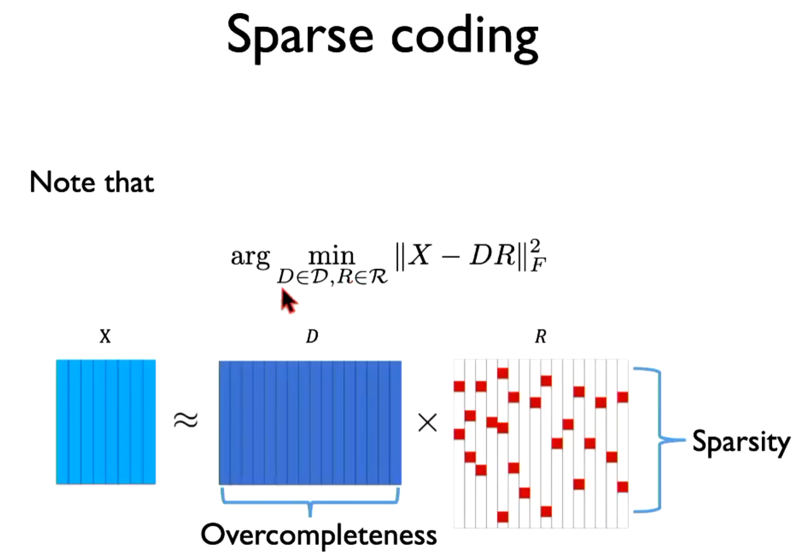

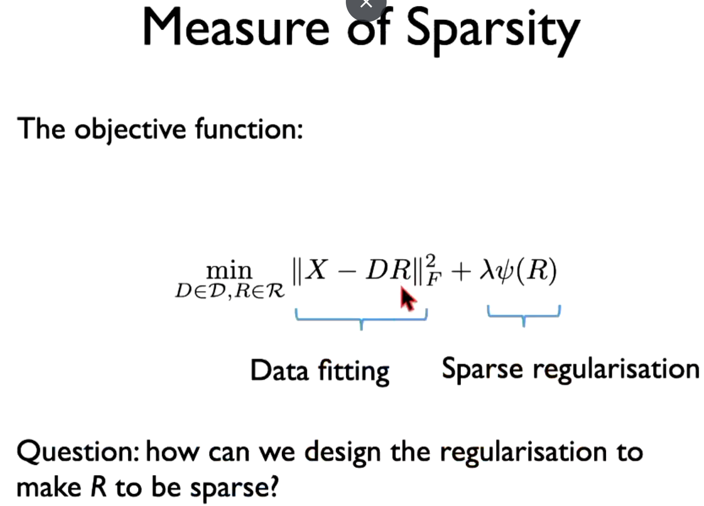

**Overcompleteness（过完备字典）** —— 对D的特点

**Sparsity（稀疏性）** —— 对 R系数矩阵的特点

#### 1.1 Overcompleteness：字典 $D$ 为什么画得“很宽”？

以前在 PCA 里，主成分个数 $k \le d$，所以字典矩阵 $D$ 通常是 $d \times k$，也就是 **列数不大于维度**。

在 sparse coding 里，常见的情况是：

$$
k > d
$$

也就是字典里“原子”（列向量）的个数比输入维度还多，因此称为 **过完备字典（overcomplete dictionary）**。

直观理解：

- 原空间是 $d$ 维；
- 但我们准备了 **更多** 的基向量（$k$ 个，且 $k > d$）；
- 这样每一个样本 $x_i$ 有更多“方向”可以组合，**表达能力更强、更灵活**；
- 代价是：如果不加约束，表示 **不唯一**，也容易 **overfit**。

图上中间那块字典 $D$ 被画得“很宽”，就是在暗示：  
$D$ 的列很多（$k$ 很大） $\Rightarrow$ overcomplete。

---

#### 1.2 Sparsity：$R$ 为什么画得“很多白的，偶尔红点”？

如果字典非常“富”，又不加任何限制，每个样本 $x_i$ 完全可以用很多列同时去组合，对应的系数向量 $\alpha_i$（即 $R$ 的第 $i$ 列）会有很多非零分量。

Sparse coding 的核心想法是：

> 虽然字典很大，但**每个样本只用少数几个字典原子来表示**。

数学上，就是对于每个 $\alpha_i \in \mathbb{R}^k$，希望它的很多分量都是 $0$，只剩很少几个非零分量。  
这就叫“**稀疏表示（sparse representation）**”——$R$ 的每一列都很稀疏。

图上右边的矩阵 $R$：

- 白色表示 $0$；
- 红色小方块表示非零；
- 每一列只有少数几个红点 $\Rightarrow$ 稀疏（sparse）。

---

#### 1.3 这一页的核心信息总结

Sparse coding 仍然是在解一个矩阵重构问题：

$$
\min_{D, R} \;\|X - D R\|_F^2
$$

（重构误差最小化）

和 PCA / K-means / NMF 的不同之处在于：

- 字典 $D$ 可以 **过完备**（列数 $>$ 维度）$\Rightarrow$ Overcompleteness；
- 系数矩阵 $R$ 要 **稀疏**（每列大部分为 $0$）$\Rightarrow$ Sparsity。

这样得到的是：

> “一大堆有意义的小基（$D$ 的列），  
> 每个样本只激活其中几个（$R$ 稀疏）”。

---

### 二、Measure of Sparsity：如何把“稀疏”写进目标函数？

这一页给出了 sparse coding 更完整的优化目标：

$$
\min_{D \in \mathcal{D},\, R \in \mathcal{R}}
\underbrace{\|X - D R\|_F^2}_{\text{Data fitting}}
\;+\;
\lambda\, \underbrace{\psi(R)}_{\text{Sparse regularisation}}
$$

下面标了两个小括号含义：

- 左边 $\|X - D R\|_F^2$：**Data fitting（拟合数据）**
- 右边 $\lambda\,\psi(R)$：**Sparse regularisation（稀疏正则）**

并且提出一个问题：

> “Question: how can we design the regularisation to make $R$ to be sparse?”

也就是：  
**“我们应该怎样设计正则项，才能让 $R$ 变稀疏？”**

---

#### 2.1 为什么仅靠 $\|X - D R\|_F^2$ 不够？

如果目标函数只有：

$$
\min_{D, R}\; \|X - D R\|_F^2,
$$

在 overcomplete（$k > d$）的情况下：

- 对每个样本 $x_i$，你可以随便选很多列来组合；
- 完全可以得到极小的重构误差，但系数向量 $\alpha_i$ 很“密”（非零很多）；
- 优化过程 **并不会“自发”偏向稀疏**。

所以我们要 **显式地告诉优化器**：

> “我不只要重构误差小，还要 $R$ 尽量稀疏。”

于是就引入第二项：$\lambda\,\psi(R)$。

---

#### 2.2 目标函数两部分各干什么？

**数据拟合项（Data fitting）：**

$$
\|X - D R\|_F^2
$$

- 和之前一样，是 **所有样本重构误差的平方和**；
- 希望它越小越好 $\Rightarrow$ 模型能很好地复现 $X$。

**稀疏正则项（Sparse regularisation）：**

$$
\lambda\,\psi(R)
$$

- $\psi(R)$ 是某种“**衡量 $R$ 是否稀疏**”的函数；
- $\lambda > 0$ 是权重（正则化系数）：
  - $\lambda$ 大 $\Rightarrow$ 更重视稀疏性，允许重构误差稍微大一点；
  - $\lambda$ 小 $\Rightarrow$ 更重视重构误差，允许 $R$ 稀疏程度低一些。

直观上就是：

> 损失 = 重构误差 + 稀疏惩罚，  
> 用 $\lambda$ 在“拟合好数据”和“保持稀疏”之间做权衡。

---

#### 2.3 $\psi(R)$ 一般怎么设计才能“逼 $R$ 稀疏”？

这一页只提出了问题，没有展开细节，但典型做法包括：

##### （1）$\ell_0$ “范数”（非零元素个数）

$$
\psi(R) = \|R\|_0
$$

其中 $\|R\|_0$ 表示矩阵中 **非零元素的个数**。

- 对每个系数，只要非零就“加罚”；
- 自然会鼓励很多系数变成 $0$；
- 但 $\ell_0$ 优化是 **NP-hard**，非常难解，通常只能做近似。

##### （2）$\ell_1$ 范数（L1 正则，最常用）

$$
\psi(R) = \|R\|_1 = \sum_{i,j} |R_{ij}|.
$$

和 Lasso 一样，$\ell_1$ 正则会倾向把很多小系数“压成 0”：

- 既鼓励稀疏；
- 又是凸的，更容易优化；
- 实际的 sparse coding 里 **大多采用 $\ell_1$ 正则**。

##### （3）其他更复杂的稀疏形式

例如：

- **Group sparsity（组稀疏）**
- **Structured sparsity（结构化稀疏）** 等等。

这一页只是提前抛出问题：“measure of sparsity 要怎么设计？”，  
后面课程一般会展开讲 $\ell_0 / \ell_1$ 等不同选择及其性质。

---

### 三、把这两页和前面所有内容串起来

到目前为止，可以这样理解整个故事：

#### 3.1 Dictionary learning 的大框架

最基本的形式是：

$$
\min_{D, R} \;\|X - D R\|_F^2,
$$

然后针对不同方法，对 $D, R$ 加不同约束：

- **PCA**：$D^\top D = I$（列正交）
- **K-means**：$R$ 的每列是 one-hot（每个样本只属于一个簇）
- **NMF**：$D, R$ 的元素都非负（Nonnegative Matrix Factorisation）

#### 3.2 Sparse coding 的特征

Sparse coding 的特点是：

- 允许 $D$ **过完备**（列很多，$k > d$）$\Rightarrow$ Overcompleteness；
- 希望每一列 $r_i$（即 $R$ 的列）**很稀疏** $\Rightarrow$ Sparsity。

所以要解的是：

$$
\min_{D, R} \;\|X - D R\|_F^2 + \lambda\,\psi(R),
$$

其中 $\psi(R)$ 用来“衡量稀疏”，常见选择是 $\ell_1$ 范数等。

---

#### 3.3 直观图像回顾

- $X$：原始数据矩阵；
- $D$：很多很多字典原子（小“基”向量，列很多，overcomplete）；
- $R$：每个样本只用其中少量几个原子组合（每列只少数非零，sparse）。

最终效果：

> 用一大堆有意义的小基（$D$）去“拼”出样本，  
> 但每个样本只激活其中少数几个（$R$ 稀疏），  
> 既能很好重构数据，又保持表示简洁、有解释性、相对更鲁棒。

## 3. L norm

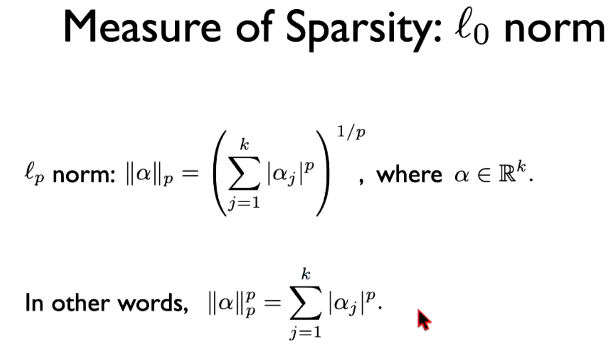

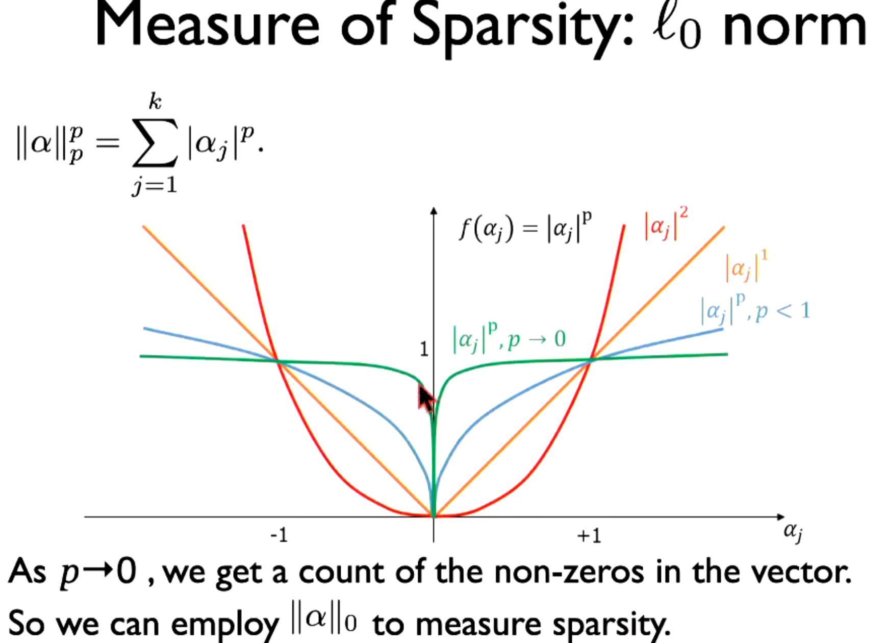

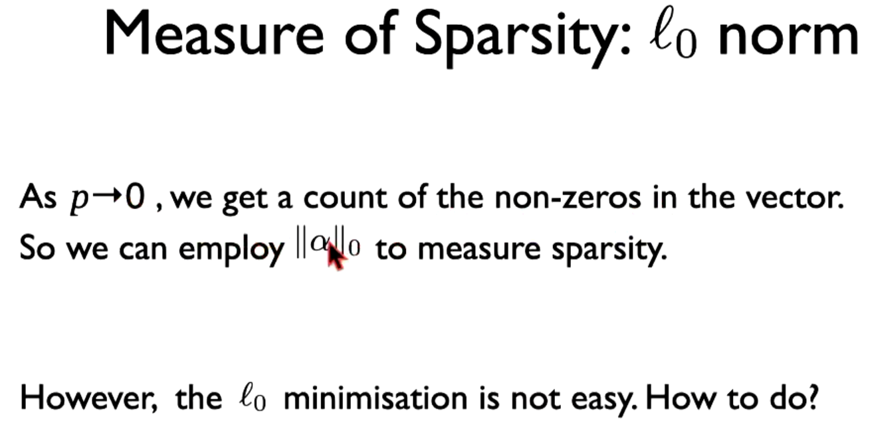

### 一、一般的 $\ell_p$ “范数”是什么？

slide 第一张写的是，对向量 $\alpha \in \mathbb{R}^k$，

$$
\|\alpha\|_p
= \Big( \sum_{j=1}^k |\alpha_j|^p \Big)^{1/p}, \quad p>0,
$$

其中

$$
\alpha = (\alpha_1,\dots,\alpha_k)
$$

是一个 $k$ 维向量，$p>0$ 是一个参数。

---

#### 1.1 常见的特例

- 当 $p = 2$ 时：

  $$
  \|\alpha\|_2
  = \Big( \sum_j \alpha_j^2 \Big)^{1/2},
  \qquad
  \|\alpha\|_2^2 = \sum_j \alpha_j^2
  $$

  这是 **欧几里得范数**（Euclidean norm）。

- 当 $p = 1$ 时：

  $$
  \|\alpha\|_1
  = \sum_j |\alpha_j|
  $$

  这是 **曼哈顿范数**（Manhattan norm）。

- 当 $p = \infty$ 时：

  $$
  \|\alpha\|_\infty
  = \max_j |\alpha_j|
  $$

  这是 **最大绝对值范数**（max norm）。

---

#### 1.2 “第二行”为什么写成 $\|\alpha\|_p^p$？

很多 slide 或文献还会写：

$$
\|\alpha\|_p^p
= \sum_{j=1}^k |\alpha_j|^p.
$$

这只是把“先求范数再 $p$ 次方”写出来而已。  
在很多优化问题里，我们直接用 $\|\alpha\|_p^p$ 做正则项，而**不再写外面的 $1/p$ 次方**，原因是：

- $\|\alpha\|_p^p$ 与 $\|\alpha\|_p$ 表达的是同一类“大小”信息；
- 去掉 $1/p$ 次方，**形式更简单，求导更方便**。

---

### 二、图：$f(\alpha_j)=|\alpha_j|^p$ 随 $p$ 的变化长什么样？

第二张 slide 画的是函数

$$
f(\alpha_j) = |\alpha_j|^p
$$

在不同 $p$ 下的曲线形状。

- **红色：$p=2$**

  $$
  f(\alpha_j) = |\alpha_j|^2
  $$

  是一条光滑的抛物线。

- **橙色：$p=1$**

  $$
  f(\alpha_j) = |\alpha_j|
  $$

  是一个 “V” 字形（绝对值函数）。

- **蓝色：$0 < p < 1$**

  曲线在原点附近变得更尖，更接近：

  > 先在 0 周围“横着”一段，然后离开 0 后突然向上竖起来。

- **绿色：$p \to 0$**

  极端情况下，$f(\alpha_j)$ 几乎变成：

  - 当 $\alpha_j = 0$ 时，$f(\alpha_j)=0$；
  - 只要 $\alpha_j \ne 0$，$f(\alpha_j)$ 都接近 1（几乎是一条水平线）。

所以直观上：

> $p$ 越小，$f(\alpha_j)=|\alpha_j|^p$ 在 $0$ 附近越像一个“开关”：  
> $\alpha_j = 0$ 的地方是 0，  
> $\alpha_j \ne 0$ 的地方都差不多是 1。

---

### 三、为什么 $p \to 0$ 会变成“数非零个数”？——$\ell_0$ 的来历

slide 上的关键句：

> As $p \to 0$, we get a count of the non-zeros in the vector.  
> So we can employ $\|\alpha\|_0$ to measure sparsity.

也就是说：当 $p \to 0$ 时，$\|\alpha\|_p^p$ 的极限就变成了“向量中非零元素的个数”。

---

#### 3.1 从单个分量看极限

先看一个固定的分量 $\alpha_j$。

**情况 1：$\alpha_j = 0$**

$$
|\alpha_j|^p = 0^p = 0, \quad \forall\, p>0,
$$

因此当 $p \to 0$ 时，这一项始终是 0，不会变。

---

**情况 2：$\alpha_j \ne 0$**

$$
|\alpha_j|^p = e^{p \ln |\alpha_j|}.
$$

由于 $\ln |\alpha_j|$ 是一个有限常数，而 $p \to 0$，所以：

$$
\lim_{p \to 0} |\alpha_j|^p
= \lim_{p \to 0} e^{p \ln|\alpha_j|}
= e^0
= 1.
$$

也就是说：

> 只要 $\alpha_j \ne 0$，无论它是 $0.01$ 还是 $1000$，  
> 当 $p \to 0$ 时，$|\alpha_j|^p$ 都趋向于 1。

---

#### 3.2 对整个向量求和

记

$$
\|\alpha\|_p^p
= \sum_{j=1}^k |\alpha_j|^p.
$$

当 $p \to 0$ 时：

- 每个 $\alpha_j = 0$ 的项贡献 $0$；
- 每个 $\alpha_j \ne 0$ 的项贡献 $1$。

于是整个和就变成了：

> “向量中非零元素的个数”。

我们把这个量记作：

$$
\|\alpha\|_0
:= \#\{ j : \alpha_j \ne 0 \}.
$$

这就是所谓的 **$\ell_0$ “范数”**：  
它不是在量“多大”，而是在数“有多少个非零”，非常适合用来衡量“稀疏性”。

---

#### 3.3 一个小数学注意

严格来说，$\|\cdot\|_0$ **不满足范数的齐次性**，例如：

$$
\|2\alpha\|_0 = \|\alpha\|_0,
$$

而真正的范数要求 $\|c\alpha\| = |c| \|\alpha\|$。  
所以从严格数学定义上讲，$\|\cdot\|_0$ 不是一个“真正的 norm”，只是沿着 $\ell_p$ 的记号习惯，大家继续叫它 $\ell_0$。

**结论：**

- $p$ 越小，$\|\alpha\|_p^p = \sum_j |\alpha_j|^p$ 越接近“数非零个数”；
- 极限 $p \to 0$ 时，就得到 $\|\alpha\|_0$；
- 所以 $\|\alpha\|_0$ 是一个 **自然的稀疏性度量**：数值越小 → 非零越少 → 越稀疏。

---

### 四、$\ell_0,\ \ell_1,\ \ell_2$ 在稀疏编码里的角色对比

你的重点是这三个，我们分别说清楚。

---

#### 4.1 $\ell_0$：直接数非零个数（理想但难算）

定义：

$$
\|\alpha\|_0 = \#\{ j : \alpha_j \ne 0 \}.
$$

在 sparse coding 中，如果用 $\ell_0$ 做正则，可以写成：

$$
\min_{D, R} \; \|X - D R\|_F^2
+ \lambda \sum_i \|\alpha_i\|_0,
$$

其中 $\alpha_i$ 是 $R$ 的第 $i$ 列。

含义非常直接：

- 第一项：重构误差 $\|X - DR\|_F^2$ 要小 → 要很好地拟合数据；
- 第二项：$\sum_i \|\alpha_i\|_0$ 要小 → 每个样本用的非零系数个数要尽量少。

这是 **最符合“稀疏”直觉** 的目标，理论上非常好。

**问题：难算**

- $\|\alpha\|_0$ 是“计数函数”，对每个坐标是 0/1 跳变，不连续；
- 优化这个目标本质上是一个 **组合搜索问题**（要在“哪些位置置 0” 的所有组合里选）；
- 一般是 **NP-hard**，只能做启发式搜索或贪心（例如 OMP 等），没有全局最优的高效算法。

因此 slide 才会提：

> However, the $\ell_0$ minimisation is not easy. How to do?

这就引出：**用 $\ell_1$ 来近似 $\ell_0$**。

---

#### 4.2 $\ell_1$：Lasso 型稀疏正则（常用折中方案）

定义：

$$
\|\alpha\|_1
= \sum_{j=1}^k |\alpha_j|.
$$

如果用 $\ell_1$ 做正则：

$$
\min_{D, R} \; \|X - D R\|_F^2
+ \lambda \sum_i \|\alpha_i\|_1.
$$

直观上：

- $\|\alpha\|_1$ 会对所有“绝对值较大”的系数加较大的罚；
- 优化过程中会倾向于把很多“小系数”推到 0，只留下少数较大的 → 得到稀疏解；
- 同时，$\ell_1$ 是 **凸的、连续的**，比 $\ell_0$ 好优化得多（Lasso、Basis Pursuit 都基于此）。

你可以这样记：

- $\ell_0$：直接数非零个数 → **真·稀疏**；
- $\ell_1$：对绝对值求和 → **逼近 $\ell_0$**，能产生许多精确为 0 的分量，是实践中最常用的稀疏正则。

在图上对应的是橙色的 $|\alpha_j|$——比 $|\alpha_j|^2$ 更“尖”，  
对接近 0 的小值惩罚相对更强，更愿意把它们干脆拉到 0。

---

#### 4.3 $\ell_2$：Ridge 型正则（不稀疏，只是“变小”）

定义：

$$
\|\alpha\|_2 = \Big( \sum_j \alpha_j^2 \Big)^{1/2},
\qquad
\|\alpha\|_2^2 = \sum_j \alpha_j^2.
$$

如果用 $\ell_2$ 做正则：

$$
\min_{D, R} \; \|X - D R\|_F^2
+ \lambda \sum_i \|\alpha_i\|_2^2.
$$

效果是：

- 所有系数都会被惩罚变小；
- 但 **很少被精确压到 0**；
- 结果往往是：“每个系数都不算大，但几乎都非零” → dense, not sparse。

几何上：

- $\ell_2$ 的等值线是圆（或球），平滑；
  - 最优点通常落在圆上某个位置，不会自然落在坐标轴上；
- $\ell_1$ 的等值线是菱形，有尖角；
  - 更容易在坐标轴（某些坐标为 0）处取得最小值 → 某些分量变成 0。

---

#### 4.4 三者对比小表（记忆用）

| 正则项           | 典型名字   | 是否鼓励真正稀疏（很多 0） | 优点                     | 缺点                                  |
| ---------------- | ---------- | -------------------------- | ------------------------ | ------------------------------------- |
| $\|\alpha\|_0$   | “L0 正则”  | ✅ 是，直接数非零个数       | 稀疏度定义最精准         | 不连续、非凸，优化非常困难（NP-hard） |
| $\|\alpha\|_1$   | L1 / Lasso | ✅ 强烈鼓励稀疏             | 凸优化，可用成熟算法求解 | 只是 $\ell_0$ 的近似，有时不够稀疏    |
| $\|\alpha\|_2^2$ | L2 / Ridge | ❌ 一般不产生许多精确 0     | 稳定、平滑，能防止过拟合 | 只能让系数变小，不会真正“选特征”      |

---

### 五、把这几张 slide 的逻辑串起来

整体逻辑可以总结为：

1. **先介绍一般的 $\ell_p$ 范数**：

   $$
   \|\alpha\|_p^p = \sum_j |\alpha_j|^p,
   $$

   不同的 $p$，对应不同的几何形状和性质。

2. **画函数 $f(\alpha_j)=|\alpha_j|^p$ 的图**，观察不同 $p$ 的区别：

   - $p=2$：圆润抛物线 → L2，不鼓励稀疏；
   - $p=1$：更尖的 “V” → L1，鼓励稀疏（Lasso）；
   - $0<p<1$：更尖、更像“开关”；
   - $p\to 0$：几乎变成 0/1 开关：$\alpha_j=0$ 时为 0，$\alpha_j\ne 0$ 时接近 1。

3. **极限 $p \to 0$**：

   $$
   \|\alpha\|_p^p
   \xrightarrow[p\to 0]{}\|\alpha\|_0
   = \text{非零元素个数},
   $$

   因此可以用 $\|\alpha\|_0$ 来衡量稀疏性。

4. **问题：$\ell_0$ 最优化太难**：

   - 组合搜索、NP-hard；
   - 实务中不容易直接用。

5. **解决：用 $\ell_1$ 代替 $\ell_0$**：

   - $\ell_1$ 是对 $\ell_0$ 的凸近似；
   - 仍然鼓励稀疏，且可用成熟的凸优化算法求解；
   - 在 sparse coding、Lasso 等模型里广泛使用。

总结一句话：

> 从 $\ell_p$ 出发，随着 $p$ 从 $2 \to 1 \to 0$，  
> 正则从“平滑、不稀疏”$\to$“尖锐、鼓励稀疏”$\to$“直接数非零个数”。  
> 理想世界用 $\ell_0$，现实世界多用 $\ell_1$ 来近似它。

### 一句话先纠正一个核心误解

**“范数”本身是一个函数：从向量映射到数字。**

例如，对同一个向量 $\alpha$，可能有：

- $\|\alpha\|_0 = 3$
- $\|\alpha\|_1 = 5.1$
- $\|\alpha\|_2 \approx 3.6$

它们都是**一个实数**，不会直接把一个向量“变成另一个向量”。

> **“加正则”** 的意思是：  
> 在目标函数中**额外加上一个范数项**，  
> 然后我们重新做一次最小化，  
> 得到一个新的最优解 $a^\star$。  

这个新向量 $a^\star$ 和“不加正则”时的解不一样。  
这种变化是通过“**重新最小化**”产生的，不是“用一个公式把旧向量直接改一改”。

你猜的那种：

- L0 之后 $a$ 变成 $(1, 0, 1, 1)$
- L1 之后 $a$ 变成 $(3, 0, 0, -2)$

其实更像是在说：**“最后得到的新解长成了那样”**，  
而不是“norm 把 $a$ 直接变成了那样”。

下面用一个非常具体的例子，一步一步把这个“过程”展开给你看。

---

### 1. 先设一个“原始解”：不加正则的 $a$

假设我们在只考虑“数据拟合”之后，得到的原始系数向量是：

$$
v = (3,\ 0,\ 0.1,\ -2).
$$

你可以理解为：

> 这是只考虑“重构误差”  
> （比如 $\|X - D R\|_F^2$）  
> 得到的最佳解。

现在，我们要在这个基础上**加正则**，重新求一个更好的 $\alpha$。

为了把正则的作用看得特别清楚，我们考虑这样一个简单模型：

$$
\min_{\alpha \in \mathbb{R}^4}
\Big[
\underbrace{\frac{1}{2}\|\alpha - v\|_2^2}_{\text{逼近原来的 } v}
\;+\;
\lambda \cdot \text{正则项}(\alpha)
\Big].
$$

这可以理解为：

> “$\alpha$ 要尽量靠近原始解 $v$，  
> 但也要满足我们希望的‘小’或‘稀疏’。”

下面我们都取同一个 $\lambda = 1$，分别看看 L2、L1、L0 会得到三个不同的新解 $\alpha^\star$。

---

### 2. L2 正则：所有分量一起缩小，但不太会变成 0

我们考虑 L2 正则（Ridge 型）：

$$
J_{L2}(\alpha)
=
\frac{1}{2}\|\alpha - v\|_2^2
+
\frac{\lambda}{2}\|\alpha\|_2^2,
\quad (\lambda = 1).
$$

写展开一点：

$$
J_{L2}(\alpha)
=
\frac{1}{2}\sum_j (\alpha_j - v_j)^2
+
\frac{1}{2}\lambda \sum_j \alpha_j^2.
$$

可以看到，这个问题**每个分量是独立的**（因为都是平方和）。  
对第 $j$ 个分量，我们要解：

$$
\min_{\alpha_j}
\;\frac{1}{2}(\alpha_j - v_j)^2
+
\frac{1}{2}\lambda \alpha_j^2.
$$

一维二次函数求导即可，最优解为：

$$
\alpha_j^\star = \frac{v_j}{1+\lambda}.
$$

所以当 $\lambda = 1$ 时：

$$
\alpha^\star_{L2}
= \frac{1}{1+1} v
= \frac{1}{2} (3,\ 0,\ 0.1,\ -2)
= (1.5,\ 0,\ 0.05,\ -1).
$$

**观察：**

- 每个分量都按同一个比例缩小了 $\tfrac{1}{2}$；
- 原来是 0 的仍然是 0（第二个分量）；
- $0.1 \to 0.05$，没有被“杀掉”，只是变小了一点。

所以 L2 的效果是：

> “全部缩小，但不稀疏”。  
> 很少会出现精确等于 0 的坐标（除非本来就是 0）。

✅ 这回答了你的一部分疑问：  
L2 正则不会直接把 $(3,0,0.1,-2)$ “公式变换”成一个新向量，  
而是通过重新求最优解，得到  
$\alpha_{L2}^\star = (1.5, 0, 0.05, -1)$ 这么一个新的向量。

---

### 3. L1 正则：把小的推到 0，大的缩小一点

现在看 L1 正则（Lasso 型）：

$$
J_{L1}(\alpha)
=
\frac{1}{2}\|\alpha - v\|_2^2
+
\lambda \|\alpha\|_1,
\quad (\lambda = 1).
$$

写成按分量的形式：

$$
J_{L1}(\alpha)
=
\sum_j \Big[
\frac{1}{2}(\alpha_j - v_j)^2
+
\lambda|\alpha_j|
\Big].
$$

同样可以**按分量拆开**，对每个 $\alpha_j$ 解：

$$
\min_{\alpha_j}
\;\frac{1}{2}(\alpha_j - v_j)^2
+ \lambda|\alpha_j|.
$$

一维情况下，这个问题的最优解是著名的 **soft-thresholding（软阈值）**：

$$
\alpha_j^\star
=
\text{sign}(v_j)\cdot
\max\big(|v_j| - \lambda,\ 0\big).
$$

对我们的 $v=(3,\ 0,\ 0.1,\ -2)$，$\lambda = 1$：

- $v_1 = 3$：

  $$
  \alpha_1^\star
  = \text{sign}(3)\cdot \max(3-1,0)
  = +2.
  $$

- $v_2 = 0$：

  $$
  \alpha_2^\star
  = 0.
  $$

- $v_3 = 0.1$：

  $$
  |0.1| - 1 < 0
  \;\Rightarrow\;
  \alpha_3^\star = 0.
  $$

  👉 这个小系数被直接干掉了。

- $v_4 = -2$：

  $$
  \alpha_4^\star
  = \text{sign}(-2)\cdot \max(2-1, 0)
  = -1.
  $$

所以：

$$
\alpha_{L1}^\star
= (2,\ 0,\ 0,\ -1).
$$

**观察：**

- 大的分量（3、-2）被“减掉一个 $\lambda$”：$3 \to 2$，$-2 \to -1$；
- 非常小的 $0.1$ 被直接压成了 0。

因此 L1 正则的典型效果是：

> “把小的推到 0，把大的缩小一点”  
> → 产生稀疏解。

---

### 4. L0 正则：只关心“开几个灯”，大于阈值的保持原样，其他直接变成 0

现在看 L0 正则（“数非零个数”）：

$$
J_{L0}(\alpha)
=
\frac{1}{2}\|\alpha - v\|_2^2
+
\lambda \|\alpha\|_0,
\qquad
\|\alpha\|_0 = \#\{j : \alpha_j \ne 0\}.
$$

写成按分量的形式：

$$
J_{L0}(\alpha)
=
\sum_j \Big[
\frac{1}{2}(\alpha_j - v_j)^2
+ \lambda \cdot \mathbf{1}_{\alpha_j \ne 0}
\Big].
$$

对每个分量 $\alpha_j$，我们解一维问题：

$$
J_{L0}(\alpha_j)
=
\frac{1}{2}(\alpha_j - v_j)^2
+ \lambda \cdot \mathbf{1}_{\alpha_j \ne 0}.
$$

这个一维问题非常“粗暴”：

- 要么选 $\alpha_j = 0$（完全关闭这一维）；
- 要么选 $\alpha_j = v_j$（保持原来的值，让平方误差为 0）；
- 中间值反而不划算：既有平方误差，又要付 $\lambda$ 的“开灯费”。

所以我们只需要比较两个代价：

**1）关灯：$\alpha_j = 0$**

$$
J(0)
=
\frac{1}{2}(v_j - 0)^2 + 0
=
\frac{1}{2}v_j^2.
$$

**2）开灯：$\alpha_j = v_j$**

$$
J(v_j)
=
\frac{1}{2}(v_j - v_j)^2 + \lambda
=
\lambda.
$$

哪个小就选哪个：

- 若 $\dfrac{1}{2}v_j^2 \le \lambda$：关掉更便宜 $\Rightarrow \alpha_j^\star = 0$；
- 若 $\dfrac{1}{2}v_j^2 > \lambda$：保留原值更便宜 $\Rightarrow \alpha_j^\star = v_j$。

等价写法：

$$
|v_j| \le \sqrt{2\lambda}
\;\Rightarrow\;
\alpha_j^\star = 0;
\qquad
|v_j| > \sqrt{2\lambda}
\;\Rightarrow\;
\alpha_j^\star = v_j.
$$

现在取 $\lambda = 1$，阈值是

$$
\sqrt{2\lambda} = \sqrt{2} \approx 1.414.
$$

对 $v = (3,\ 0,\ 0.1,\ -2)$：

- $v_1 = 3$，$|3| > 1.414$ → 保留 → $\alpha_1^\star = 3$；
- $v_2 = 0$，$|0| \le 1.414$ → 关掉（本来就是 0）→ $\alpha_2^\star = 0$；
- $v_3 = 0.1$，$|0.1| \le 1.414$ → 关掉 → $\alpha_3^\star = 0$；
- $v_4 = -2$，$|-2| > 1.414$ → 保留 → $\alpha_4^\star = -2$。

所以：

$$
\alpha_{L0}^\star
= (3,\ 0,\ 0,\ -2).
$$

你刚才猜的“L1 就变成 $(3,0,0,-2)$”其实更接近 **L0 的效果**（在这个例子和这个 $\lambda$ 下）。

**观察：**

- L0 的行为是“要么完全保留，要么直接归零”，中间值几乎不存在；
- 比 L1 更狠：大分量完全不动，小分量直接杀掉；
- 它真正做的事情是：  
  > “选出少数几个维度保留（开灯），其余全部关掉”。

---

### 5. 回到你的具体疑问，一句句回答

#### （1）“加了正则以后，是 $a$ 本身改变了吗？”

✅ 是的。

加正则之后，我们真正解的是：

$$
a^\star
=
\arg\min_a
\big[
\text{数据误差}(a)
+
\lambda\cdot \text{正则}(a)
\big].
$$

这个新的最小点 $a^\star$，和原来只最小化“数据误差”时的解**不一样**。  
“改变”是通过“重新求最小值”发生的，而不是对旧解套一条简单公式。

---

#### （2）“比如说 L0 norm 对 $a$ 来说就变成了 $(1,0,1,1)$？”

向量 $(1,0,1,1)$ 更像是对原向量的一个**“非零指标向量”**：

- $3 \to 1$（非零）
- $0 \to 0$（零）
- $0.1 \to 1$（非零）
- $-2 \to 1$（非零）

但这 **不是** “L0 norm 的结果”。

- L0 范数本身是一个数：  
  $$\|\alpha\|_0 = 3.$$

在优化问题里，L0 正则会让最终求得的**新解**变成像

$$
(3,\ 0,\ 0,\ -2)
$$

这种“只保留大分量，其余全 0”的向量（当然具体结果还取决于 $\lambda$）。

---

#### （3）“L1 就变成了 $(3,0,0,-2)$？”

在我们这个例子里：

- L1 的解是：  
  $$\alpha_{L1}^\star = (2,\ 0,\ 0,\ -1);$$
- L0 的解才是：  
  $$\alpha_{L0}^\star = (3,\ 0,\ 0,\ -2).$$

对比三者：

- **L0**：大分量不动（3、-2），小的直接杀掉；  
- **L1**：大分量也会变小（3→2，-2→-1），小的也会杀掉（0.1→0）；  
- **L2**：所有分量都按比例缩小（3→1.5，0.1→0.05，-2→-1），**不杀掉小的**。

---

### 6. 再用一句很直观的话总结三者的“过程”

在“从原始解 $v$ 出发，加正则重新求解”的过程中：

- **L2 正则**  
  像在所有系数上**喷了一层水雾**：  
  每个值都缩小一些，但基本都还在，  
  几乎不会被“擦成 0”。

- **L1 正则**  
  像拿**橡皮擦**：  
  小的直接擦成 0，  
  大的擦薄一点但仍然存在，  
  → 得到带很多精确 0 的稀疏解。

- **L0 正则**  
  像“**开灯 / 关灯**”：  
  每开一盏灯就要付一笔钱。  
  要么彻底关掉（设为 0），  
  要么干脆保持原值（不帮你折中），  
  → 最后只保留少数几个“最重要”的灯，其余全部关闭。

真正发生的不是“范数把向量直接改掉”，  
而是：**目标函数变了 → 最优解位置变了 → 新向量自然就跟原来不一样了**。

## 4. MLE

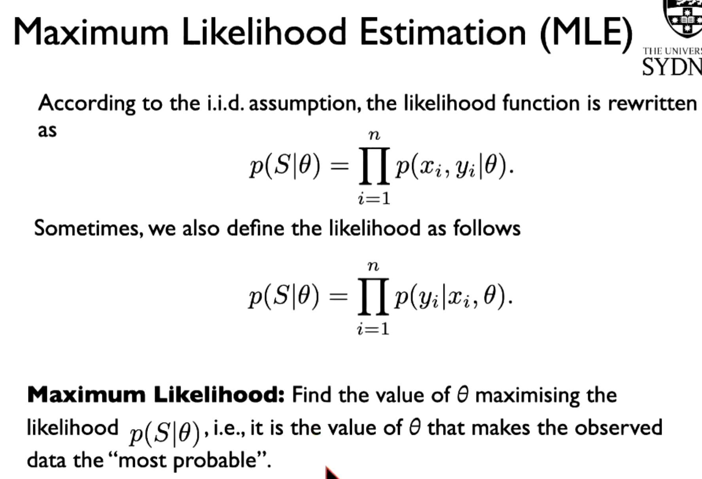

**解答：**

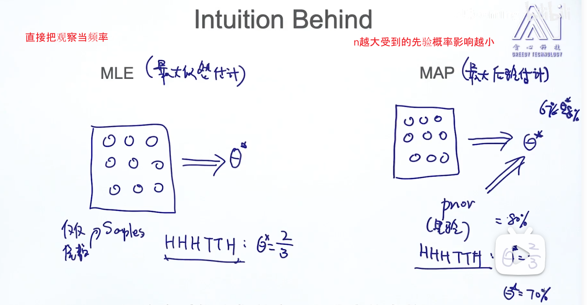

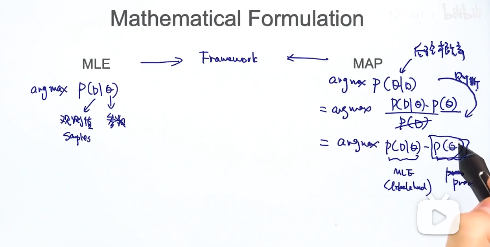

这里的MAP其实就是MLE加了正则，如果θ是高斯分布， 就相当于加了一个l2，如果是laplace分布， 就是加了l1

[非常好的讲解视频MLE和MAP区别](https://www.bilibili.com/video/BV1rU28YyEE8/)

## 5. MAP

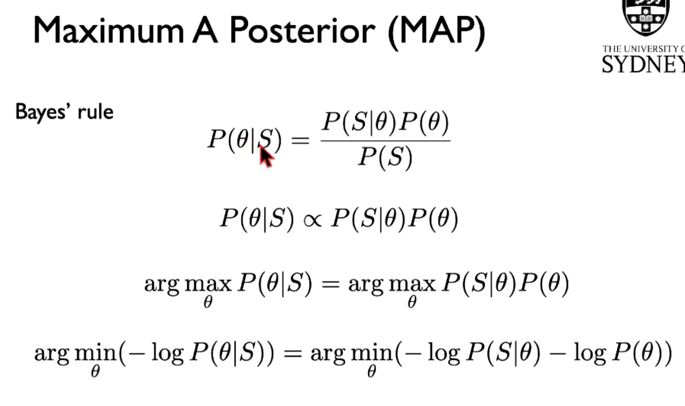

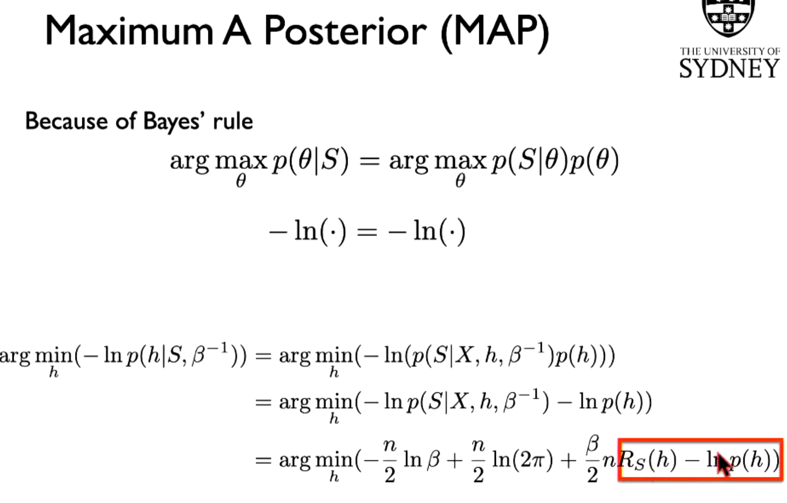

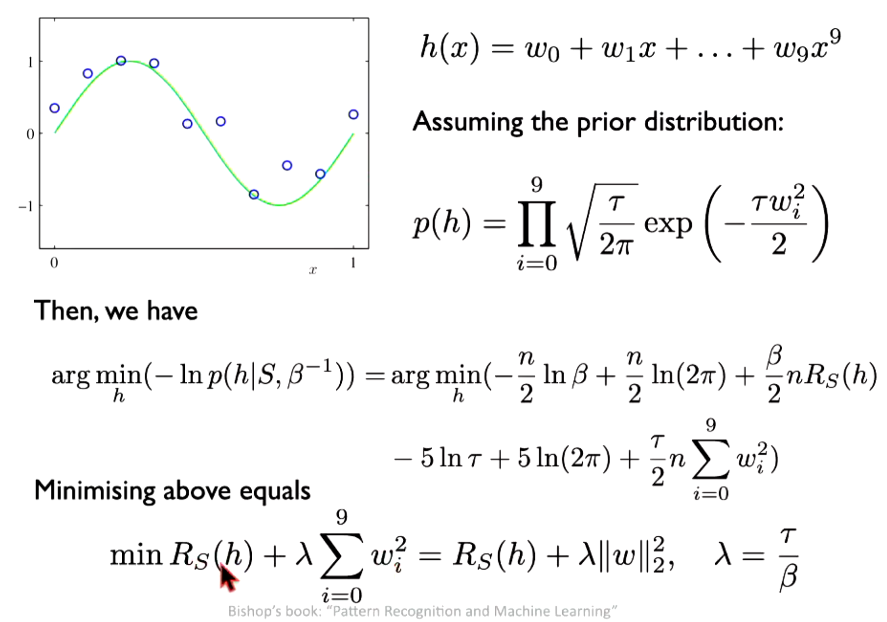

### 二、在机器学习里：什么时候用 MLE？什么时候用 MAP？

其实很多你熟悉的模型，都可以这样归类：

#### 2.1 典型的 “用 MLE” 的情况

**特点：** 不写先验，不写正则；目标 = 似然最大 / NLL 最小。

例子：

- 传统逻辑回归 / softmax 回归（**不加** L2/L1 正则的时候）。
- 大多数教科书里的朴素贝叶斯、高斯判别分析等 generative model。
- 深度学习里，“交叉熵损失 + SGD” 本质上就是在做 MLE：

$$
\min_{\theta} \; - \sum_i \log p_\theta(y_i \mid x_i)
$$

**适用场景：**

- 数据量比较大，容易“用数据本身就压住噪声”；
- 你没有很明确的先验偏好；
- 想要一个无偏的、渐近一致的估计（在数学理论里好证明）。

---

#### 2.2 典型的 “用 MAP” 的情况

**特点：** 你在 loss 旁边加了正则项，本质上就是 MAP。

比如：

**带 L2 正则的逻辑回归 / 线性回归（Ridge）：**

$$
\min_{w}
\left(
\underbrace{\sum_i \ell\big(y_i, f_w(x_i)\big)}_{\text{数据损失}}
+
\underbrace{\lambda \|w\|_2^2}_{\text{L2 正则}}
\right)
$$

这等价于假设：

$$
w \sim \mathcal{N}(0, \sigma^2 I)
$$

的高斯先验，在这个先验下做 MAP。

**带 L1 正则的模型（Lasso, L1 logistic）：**

- 对应给权重一个 Laplace（双指数）先验，做 MAP。

**稀疏编码 / 字典学习里加的** $\lambda \|\alpha\|_1$，本质上也是 MAP 的思想。

---

**适用场景：**

- 数据量不算特别大，风险过拟合 → 需要正则；
- 你对参数有一些**结构性先验**：
  - 权重应该比较小、比较平滑（→ L2）；
  - 大部分权重应该为 0，希望稀疏（→ L1 / L0）；
- 想把“先验知识”放进模型，而不仅仅依赖数据。

> 一句简单记忆：
>
> 👉 “只用 loss” = **MLE**  
> 👉 “loss + 正则” = **MAP**（在对应的先验下）

---

#### 2.3 那我到底用哪个？

在实际 ML 里，其实是这样：

- 如果你**不写先验 / 正则**，默认就是在做 **MLE**。
- 但几乎所有实践中的“好”模型，都会加正则、权重衰减、先验等 → 实际上都是在做 **MAP**。

所以更实用的判断：

- **大样本 & 先验不强：** 直接 MLE（即普通的最小化损失）就够用了。
- **小样本 / 高维 / 容易过拟合：** 一定要用 MAP，也就是加正则。
- 你对参数有很强的**结构性先验**（稀疏、非负、平滑、分组等）：  
  更应该用 MAP，并精心设计先验 / 正则。

---

### 三、详细解释这 3 张 MAP 的 slides

下面按顺序逐行解释。

#### 3.1 第一张：Bayes rule + MAP 目标形式

这一页在做两件事：

1. 写出 Bayes 公式；
2. 把“最大化后验”写成“最小化负 log 后验”。

##### (1) Bayes rule

$$
P(\theta \mid S)
=
\frac{P(S \mid \theta)\, P(\theta)}{P(S)}
$$

- $P(\theta)$：先验（我们事先对参数的看法）；
- $P(S \mid \theta)$：似然（当前数据在参数 $\theta$ 下出现的概率）；
- $P(\theta \mid S)$：后验（看到数据后，我们对 $\theta$ 的更新信念）；
- $P(S)$：归一化常数（和 $\theta$ 无关）。

常用的比例写法：

$$
P(\theta \mid S) \propto P(S \mid \theta) P(\theta).
$$

##### (2) MAP 的 argmax

$$
\theta_{\text{MAP}}
=
\arg\max_{\theta} P(\theta \mid S)
=
\arg\max_{\theta} P(S \mid \theta) P(\theta).
$$

因为 $P(S)$ 跟 $\theta$ 无关，所以在 $\arg\max$ 里可以直接丢掉。

##### (3) 取负 log，变成最小化问题

$$
\theta_{\text{MAP}}
=
\arg\max_{\theta} P(\theta \mid S)
=
\arg\min_{\theta} \big[-\log P(\theta \mid S)\big].
$$

利用：

$$
\log P(\theta \mid S)
= \log P(S \mid \theta)
+ \log P(\theta)
+ \text{常数}
$$

得到：

$$
\theta_{\text{MAP}}
=
\arg\min_{\theta}
\Big[
-\log P(S \mid \theta)
-
\log P(\theta)
\Big].
$$

这就直接对应你脑子里的那句：

- 第一项：数据 fitting（比如平方误差、交叉熵）；
- 第二项：先验惩罚（= 正则化）。

---

#### 3.2 第二张：把 MAP 写成 “经验风险 + 正则项”

这里变量名从 $\theta$ 换成了 $h$（模型/假设），并引入了一个 $\beta^{-1}$（噪声方差的参数）。我们一步一步看。

##### (1) 上半部分：Bayes 形式保持不变

$$
\arg\max_{\theta} p(\theta \mid S)
=
\arg\max_{\theta} p(S \mid \theta)\, p(\theta).
$$

用 $-\ln(\cdot)$ 是在提示：  
**最大化概率 ⇔ 最小化负 log 概率**，只是单调变换。

##### (2) 换成 $h$ 和具体的 $S, X, \beta$

写成：

$$
\arg\min_h \big[-\ln p(h \mid S, \beta^{-1})\big].
$$

根据 Bayes 公式：

$$
p(h \mid S, \beta^{-1})
\propto
p(S \mid X, h, \beta^{-1}) \, p(h),
$$

所以：

$$
\begin{aligned}
\arg\min_h \big[-\ln p(h \mid S, \beta^{-1})\big]
&=
\arg\min_h
\big[-\ln\big(p(S \mid X, h, \beta^{-1}) p(h)\big)\big] \\
&=
\arg\min_h
\big[-\ln p(S \mid X, h, \beta^{-1}) - \ln p(h)\big].
\end{aligned}
$$

这一行就是 slide 里那句：

> $\arg\min_h(-\ln p(h\mid S,\beta^{-1}))  
> = \arg\min_h(-\ln p(S\mid X,h,\beta^{-1}) - \ln p(h))$

##### (3) 把高斯噪声的 log-likelihood 展开

假设是高斯回归模型：

$$
y_i = h(x_i) + \epsilon_i,
\quad
\epsilon_i \sim \mathcal{N}(0, \beta^{-1}).
$$

那么：

$$
p(S \mid X, h, \beta^{-1})
=
\prod_{i=1}^n
\left[
\left(\frac{\beta}{2\pi}\right)^{1/2}
\exp\left(
-\frac{\beta}{2} (y_i - h(x_i))^2
\right)
\right].
$$

取负 log：

$$
\begin{aligned}
-\ln p(S \mid X, h, \beta^{-1})
&=
-\sum_{i=1}^n
\left[
\frac{1}{2}\ln\frac{\beta}{2\pi}
-
\frac{\beta}{2}(y_i - h(x_i))^2
\right] \\
&=
-\frac{n}{2}\ln \beta
+ \frac{n}{2}\ln(2\pi)
+ \frac{\beta}{2}\sum_{i=1}^n (y_i - h(x_i))^2.
\end{aligned}
$$

如果定义经验平方误差（经验风险）：

$$
R_S(h)
=
\frac{1}{n}\sum_{i=1}^n (y_i - h(x_i))^2,
$$

则有：

$$
-\ln p(S \mid X, h, \beta^{-1})
=
-\frac{n}{2}\ln \beta
+ \frac{n}{2}\ln(2\pi)
+ \frac{\beta n}{2} R_S(h).
$$

这就是 slide 中那一长串公式的简洁写法。

于是 MAP 的目标变成：

$$
\arg\min_h
\left(
-\frac{n}{2}\ln \beta
+ \frac{n}{2}\ln(2\pi)
+ \frac{\beta n}{2} R_S(h)
- \ln p(h)
\right).
$$

其中前两项是与 $h$ 无关的常数，在 $\arg\min$ 里可以扔掉，留下的就是“红框部分”：

$$
\arg\min_h
\left(
\frac{\beta n}{2} R_S(h)
- \ln p(h)
\right).
$$

也就是你看到的那一块：

$$
\frac{\beta n}{2} R_S(h) - \ln p(h).
$$

**重要解释：**

- $R_S(h)$：经验风险（数据误差）；
- $-\ln p(h)$：先验惩罚。

所以：

> **MAP = “经验风险 + 先验惩罚”**，差一个常数因子（不影响最优解）。

---

#### 3.3 第三张：具体到“高斯先验” ⇒ L2 正则（Ridge）

这页是一个具体例子：**多项式回归 + 高斯先验**，推到 **岭回归 (Ridge)** 的目标函数。

##### (1) 模型形式

右上角：

$$
h(x)
=
w_0 + w_1 x + \dots + w_9 x^9.
$$

也就是 9 次多项式回归，参数是 $w_0, \dots, w_9$。

##### (2) 先验：给每个 $w_i$ 高斯先验

假设：
$$
p(h)
=
\prod_{i=0}^9
\left[
\left(\frac{\tau}{2\pi}\right)^{1/2}
\exp\left(-\frac{\tau}{2}w_i^2\right)
\right].
$$

可以理解为：我们**先验相信权重应该靠近 0**，太大的权重不太合理。  
$\tau$ 越大，这个高斯分布越“窄”，惩罚权重大的力度越大。

取负 log：

$$
\begin{aligned}
-\ln p(h)
&=
\sum_{i=0}^9
\left[
-\frac{1}{2}\ln\frac{\tau}{2\pi}
+
\frac{\tau}{2}w_i^2
\right] \\
&=
-5\ln \tau
+ 5\ln(2\pi)
+
\frac{\tau}{2}\sum_{i=0}^9 w_i^2.
\end{aligned}
$$

前两项是常数，可以忽略；关键是里面出现了：

$$
\frac{\tau}{2}\sum_{i=0}^9 w_i^2.
$$

##### (3) 代回前一页的 MAP 目标

上一页得到：

$$
\arg\min_h
\left(
\frac{\beta n}{2} R_S(h)
- \ln p(h)
\right).
$$

把 $-\ln p(h)$ 展开后，再把所有与 $h$ 无关的常数丢掉，得到：

$$
\arg\min_h
\left(
\frac{\beta n}{2} R_S(h)
+
\frac{\tau}{2}\sum_{i=0}^9 w_i^2
\right).
$$

两边都除以 $\frac{\beta n}{2}$，把系数合并成

$$
\lambda = \frac{\tau}{\beta},
$$

就得到最后一行：

$$
\min_h
\left[
R_S(h)
+
\lambda \sum_{i=0}^9 w_i^2
\right],
\qquad
\text{where } \lambda = \frac{\tau}{\beta}.
$$

这就是：

> **经验风险 + L2 正则 = 岭回归 (Ridge Regression)**

**关键结论：**

- 假设噪声是高斯：$\epsilon \sim \mathcal{N}(0, \beta^{-1})$；
- 假设权重 $w_i$ 有高斯先验：$w_i \sim \mathcal{N}(0, \tau^{-1})$；
- 做 MAP ⇒ 等价于最小化

  $$
  R_S(h) + \lambda \|w\|_2^2.
  $$

也就是我们在机器学习课里学过的**“平方误差 + L2 正则”**。

---

### 小小总结收尾

你现在的理解是对的：

- **MLE：** 只看数据，最大化 $p(S \mid \theta)$。
- **MAP：** 看数据 + 先验，最大化 $p(\theta \mid S)$，等价于最小化

  $$
  -\log p(S \mid \theta) - \log p(\theta)
  = \text{损失} + \text{正则}.
  $$

在机器学习里：

- “**不加正则的 loss 最小化**” ≈ **MLE**；
- “**loss + 正则**” = **MAP**（在某个先验下）；

实战中，为了防过拟合，我们**几乎总是在做 MAP**，只是很多时候不会刻意说“这是 MAP”。

这 3 张 slide：

1. 第一张：从 Bayes 公式推到 MAP 的一般形式（**后验最大化 ⇔ NLL + 先验**）。
2. 第二张：对高斯回归模型，把 MAP 展开成 “经验风险 $R_S(h)$ + 先验惩罚 $-\ln p(h)$”。
3. 第三张：具体选高斯先验 $p(h)$，就得到  
   “$R_S(h) + \lambda \|w\|_2^2$” 这种 **岭回归 (Ridge)** 形式。

## 6. optimality criterion

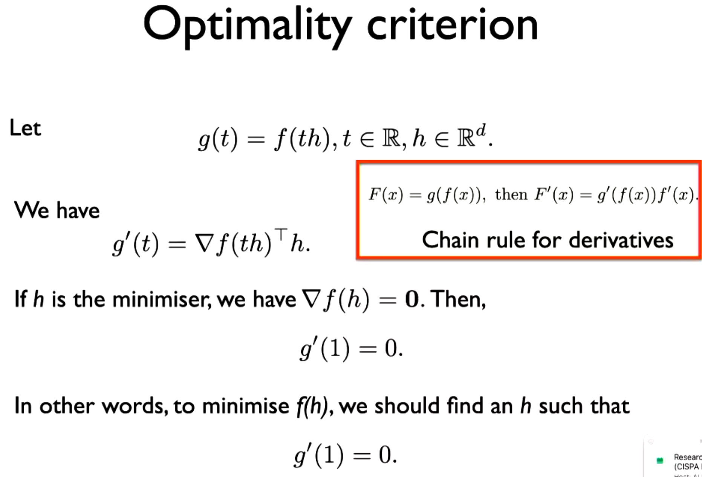

  ### 一、Optimality criterion 这页在干嘛？

#### 1.1 先看定义

他们定义了一个一维函数：

$$
g(t) = f(t h), \quad t \in \mathbb{R},\ h \in \mathbb{R}^d.
$$

- $f(h)$：原来的目标函数，变量是 $d$ 维向量 $h$（比如模型参数向量）。
- $g(t)$：把方向固定成 $h$，只让一个标量 $t$ 来决定“走到哪儿”。

当：

- $t = 0$：在原点，点是 $0$。
- $t = 1$：点就是我们关注的 $h$。
- $t = 2$：点是 $2h$，就是往同一方向再走远一点。

所以 $g(t)$ 就是沿着“从原点朝 $h$ 的射线”上的一维函数。

直觉：我们先把 $d$ 维问题“压缩”成在某一条直线方向上的一维问题，方便用一维微积分（导数）来分析。

---

#### 1.2 用链式法则算导数：$g'(t) = \nabla f(th)^\top h$

右边图框里写的是一维链式法则：

若
$$
F(x) = g(f(x)),
$$
则
$$
F'(x) = g'(f(x)) \, f'(x).
$$

现在把它类比到我们的
$$
g(t) = f(t h)
$$
上：

- 外层：$f(\cdot)$，从 $\mathbb{R}^d \to \mathbb{R}$；
- 里层：$t h$，从 $\mathbb{R} \to \mathbb{R}^d$。

对 $t$ 求导时，用多元函数的链式法则：

$$
g'(t)
= \nabla f(t h)^\top \frac{d(t h)}{dt}.
$$

而 $t h$ 对 $t$ 的导数就是向量 $h$，所以：

$$
g'(t) = \nabla f(t h)^\top h.
$$

这其实就是**沿着方向 $h$ 的方向导数**，只是用 $g'(t)$ 的形式写了出来。

---

#### 1.3 为什么是 $g'(1)$？1 代表什么？

如果 $h^\*$ 是最优解（minimiser），那么必然有一阶必要条件：

$$
\nabla f(h^\*) = 0.
$$

现在把 $t = 1$ 代入上面的公式：

$$
g'(1)
= \nabla f(1 \cdot h)^\top h
= \nabla f(h)^\top h.
$$

如果 $h = h^\*$ 是最优点，那么 $\nabla f(h^\*) = 0$，于是：

$$
g'(1)
= \nabla f(h^\*)^\top h^\*
= 0.
$$

所以：

> 在最优解 $h^\*$ 上，沿着“缩放方向” $t$ 在 $t=1$ 的导数为 0。

也就是说：  
我们把“在 $h$ 处梯度为 0”翻译成了：

> 沿着从原点到 $h$ 那条线看一维函数 $g(t)$，在 $t = 1$ 处导数为 0。

为什么不写 $g'(0)$ 呢？因为：

- $t = 1$ 对应的正是我们关心的那个点 $h$；
- $t = 0$ 对应的点是**原点** $0$，不是我们要的模型参数。

总结一下：

在 $g(t) = f(t h)$ 中，

- $t$ 表示“把参数 $h$ 放大/缩小多少倍”；
- $t = 1$ 就是“不缩放”，对应原本的 $h$。

所以要检查“在 $h$ 这里是否最优”，就得看 $g'(1)$ 是否为 0。

---

### 二、Surrogate loss function robustness 这一页怎么来的？

现在把这个“小技巧”用在监督学习的损失函数上，看看不同 loss 的 $g'(1)$ 形式，从而分析“鲁棒性”（对异常点的敏感程度）。

#### 2.1 一般形式：用残差 $r_i = y_i - h(x_i)$

假设我们做回归或类似的任务，有数据 $(x_i, y_i)$，损失函数写成：

$$
f(h) = \frac{1}{n} \sum_{i=1}^n \rho\bigl(y_i - h(x_i)\bigr).
$$

- $\rho(\cdot)$：点损失（penalty），比如平方、绝对值、Cauchy 等；
- $r_i = y_i - h(x_i)$：第 $i$ 个样本的残差（预测误差）。

现在按上一页的套路，定义：

$$
g(t) = f(t h)
= \frac{1}{n} \sum_{i=1}^n \rho\bigl(y_i - t\,h(x_i)\bigr).
$$

对 $t$ 求导（链式法则）：

$$
\begin{aligned}
g'(t)
&= \frac{1}{n} \sum_{i=1}^n \rho'\bigl(y_i - t\,h(x_i)\bigr)
\cdot \frac{d}{dt}\bigl(y_i - t\,h(x_i)\bigr) \\
&= \frac{1}{n} \sum_{i=1}^n \rho'\bigl(y_i - t\,h(x_i)\bigr)
\cdot \bigl(-h(x_i)\bigr).
\end{aligned}
$$

特别地，在我们关心的 $t = 1$ 处：

$$
g'(1)
= \frac{1}{n} \sum_{i=1}^n \rho'\bigl(y_i - h(x_i)\bigr)
\bigl(-h(x_i)\bigr).
$$

这就是下面每一种损失的通式来源。

要让 $h$ 成为候选最优解，必须让 $g'(1) = 0$。  
也就是说：**加权后的残差对模型的“合力”为 0**，这里“权重”就是 $\rho'(r_i)$。

不同的 $\rho$ 给的权重不一样  
$\Rightarrow$ 对“离群点”的影响不同  
$\Rightarrow$ 鲁棒性不同。

---

#### 2.2 对应到 slide 里的四种损失

下面把每一行的式子推出来，你就能完全对上号。

---

##### ① Least square loss（平方损失）

$$
\rho(r) = r^2, \quad \rho'(r) = 2r.
$$

代入一般式：

$$
\begin{aligned}
g'(1)
&= \frac{1}{n} \sum_{i=1}^n 2\bigl(y_i - h(x_i)\bigr)
\bigl(-h(x_i)\bigr).
\end{aligned}
$$

这就是 slide 上写的：

$$
g'(1) = \frac{1}{n} \sum 2\bigl(y_i - h(x_i)\bigr)\bigl(-h(x_i)\bigr).
$$

直觉：

- 权重是 $\rho'(r_i) = 2 r_i$，残差越大，权重越大；
- 所以一个**极端异常值**（残差非常大）会给梯度贡献巨大的力，把模型猛地往它那边拉  
  $\Rightarrow$ 不鲁棒（对 outlier 超级敏感）。

---

##### ② Absolute loss（绝对值损失）

$$
\rho(r) = |r|.
$$

严格上：

$$
\rho'(r) = \mathrm{sign}(r)
$$

（在 $r=0$ 处用次梯度），也等价写成：

$$
\mathrm{sign}(r) = \frac{r}{|r|} \quad (\text{r} \neq 0 \text{ 时}).
$$

所以：

$$
\rho'(r) = \frac{r}{|r|}.
$$

代入：

$$
g'(1)
= \frac{1}{n} \sum_{i=1}^n
\frac{y_i - h(x_i)}{|\,y_i - h(x_i)\,|}
\bigl(-h(x_i)\bigr).
$$

slide 上写法是：

$$
g'(1)
= \frac{1}{n} \sum_{i=1}^n
\frac{1}{|\,y_i - h(x_i)\,|}
\bigl(y_i - h(x_i)\bigr)
\bigl(-h(x_i)\bigr),
$$

这两个完全等价：把 $\bigl(y_i - h(x_i)\bigr)$ 放到分子里就是 $\mathrm{sign}$。

直觉：

- 权重 $\rho'(r_i) = \mathrm{sign}(r_i)$ 的**大小恒为 1**（只有符号），不随残差变大而变大；
- 所以异常点的影响被“截断”在一个常数里，比平方损失鲁棒得多。

---

##### ③ Cauchy loss

常见的一种鲁棒损失（其中 $\gamma > 0$ 为尺度参数）：

$$
\rho(r) = \gamma^2 \log\left(1 + \frac{r^2}{\gamma^2}\right).
$$

对 $r$ 求导：

> 这里可以理解成：我们只关心 $\rho'(r)$ 的形状，整体常数因子无所谓（不会影响最优解的位置）。

典型的导数形式可以写成：

$$
\rho'(r) = \frac{2r}{\gamma^2 + r^2}.
$$

代入：

$$
g'(1)
= \frac{1}{n} \sum_{i=1}^n
\frac{2\bigl(y_i - h(x_i)\bigr)}{\gamma^2 + \bigl(y_i - h(x_i)\bigr)^2}
\bigl(-h(x_i)\bigr).
$$

slide 上通常会把 $(y_i - h(x_i))$ 抽到外面，写成类似形式：

$$
g'(1)
= \frac{1}{n} \sum_{i=1}^n
\frac{2}{\gamma^2 + \bigl(y_i - h(x_i)\bigr)^2}
\bigl(y_i - h(x_i)\bigr)\bigl(-h(x_i)\bigr).
$$

直觉：

- 权重是
  $$
  w(r_i) = \frac{2}{\gamma^2 + r_i^2},
  $$
  $|r_i|$ 越大，$w(r_i)$ 越小；
- 对于超大的残差，权重趋近于 0  
  $\Rightarrow$ “几乎忽略 outlier 的影响”；
- 所以这是比 L1 还更强的鲁棒损失。

---

##### ④ Correntropy / Welsch loss

另一种常见鲁棒损失（其中 $\sigma > 0$ 为尺度参数），大致形式：

$$
\rho(r) = 1 - \exp\left(-\frac{r^2}{\sigma^2}\right).
$$

对 $r$ 求导：

$$
\begin{aligned}
\rho'(r)
&= -\exp\left(-\frac{r^2}{\sigma^2}\right)
\cdot \left(-\frac{2r}{\sigma^2}\right) \\
&= \frac{2r}{\sigma^2}
\exp\left(-\frac{r^2}{\sigma^2}\right).
\end{aligned}
$$

有的 slide 会通过等价变形把指数写成别的形式，你会看到类似：

$$
\rho'(r)
= \frac{2r}{\sigma^2} \exp\left(-\frac{r^2}{\sigma^2}\right),
$$

或者在常数因子上有一些调整（这些整体常数不会改变最优解的位置）。

代入：

$$
g'(1)
= \frac{1}{n} \sum_{i=1}^n
\frac{2\bigl(y_i - h(x_i)\bigr)}{\sigma^2}
\exp\left(-\frac{\bigl(y_i - h(x_i)\bigr)^2}{\sigma^2}\right)
\bigl(-h(x_i)\bigr).
$$

slide 里只是把形式整理了一下，与你看到的式子对得上。

直觉：

- 权重大致
  $$
  w(r_i) \sim \exp\left(-\frac{r_i^2}{\sigma^2}\right);
  $$
- 误差一大，指数立刻变得非常小  
  $\Rightarrow$ 对 outlier 的影响几乎完全消失；
- 这是非常强的鲁棒损失。

---

### 三、把两页连接起来的“大图景”

第一页：

- 用 $g(t) = f(t h)$ 和链式法则，把
  $$
  \nabla f(h) = 0
  $$
  转换成了
  $$
  g'(1) = 0
  $$
  （在缩放方向上一维的导数为 0）。

第二页：

- 把 $f(h)$ 具体设成各种回归损失；
- 求出对应的 $g'(1)$ 具体形式，
- 就能看出“每个样本对梯度的贡献 = 残差 $\times$ 某个权重函数”。

比较不同 loss 的权重函数 $\rho'(r)$ ：

- 有的是**线性**（平方损失）；
- 有的是**常数大小、只有符号**（绝对值损失）；
- 有的是随 $|r|$ 变大而**变小**（Cauchy、Welsch 等）。

就能看出它们对异常值的敏感程度不同  
$\Rightarrow$ robustness（鲁棒性）差别。

至于“为什么都是 $g'(1)$”：

- 因为 $t = 1$ 对应的正是原来的点 $h$；
- 我们要检查的是“在 $h$ 这个点是否达到最小”，
- 所以自然要看沿着 $t$ 方向在 $t = 1$ 处的导数是否为 0。

换句话说：

- $g(t) = f(t h)$ 把高维问题投影到一条线；
- 在这条线上，$t=1$ 就是我们关心的点；
- 在这个点上，一维导数 $g'(1)$ 为 0  
  $\Longleftrightarrow$ 高维里 $\nabla f(h) = 0$。

这就是这两页 slide 的核心连接逻辑。

## 7. surrogate loss function robustness

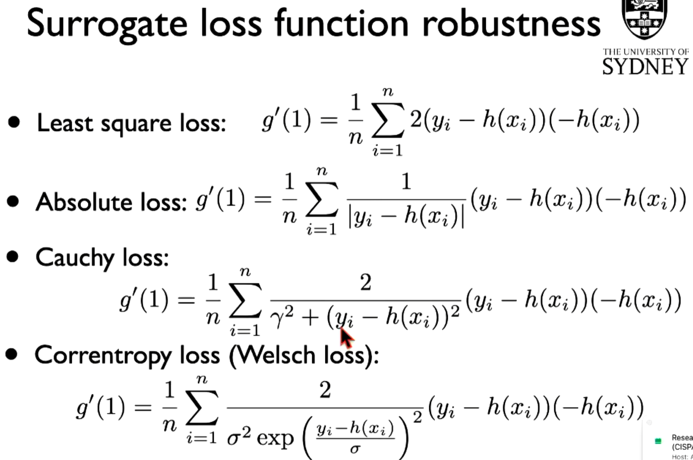

### 1. Optimality criterion 这页到底在干嘛？

这页的核心其实就一句话：

> 如果 $h$ 是最优解，那它必须满足一个一阶最优性条件。

---

#### 1.1 做法：先把高维问题压成一维

做法是：

定义一条“沿着 $h$ 方向的直线”上的一维函数：
$$
g(t) = f(th), \quad t \in \mathbb{R},\ h \in \mathbb{R}^d.
$$

- $f(h)$：原始的目标函数，变量是 $d$ 维向量 $h$。
- $g(t)$：把方向固定成 $h$，只让一个标量 $t$ 来决定“走到哪儿”。

---

#### 1.2 用链式法则算导数

对 $g(t) = f(th)$ 用链式法则求导：

$$
g'(t) = \nabla f(th)^\top h.
$$

如果 $h$ 是使 $f$ 最小的点（minimiser），那在 $h$ 处有一阶必要条件：
$$
\nabla f(h) = 0 
\ \Rightarrow\ 
g'(1) = \nabla f(h)^\top h = 0.
$$

也就是说：

> 在最优解 $h$ 处，沿着从原点指向 $h$ 这条射线的一维函数 $g(t)$ 的导数，在 $t = 1$ 必须为 0。

这就是“optimality criterion”（一阶最优性条件）的意思。  
它本身没有提到“有无噪声”，只是一个纯粹的数学条件：

> 谁想当最优解，必须先满足 $g'(1) = 0$（或者 $\nabla f(h) = 0$）。

---

### 2. 为什么后面都在算 $g'(1)$，跟鲁棒性 / 噪声有什么关系？

有了上面的通式后，老师把 $f(h)$ 具体换成各种**损失函数的经验风险**：

$$
f(h)
= \frac{1}{n} \sum_{i=1}^n \rho\bigl(y_i - h(x_i)\bigr),
$$

然后仍然按同样的定义：

$$
g(t) = f(th),
$$

并套用链式法则（对 $t$ 求导，取 $t=1$）得到：

$$
g'(1) 
= \frac{1}{n} \sum_{i=1}^n 
\rho'\bigl(y_i - h(x_i)\bigr)\, \bigl(-h(x_i)\bigr).
$$

于是对不同的 $\rho$（平方损失、绝对损失、Cauchy、Welsch…）就得到不同形式的

$$
g'(1)
= \frac{1}{n}\sum_i 
\underbrace{\rho'(r_i)}_{\text{“权重”}_i}
\cdot ( -h(x_i) ),
\quad r_i = y_i - h(x_i).
$$

或者你也可以理解成（把残差因子重新写进去）：

$$
g'(1)
\propto \frac{1}{n}\sum_i
\text{“权重”}_i \cdot (y_i - h(x_i)) \cdot \bigl(-h(x_i)\bigr),
$$

其中
$$
\text{“权重”}_i = \rho'(r_i), \quad r_i = y_i - h(x_i).
$$

不同的 $\rho$，让 $\rho'(r_i)$ 跟残差 $r_i$ 的关系不一样：

- **平方损失**：权重 $\sim r_i$，残差越大，权重越大 $\Rightarrow$ 非常怕 outlier；
- **绝对损失**：权重恒为 $\pm 1$（只看符号）$\Rightarrow$ 比较鲁棒；
- **Cauchy / Welsch 等鲁棒损失**：权重随 $|r_i|$ 增大而迅速减小 $\Rightarrow$ 特别鲁棒。

于是我们就可以说：

> 不同 surrogate loss 在“最优点必须满足的条件”里，对“大残差样本”的权重不一样  
> $\Rightarrow$ 对噪声 / 异常点的敏感程度不一样  
> $\Rightarrow$ 鲁棒性不同。

这里的“噪声”可以是：

- **label noise**（异常标签）；
- **extreme outliers**（极端样本）；
- 甚至某些 **feature noise** 造成的巨大残差。

但“feature noise 的具体建模”不是这几页在讲的重点。  
重点是：

> 利用 optimality criterion（$g'(1) = 0$）+ 链式法则，把“最优条件”写成一堆残差加权求和的形式，再看不同 $\rho$ 让权重长什么样，从而比较鲁棒性。

---

### 3. 回答你的两个猜想

#### 猜想 1

> “optimality criterion 是不是在讲存在 feature noise 时怎么处理、怎么修改 loss 的原理？”

不完全是。

- 这页更基础：它只是把“最优解要满足的数学条件”写出来。
- 后面讲鲁棒 loss，是把“outlier / noise 会产生大残差”这件事带进来，
  借由这个条件来比较不同 loss 的表现。

真正“根据某个 feature noise 模型推导出一个新的 loss”的过程会更复杂：

- 要写噪声分布、推导 M-estimator 等；
- 这几页只是给**直觉和形式**。

你可以把这页理解为：

> 以后无论你选什么 surrogate loss，它在最优点都必须满足某种形式的 $g'(1) = 0$，  
> 我们把这个式子写出来，就看清楚 **每个样本对参数更新的“拉力”是怎样依赖残差的**，  
> 从而看出鲁棒性。

---

#### 猜想 2

> “是不是说可以通过链式法则，去完善之前没有噪声情况下的 surrogate loss function？”

链式法则本身不是“完善 loss” 的工具，而是：

- 给你一个**统一的方式**来推导“最优条件”；
- 然后你根据自己的需求（抗噪、抗 outlier、平滑性、凸性…）去设计不同的 $\rho$；
- 再用这个“最优条件”去分析：  
  这个新 loss 在大残差处给什么权重，从而判断它对噪声是不是更友好。

所以更准确的说法是：

> optimality criterion + 链式法则  
> = **分析 & 对比** 不同 surrogate loss 鲁棒性的数学工具，  
> 而不是直接“从无噪声版 loss 推出有噪声版 loss”。

---

### 4. 一句“鸟瞰总结”来记

**Optimality criterion：**

> 谁要当最优解，先把
> $$
> g(t) = f(th)
> $$
> 拿出来，在 $t = 1$ 处要满足
> $$
> g'(1) = 0.
> $$
>
> 

## 8. domain adapation

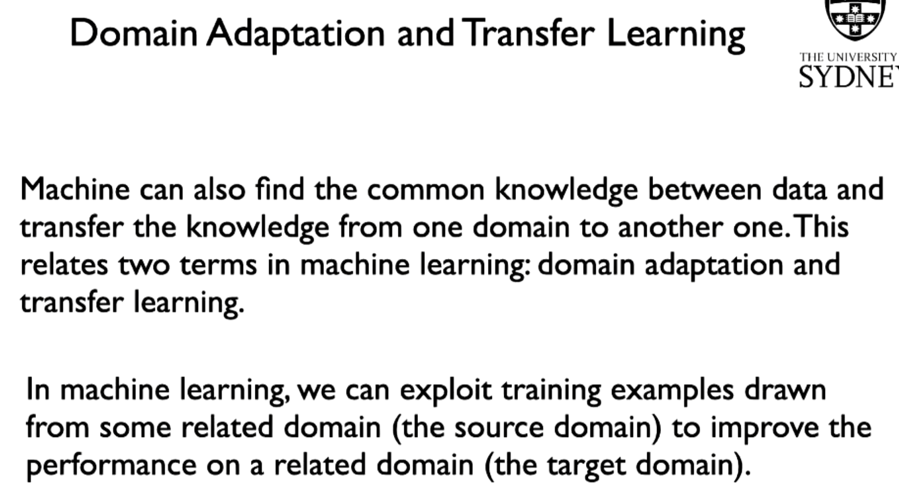

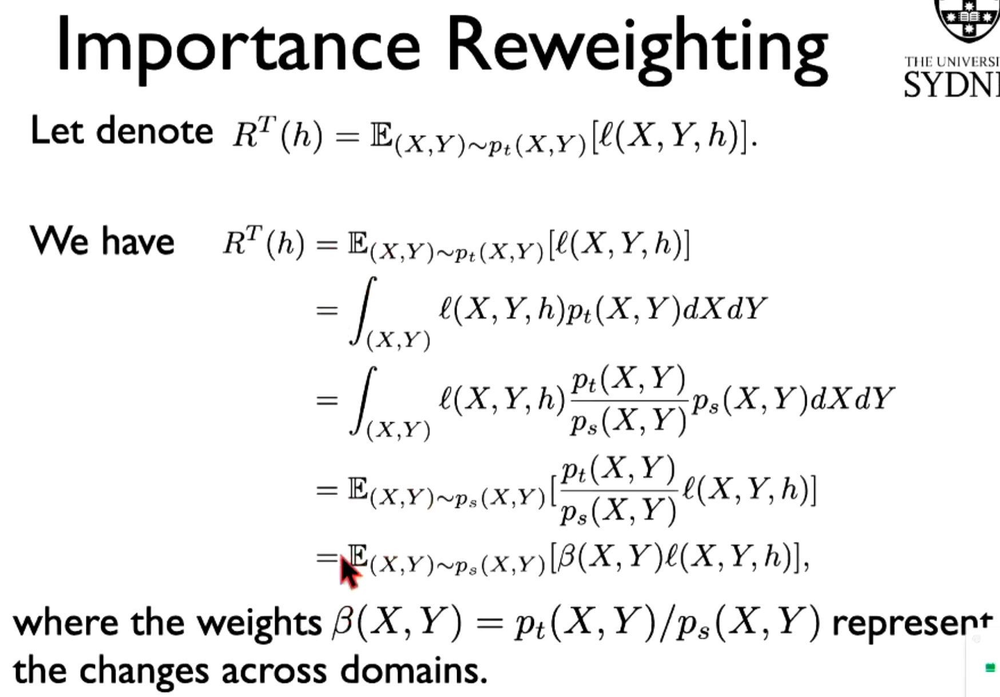

### 一、Domain Adaptation & Transfer Learning 这一页在说什么？

#### 1.1 什么是“域”（domain）？

在理论里，一个 domain 通常指：

- 输入空间：$X$（比如所有图片、所有文本）
- 上面的数据分布：$p(X)$ 或 $p(X, Y)$

简单理解就是：

> **“域 = 某种场景下的数据分布”**

例如：

- **Source domain**：白天街景照片（光照好、噪声小）
- **Target domain**：夜晚街景照片（噪声大、颜色偏蓝）

虽然任务都一样（行人检测），但图像分布明显不同  
$\Rightarrow$ 这是两个不同的 domain。

---

#### 1.2 Transfer learning（迁移学习）

迁移学习的大思想：

> 把一个场景 / 任务中学到的“知识”，迁移到另一个相关的场景 / 任务上去。

例如：

- 在 ImageNet 上训练好的 CNN，用作医疗影像分类的预训练模型。

“知识”可以是：

- 特征表示（低层的边缘、纹理）
- 参数初始化
- 子网络结构等

迁移学习的概念比较大：

- 可以 **换数据分布（domain）**
- 也可以 **换任务**（比如从“分类”到“检测”）

---

#### 1.3 Domain adaptation（领域自适应）

Domain adaptation 是迁移学习的一种**更具体的情况**：

> 任务一样，标签空间一样；只是训练数据和测试数据的分布不同。

例如：

- **Source**：高清扫描的手写数字数据集（MNIST）
- **Target**：街头门牌上的手写数字（SVHN）

任务都是“数字识别”，但数据分布不一样。

目标：

> 利用 source domain 的样本（通常有标签），去提升 target domain 上的表现。

这一页文字本质上在说：

- 机器可以找到不同数据之间的“共同知识”，
- 把从一个 domain（source）学到的东西，迁移到另一个相关的 domain（target），

这就是 **domain adaptation / transfer learning** 的核心思想。

---

### 二、Importance Reweighting 这一页的推导

现在进到第二页的数学部分：**重要性重加权（importance reweighting）**。  
这是做 domain adaptation 时非常经典的一招。

---

#### 2.1 先看符号

- $p_s(X, Y)$：source 域的数据分布（训练数据来自这里）
- $p_t(X, Y)$：target 域的数据分布（我们真正关心的测试环境）
- $\ell(X, Y, h)$：样本 $(X, Y)$ 在模型 $h$ 下的 loss
- $R_T(h)$：模型 $h$ 在 target 域的期望风险（真实想要最小化的东西）

定义 target 风险：
$$
R_T(h)
= \mathbb{E}_{(X, Y) \sim p_t(X, Y)}\bigl[\ell(X, Y, h)\bigr].
$$

注意：这里的期望是**在 target 分布下**取的，但我们通常没有很多 target 样本，尤其是**带标签的 target 样本**。

---

#### 2.2 逐行推导（每一步都解释）

从定义开始：
$$
R_T(h)
= \mathbb{E}_{(X, Y) \sim p_t(X, Y)}\bigl[\ell(X, Y, h)\bigr].
$$

写成积分形式（连续情形）：
$$
R_T(h)
= \iint \ell(X, Y, h)\, p_t(X, Y)\, dX\, dY.
$$

也就是：

> 在整个 $(X, Y)$ 空间上，对 loss 做加权平均，权重是 target 分布 $p_t(X, Y)$。

接下来搞一个“小伎俩”：在被积函数里**乘除以 $p_s(X, Y)$**  
（前提是：只要在 $p_t(X, Y) > 0$ 的地方，$p_s(X, Y) > 0$）：

$$
\begin{aligned}
R_T(h)
&= \iint \ell(X, Y, h)\, p_t(X, Y)\, dX\, dY \\
&= \iint \ell(X, Y, h)\, 
      \frac{p_t(X, Y)}{p_s(X, Y)}\, p_s(X, Y)\, dX\, dY.
\end{aligned}
$$

现在这看起来就像是在 **source 分布上取期望** 了，因为里面有 $p_s(X, Y)$：

$$
\iint f(X, Y)\, p_s(X, Y)\, dX\, dY
= \mathbb{E}_{(X, Y) \sim p_s}[f(X, Y)].
$$

于是得到：

$$
\begin{aligned}
R_T(h)
&= \mathbb{E}_{(X, Y) \sim p_s(X, Y)}
\Bigl[
  \underbrace{\frac{p_t(X, Y)}{p_s(X, Y)}}_{\beta(X, Y)}
  \,\ell(X, Y, h)
\Bigr].
\end{aligned}
$$

其中，我们定义了一个**重要性权重**：
$$
\beta(X, Y) 
= \frac{p_t(X, Y)}{p_s(X, Y)}.
$$

也就是说：
> $\beta(X, Y)$ 代表该样本在 target 域相对于 source 域的“重要性权重”。

---

#### 2.3 这有什么用？——重要性重加权的直觉

**问题背景：**

- 我们想最小化的是 **target 风险** $R_T(h)$；
- 但手里很多是 **source 域采样**的数据（比如旧环境 / 旧分布下的数据）；
- target 域数据少或没有标签，无法直接从 $p_t$ 采样来估计期望。

刚才的推导告诉我们：

> 在数学上，我们可以通过“对 source 样本加权”的方式，来估计 target 风险。

具体做法：

对每个来自 source 域的样本 $(x_i, y_i)$ 计算（或估计）一个权重：
$$
\beta(x_i, y_i) 
\approx \frac{p_t(x_i, y_i)}{p_s(x_i, y_i)}.
$$

然后用**加权的经验风险**来近似 target 风险：
$$
\hat{R}_T(h)
\approx \frac{1}{n} \sum_{i=1}^n
\beta(x_i, y_i)\, \ell(x_i, y_i, h).
$$

直觉：

- 如果某个样本在 target 域更“常见”  
  （$p_t(x_i, y_i) > p_s(x_i, y_i)$）  
  说明在 old 数据里它被**低估**了  
  $\Rightarrow \beta(x_i, y_i) > 1$，**权重大于 1**，要“上调”。

- 如果某个样本在 target 域很少见  
  （$p_t(x_i, y_i) < p_s(x_i, y_i)$）  
  说明 old 数据里它被“过度采样”  
  $\Rightarrow \beta(x_i, y_i) < 1$，**权重小于 1**，要“下调”。

这样一来：

> 虽然训练数据来自 source 域，但通过 reweight，我们可以让训练过程“看起来像是在 target 域上优化”。

这就是 **importance reweighting / importance sampling 在 domain adaptation 里的作用**。

---

### 三、小结（用一句话串起来）

- **第一页**：告诉你  
  **domain adaptation / transfer learning 的动机**：
  > 用一个 domain（source）的样本，帮另一个 domain（target）提升表现。

- **第二页**：给你一个具体数学工具：
  $$
  R_T(h)
  = \mathbb{E}_{p_s}\bigl[\beta(X, Y)\, \ell(X, Y, h)\bigr],
  \quad 
  \beta(X, Y) = \frac{p_t(X, Y)}{p_s(X, Y)}.
  $$

  把 target 风险写成 **source 风险的加权形式**。

以后只要你能估计出这个比值（或近似它），就能用 source 数据：

> “**假装自己在 target 域上训练**”，  
> 从而实现一种简单但经典的 **domain adaptation** 方法——importance reweighting。

## 9. transfer learning

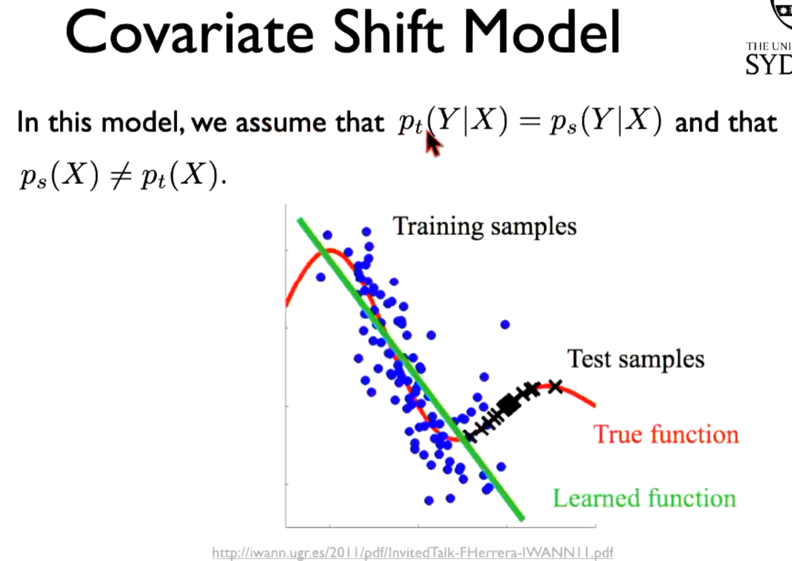

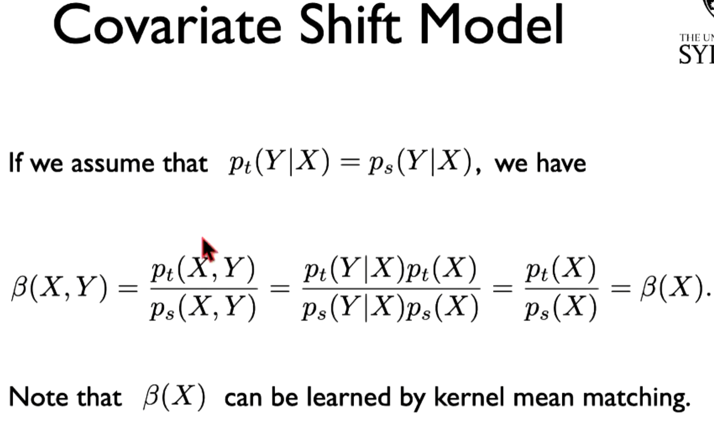

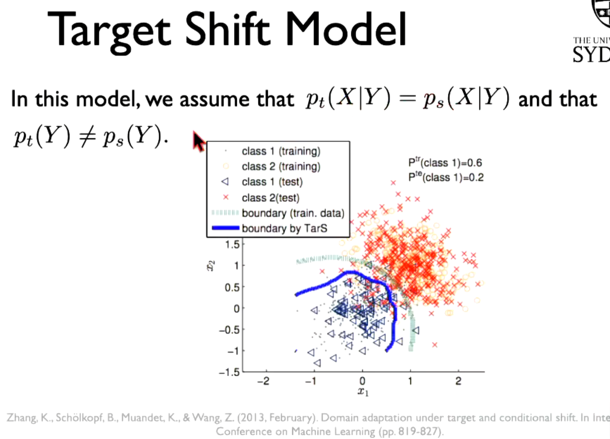

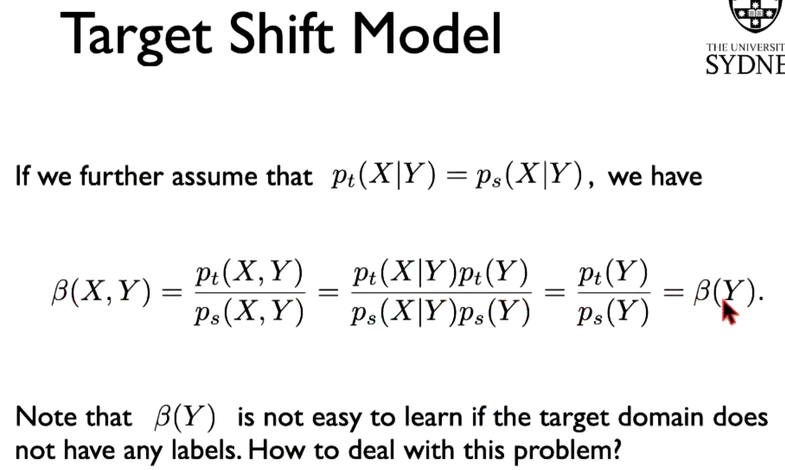

### 一、Transfer Learning Models 这页在说什么？

先把符号捋清：

**源域（source domain）**分布：$p_s(X,Y)$，有训练样本  
$\{(x_1^S,y_1^S),\dots,(x_{n_S}^S,y_{n_S}^S)\}$。

**目标域（target domain）**分布：$p_t(X,Y)$，我们真正关心的是在目标域上的风险。

目标：在目标分布下最小化风险：
$$
R_T(h)
= \mathbb{E}_{(X,Y)\sim p_t(X,Y)}
\big[\ell(X,Y,h)\big].
$$

但我们手上只有源域的样本，怎么办？

前面一页的 importance reweighting 告诉你：
$$
\begin{aligned}
R_T(h)
&= \mathbb{E}_{(X,Y)\sim p_s(X,Y)}
\big[\beta(X,Y)\,\ell(X,Y,h)\big],\\[4pt]
\beta(X,Y)
&= \frac{p_t(X,Y)}{p_s(X,Y)}.
\end{aligned}
$$

于是可以用源域样本来近似这个期望：
$$
R_T(h)
\approx
\frac1{n_S}\sum_{i=1}^{n_S}
\beta\big(x_i^S,y_i^S\big)\,\ell\big(x_i^S,y_i^S,h\big).
$$

这就是 **Transfer Learning Models** 这页公式里说的：

> “We can approximate $R_T(h)$ by
> $$
> \frac1{n_S}\sum_{i=1}^{n_S}
> \beta\big(x_i^S,y_i^S\big)\,\ell\big(x_i^S,y_i^S,h\big).
> $$
> Our target is to learn $\beta(X,Y)$.”

**核心思想：**

- 想用源域数据替目标域“打工”；  
- 但源域和目标分布不一样，所以给每个源域样本一个权重 $\beta$，让整体效果尽量像目标分布。

后面 Covariate shift / Target shift 两种模型，就是两种不同的假设下，$\beta(X,Y)$ 会简化成只跟 $X$ 或只跟 $Y$ 有关，从而更容易估计。

---

### 二、Covariate Shift Model

#### 2.1 模型假设

假设：**条件分布相同**：
$$
p_t(Y\mid X)=p_s(Y\mid X).
$$

直观：给定同一个特征 $X$，源域和目标域的“标注规则”是一样的，只是看到的样本分布位置不一样。

但**边缘分布不同**：
$$
p_s(X)\neq p_t(X).
$$

直观：输入 $X$ 的分布发生了变化（训练数据和测试数据的 $X$ 范围 / 密度不一样），这就是 **协变量漂移（covariate shift）**。

图里的意思可以理解为：

- 蓝点：源域训练数据，主要集中在左边那条斜线附近；
- 黑叉：目标域测试数据，集中在右边一块；
- 红线：真实函数；
- 绿线：只用源域训练出来的模型（会在训练区域拟合得好，但在目标区域表现差）。

#### 2.2 为什么 $\beta(X,Y)=\beta(X)$？

从联合分布分解开始：
$$
p(X,Y)=p(Y\mid X)\,p(X).
$$

于是
$$
\begin{aligned}
\beta(X,Y)
&= \frac{p_t(X,Y)}{p_s(X,Y)} \\
&= \frac{p_t(Y\mid X)\,p_t(X)}{p_s(Y\mid X)\,p_s(X)}.
\end{aligned}
$$

在 covariate shift 模型中，假设 $p_t(Y\mid X)=p_s(Y\mid X)$，所以这两个直接约掉：
$$
\beta(X,Y)
= \frac{p_t(X)}{p_s(X)}
\triangleq \beta(X).
$$

**结论：**  
在 Covariate Shift 下，重要性权重只依赖于 $X$，跟 $Y$ 无关。

这很重要，因为目标域往往没有标签（没 $Y$），但我们只需要估计 $p_t(X)/p_s(X)$，可以利用源域有标签的 $X_S$ 和目标域无标签的 $X_T$ 来做，例如：kernel mean matching 等方法（slide 也顺嘴提了一句）。

---

### 三、Target Shift Model

#### 3.1 模型假设

这次假设相反：

- **条件分布相同：**
  $$
  p_t(X\mid Y)=p_s(X\mid Y)
  $$
- **类别先验不同：**
  $$
  p_t(Y)\neq p_s(Y)
  $$

解释：同一类 $Y$ 的样本，在源域和目标域中 $X$ 的分布是一样的（比如“猫”这一类在两个域里长得差不多），但各个类别在两个域里的比例不一样——这就是 **target shift / label shift**。

图上的数字示例：

- $P_{tr}(\text{class }1)=0.6$（训练集 60% 是 1 类），
- $P_{te}(\text{class }1)=0.2$（测试集只有 20% 是 1 类）。

如果训练时不管这个差异，模型会偏向预测 class 1（因为在训练里出现太多）。

#### 3.2 为什么 $\beta(X,Y)=\beta(Y)$？

同样从联合分布分解，这次分解成 $p(X\mid Y)p(Y)$：
$$
p(X,Y)=p(X\mid Y)\,p(Y).
$$

于是
$$
\begin{aligned}
\beta(X,Y)
&= \frac{p_t(X,Y)}{p_s(X,Y)} \\
&= \frac{p_t(X\mid Y)\,p_t(Y)}{p_s(X\mid Y)\,p_s(Y)}.
\end{aligned}
$$

根据假设 $p_t(X\mid Y)=p_s(X\mid Y)$，可以约掉，得到：
$$
\beta(X,Y)
= \frac{p_t(Y)}{p_s(Y)}
\triangleq \beta(Y).
$$

**结论：**  
在 Target Shift 下，权重只依赖于标签 $Y$，与 $X$ 无关。

**直观理解：**

- 如果某一类在目标域里更少（比如训练 60%，测试 20%），那么它的权重就要变小（$\beta<1$），防止过度偏向它；
- 如果某一类在目标域里更多，权重要变大（$\beta>1$），提高它在训练时的“话语权”。

#### 3.3 为什么 slide 说 “$\beta(Y)$ 不好学”？

> Note that $\beta(Y)$ is not easy to learn if the target domain does not have any labels.

因为要估计
$$
\beta(Y)=\frac{p_t(Y)}{p_s(Y)}:
$$

- $p_s(Y)$：在源域有标签，很好算；
- $p_t(Y)$：要统计目标域各类比例，必须要目标域的标签。

但现实中的很多域适应场景：目标域是无标签或少标签的，所以直接估计 $p_t(Y)$ 很困难 ⇒ 学习 $\beta(Y)$ 就难了，需要更复杂的办法（如用模型预测软标签再做 EM、moment matching 等）。

---

### 四、Covariate shift vs Target shift 小结

给你一个对比表方便记忆：

| 模型类型                   | 变化的地方                                | 不变的地方                 | 权重形式                                     | 目标域需不需要标签？         | 直观场景                               |
| -------------------------- | ----------------------------------------- | -------------------------- | -------------------------------------------- | ---------------------------- | -------------------------------------- |
| Covariate shift            | $p(X)$ 不同：$p_s(X)\neq p_t(X)$          | 条件分布 $p(Y\mid X)$ 相同 | $\beta(X,Y)=\dfrac{p_t(X)}{p_s(X)}=\beta(X)$ | 不需要目标域标签，只要 $X$   | 训练和测试输入分布不同，但标注规则一样 |
| Target shift (label shift) | 类别先验 $p(Y)$ 不同：$p_s(Y)\neq p_t(Y)$ | 条件分布 $p(X\mid Y)$ 相同 | $\beta(X,Y)=\dfrac{p_t(Y)}{p_s(Y)}=\beta(Y)$ | 需要目标域标签（或间接估计） | 类比例在训练 / 测试中发生变化          |

再和前一页的 “Transfer Learning Models” 连起来看：

我们总是要用
$$
\frac1{n_S}\sum_{i=1}^{n_S}
\beta(\cdot)\,\ell(\cdot)
$$
去近似目标风险；不同的 shift 模型，只是告诉你 $\beta$ 应该长什么样：

- Covariate shift：$\beta=\beta(X)$，只和特征相关；
- Target shift：$\beta=\beta(Y)$，只和标签相关。

## 10. how to learn the data, kernel mean matching（重新学视频）

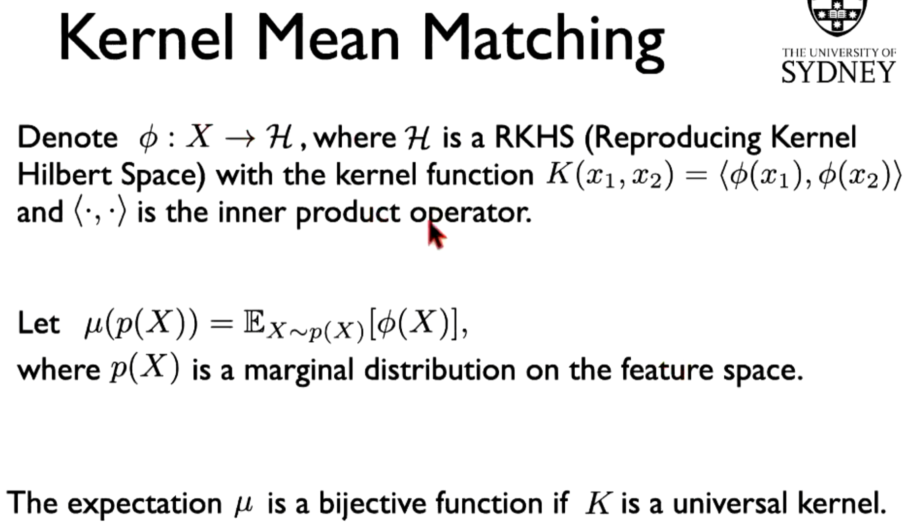

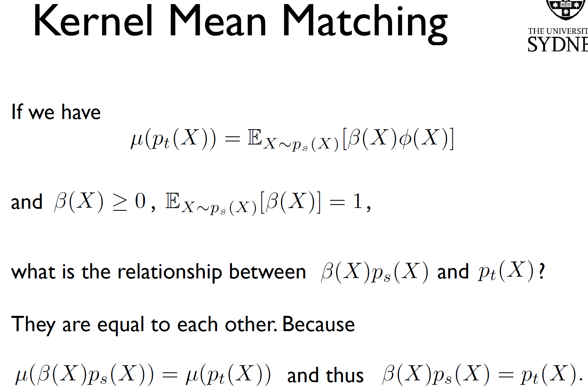

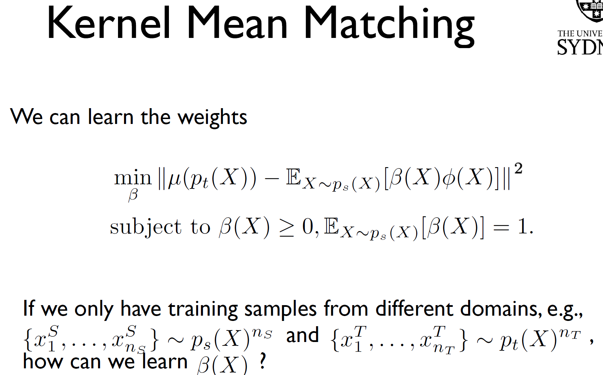

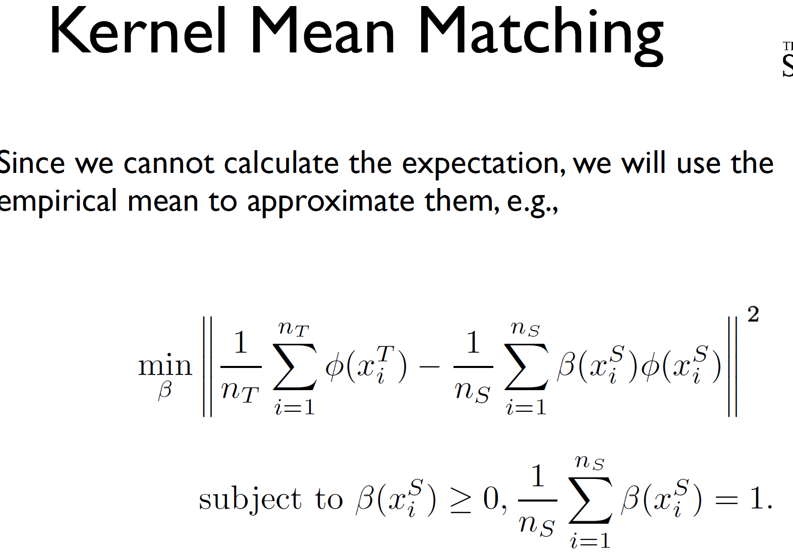

### Kernel Mean Matching（KMM）笔记

### 0. 这几页到底在解决什么问题？

前几页你已经看到：在 **covariate shift** 情况下，我们希望有一个权重函数
$$
\beta(x) = \frac{p_t(x)}{p_s(x)},
$$
然后用 **加权经验风险**
$$
\frac{1}{n_S}\sum_{i=1}^{n_S} 
\beta\big(x_i^S\big)\,\ell\big(x_i^S,y_i^S,h\big)
$$
去近似 target risk（目标域风险）：
$$
R_T(h).
$$

**问题：** 真实的 $\beta(x)$ 我并不知道，只能拿到 source / target 的样本。

**Kernel Mean Matching（KMM）** 就是一种：

> “只靠样本，把 $\beta(x)$ 学出来”的方法。

核心想法一句话：

> 让 **加权后的 source 分布** 在一个高维特征空间里，  
> 和 target 分布 的“均值向量”尽量一致。  
> 一致 $\Rightarrow$ 分布相同 $\Rightarrow \beta(x)p_s(x)=p_t(x)$。

下面按 slide 的逻辑展开。

---

### 1️⃣ 第一页：RKHS + 核均值嵌入 $\mu$

设
$$
\varphi: \mathcal{X} \to \mathcal{H},
$$
其中 $\mathcal{H}$ 是一个 RKHS（再生核 Hilbert 空间），核函数定义为
$$
K(x_1,x_2)=\langle \varphi(x_1),\varphi(x_2)\rangle_\mathcal{H}.
$$

- $\mathcal{X}$：原始特征空间（比如图片、向量等）。
- $\varphi(x)$：把一个样本 $x$ 映射到高维（甚至无限维）的 Hilbert 空间 $\mathcal{H}$。
- 在 $\mathcal{H}$ 里，数据往往更“线性可分”。
- $\langle\cdot,\cdot\rangle_\mathcal{H}$：$\mathcal{H}$ 中的内积。
- 使用核函数 $K(x_1,x_2)$，就可以不用显式计算 $\varphi(x)$（kernel trick）。

**核均值嵌入（kernel mean embedding）：**

对一个分布 $p(X)$，定义它在 RKHS 中的“均值向量”：
$$
\mu\big(p(X)\big)
= \mathbb{E}_{X\sim p(X)}[\varphi(X)]
\in \mathcal{H}.
$$

直觉：

- 在普通空间里，“均值”是一个向量；
- 在 RKHS 里，我们把 **整个分布** 编码成一个向量 $\mu(p)$。

若核 $K$ 是 **universal kernel**（比如 RBF/Gaussian 核），则有一个关键性质：

> 映射 $p \mapsto \mu(p)$ 是一一对应（bijective）：
> - 不同分布 $p_1 \neq p_2$ 会得到不同的 $\mu(p_1)\neq \mu(p_2)$；
> - 如果 $\mu(p_1)=\mu(p_2)$，就可以认为 $p_1=p_2$。

**关键意义：**

如果我能让两个分布在 RKHS 里的均值向量相等，
在 universal kernel 下，就可以认为这两个分布本身相等。

> 这句话是后面所有推导的“地基”。

---

### 2️⃣ 第二页：$\mu(p_t)=\mathbb{E}_{p_s}[\beta(X)\varphi(X)]\Rightarrow \beta(X)p_s(X)=p_t(X)$

假设我们有关系
$$
\mu\big(p_t(X)\big)
= \mathbb{E}_{X\sim p_s(X)}\big[\beta(X)\varphi(X)\big]
$$
并且满足约束
$$
\beta(X)\ge 0,\qquad
\mathbb{E}_{X\sim p_s}[\beta(X)] = 1.
$$

**问题：** 这和 $\beta(X)p_s(X)$、$p_t(X)$ 有什么关系？

---

#### （1）把右边写成一个新分布 $q(x)$ 的 embedding

先看右边：
$$
\begin{aligned}
\mathbb{E}_{X\sim p_s}\big[\beta(X)\varphi(X)\big]
&= \int \beta(x)\varphi(x)\,p_s(x)\,dx \\
&= \int \varphi(x)\,\underbrace{\beta(x)p_s(x)}_{q(x)}\,dx \\
&= \mathbb{E}_{X\sim q}[\varphi(X)].
\end{aligned}
$$

因此可以记
$$
q(x) := \beta(x)p_s(x), \qquad
\mathbb{E}_{X\sim p_s}\big[\beta(X)\varphi(X)\big] = \mu(q).
$$

也就是说：

> “加权后的 source 分布” $q(x)=\beta(x)p_s(x)$ 的 kernel mean embedding 是 $\mu(q)$。

---

#### （2）左边就是 target 的 embedding

左边：
$$
\mu(p_t) = \mathbb{E}_{X\sim p_t}[\varphi(X)].
$$

所以 slide 上的条件实际上是：
$$
\mu(p_t) = \mu(q).
$$

又由于我们有
$$
\beta(X)\ge 0,\qquad 
\mathbb{E}_{X\sim p_s}[\beta(X)] = 1
\;\Longrightarrow\;
\int \beta(x)p_s(x)\,dx = 1,
$$
因此 $q(x)=\beta(x)p_s(x)$ 是一个合法的概率密度函数。

再加上 **kernel 是 universal**，mean embedding 一一对应，于是：
$$
\mu(p_t) = \mu(q)
\;\Longrightarrow\;
p_t(x) = q(x) = \beta(x)p_s(x),
$$
也就是
$$
\beta(x) = \frac{p_t(x)}{p_s(x)}.
$$

这就回到了前面 importance reweighting 想要的东西：

> 若能找到一个非负函数 $\beta(x)$，  
> 使得 “source 加权后的均值向量” = “target 的均值向量”，  
> 在 RKHS + universal kernel 条件下，就等价于  
> “加权后的 source 分布 = target 分布”。

---

### 3️⃣ 第三页：如何学习 $\beta(X)$ —— 理论上的优化问题

KMM 的理论形式是：

> 在连续分布层面上，直接对函数 $\beta(\cdot)$ 做优化：

目标函数：
$$
\min_{\beta}
\Big\|
\mu\big(p_t(X)\big)
-
\mathbb{E}_{X\sim p_s(X)}\big[\beta(X)\varphi(X)\big]
\Big\|_\mathcal{H}^2
$$

约束条件：
$$
\beta(X)\ge 0,\qquad
\mathbb{E}_{X\sim p_s}[\beta(X)] = 1.
$$

解释：

- **目标：**  
  最小化 “target 的均值嵌入” 和 “加权后 source 的均值嵌入” 之间的 RKHS 范数距离。
- **约束：**
  - $\beta(X)\ge 0$：权重不为负；
  - $\mathbb{E}_{X\sim p_s}[\beta(X)] = 1$：权重的平均为 1，使得 $\beta(X)p_s(X)$ 是一个概率分布。

如果这个最优化问题的最小值为 0（两者均值完全重合），  
根据第 2️⃣ 部分的推导，就有
$$
\beta(X)p_s(X) = p_t(X).
$$

---

### 4️⃣ 第四页：只有样本时的经验版本

现实中我们不知道 $p_s,p_t$ 的解析形式，只能拿到**样本**：

- Source 样本：
  $$
  \{x_1^S,\dots,x_{n_S}^S\}\sim p_s(X)
  $$
- Target 样本：
  $$
  \{x_1^T,\dots,x_{n_T}^T\}\sim p_t(X)
  $$

由于无法计算真实期望，只能用**经验均值**来近似：

#### （1）用样本均值替代期望

target 端的均值嵌入：
$$
\mu\big(p_t(X)\big)
\approx
\frac{1}{n_T}\sum_{i=1}^{n_T}\varphi\big(x_i^T\big)
$$

source 端加权均值：
$$
\mathbb{E}_{X\sim p_s}[\beta(X)\varphi(X)]
\approx
\frac{1}{n_S}\sum_{i=1}^{n_S}\beta\big(x_i^S\big)\,\varphi\big(x_i^S\big).
$$

代入优化目标，得到经验版本：
$$
\min_{\beta}
\left\|
\frac{1}{n_T}\sum_{i=1}^{n_T}\varphi\big(x_i^T\big)
-
\frac{1}{n_S}\sum_{i=1}^{n_S}\beta\big(x_i^S\big)\,\varphi\big(x_i^S\big)
\right\|_\mathcal{H}^2
$$

约束也变成样本形式：
$$
\beta\big(x_i^S\big) \ge 0,\qquad
\frac{1}{n_S}\sum_{i=1}^{n_S}\beta\big(x_i^S\big)=1.
$$

通常记
$$
\beta_i := \beta\big(x_i^S\big),
$$
于是这是一个 **有限维的二次规划（Quadratic Programming, QP）** 问题：
$$
\min_{\beta_1,\dots,\beta_{n_S}}
\left\|
\frac{1}{n_T}\sum_{i=1}^{n_T}\varphi\big(x_i^T\big)
-
\frac{1}{n_S}\sum_{i=1}^{n_S}\beta_i\,\varphi\big(x_i^S\big)
\right\|_\mathcal{H}^2
$$
subject to
$$
\beta_i\ge 0,\qquad
\frac{1}{n_S}\sum_{i=1}^{n_S}\beta_i = 1.
$$

#### （2）为什么还能用 kernel trick？

注意目标是一个 RKHS 范数：
$$
\left\|
\sum_i a_i\,\varphi(z_i)
\right\|_\mathcal{H}^2
=
\sum_i\sum_j a_i a_j\,K(z_i,z_j),
$$
因此不需要显式计算 $\varphi(\cdot)$，只要核矩阵 $K(z_i,z_j)$ 即可。

> 这就是 “Kernel Mean Matching” 中 “Kernel” 的来源：  
> 最终优化问题只依赖核函数 $K$，而不需要显式的特征映射 $\varphi$。

---

### 5️⃣ 算法直觉小结

把这 4 页合在一起，就是一个完整的故事：

#### 目标

我们要估计
$$
\beta(x)=\frac{p_t(x)}{p_s(x)},
$$
这样在训练时可以用加权的 source 样本近似 target 风险：
$$
R_T(h)
\approx
\frac{1}{n_S}\sum_{i=1}^{n_S}\beta_i\,\ell\big(x_i^S,y_i^S,h\big),
\qquad
\beta_i=\beta\big(x_i^S\big).
$$

#### 思想：在 RKHS 里看“分布的均值向量”

对任意分布 $p$，考虑
$$
\mu(p) = \mathbb{E}[\varphi(X)].
$$

若 kernel 是 universal：

- 若 $\mu(p_t)=\mu(\beta p_s)$，则
  $$
  p_t = \beta p_s.
  $$

因此我们通过“让均值嵌入尽可能接近”来间接对齐分布。

#### 优化问题（连续形式）

$$
\min_{\beta}
\Big\|
\mu(p_t)-\mathbb{E}_{p_s}[\beta(X)\varphi(X)]
\Big\|_\mathcal{H}^2
$$

#### 优化问题（样本形式）

$$
\min_{\beta_1,\dots,\beta_{n_S}}
\left\|
\frac{1}{n_T}\sum_{i=1}^{n_T}\varphi\big(x_i^T\big)
-
\frac{1}{n_S}\sum_{i=1}^{n_S}\beta_i\,\varphi\big(x_i^S\big)
\right\|_\mathcal{H}^2
$$

subject to
$$
\beta_i\ge 0,\qquad
\frac{1}{n_S}\sum_{i=1}^{n_S}\beta_i = 1.
$$

#### 得到 $\beta_i$ 之后如何训练模型？

求得最优 $\beta_i$ 后，在训练预测模型 $h$ 时，用**加权经验风险**：
$$
\min_h
\frac{1}{n_S}\sum_{i=1}^{n_S}
\beta_i\,\ell\big(x_i^S,y_i^S,h\big).
$$

这时我们优化的就是 **target risk 的一个无偏（或近似无偏）的估计**，  
而不再是原来的 **source risk**。

> 这就是 Kernel Mean Matching 的核心：  
> **先用 KMM 学出样本权重 $\beta_i$，再用这些权重去训练下游模型。**

## 11. noisy labels 计算题

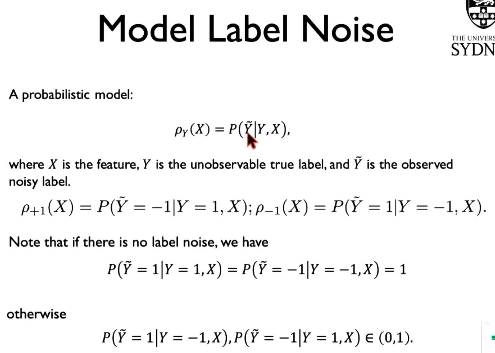

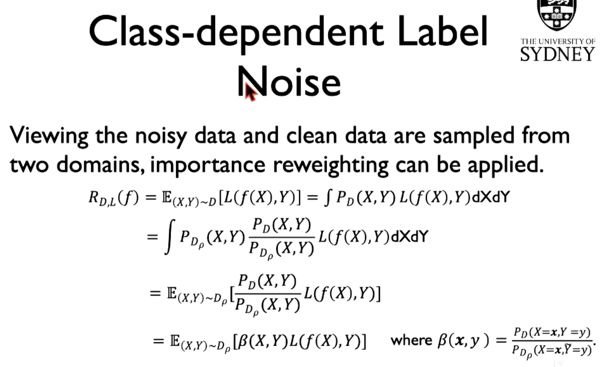

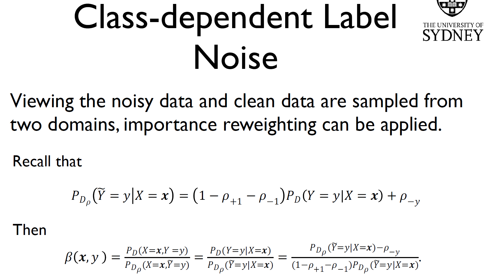

## 12. RL 画图

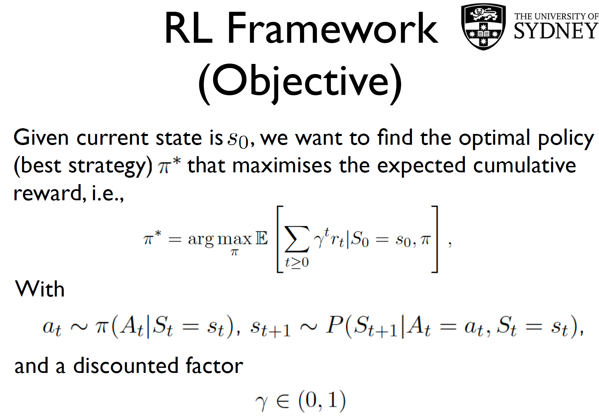

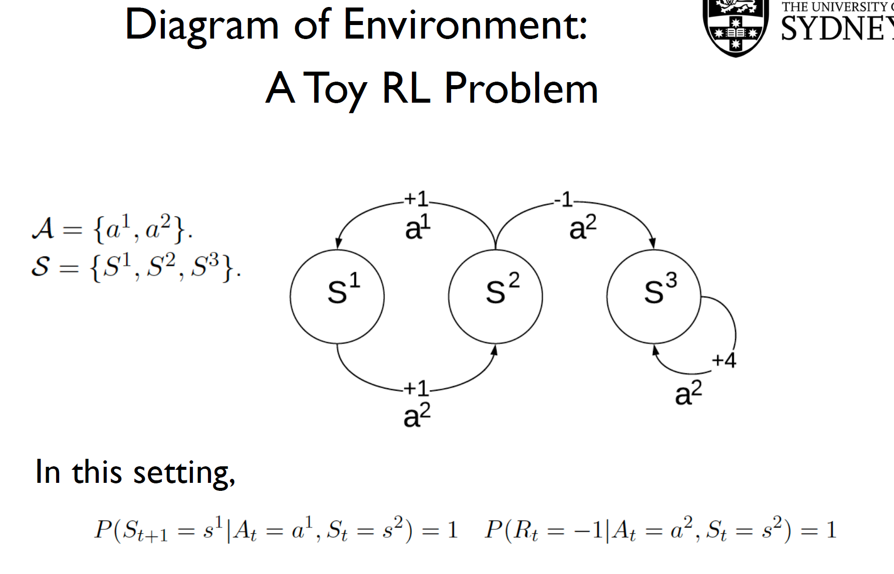

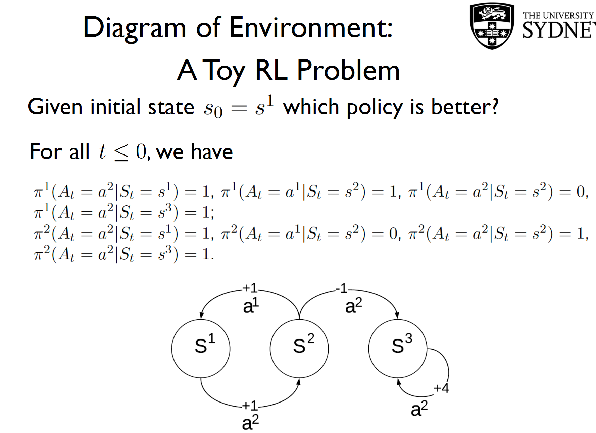

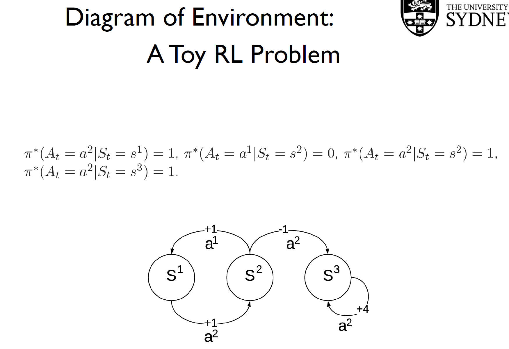

## 13. causality

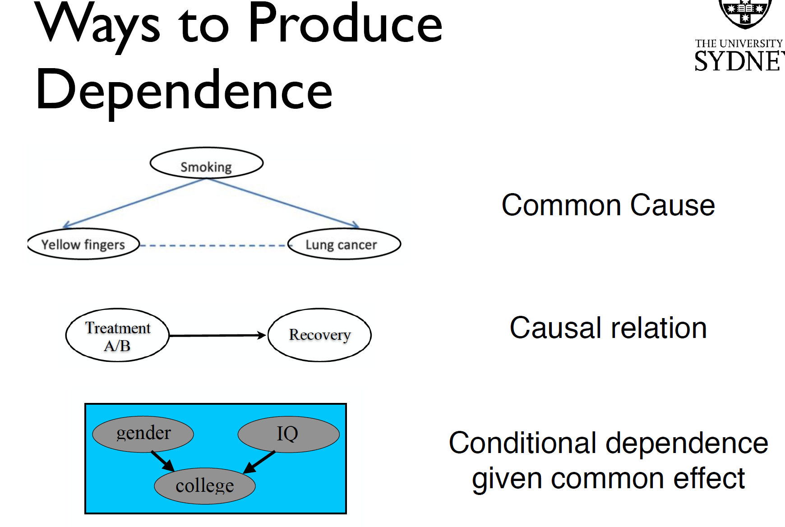

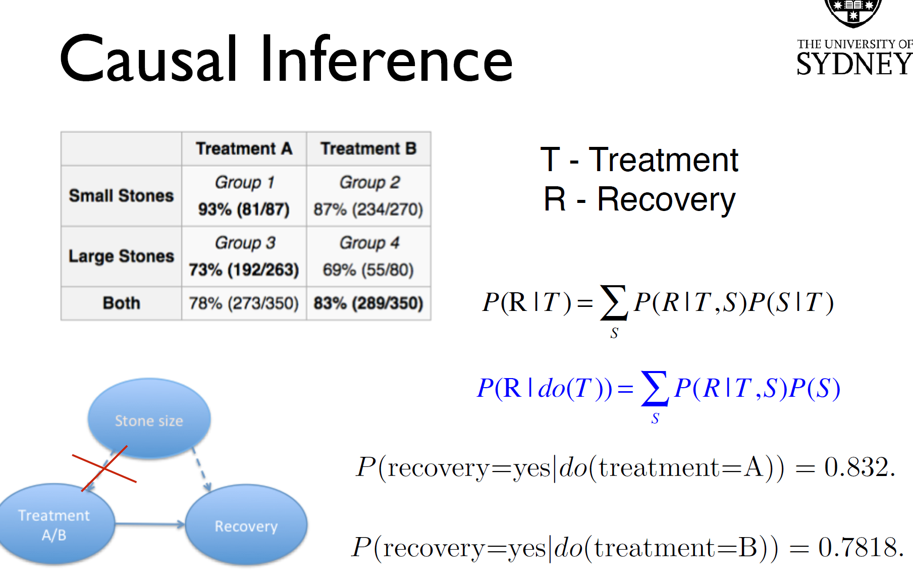

### 一、Ways to Produce Dependence（产生相关性的三种方式）

这页在说明：两个变量之间为什么会“相关”？有三种典型原因：

---

#### 1. Common Cause（共同原因）

示意图（文字版）：

- Smoking → Yellow fingers  
- Smoking → Lung cancer  
- Yellow fingers —— Lung cancer（虚线，只是相关，不是因果）

真实的因果结构：

- 吸烟（Smoking）同时导致：
  - 手指发黄（Yellow fingers）
  - 肺癌（Lung cancer）

现象上看到：**手指发黄的人肺癌更多**，看起来“Yellow fingers ↔ Lung cancer”是相关的。

但真正原因是：它们只是有 **共同原因** Smoking。  
所以 Yellow fingers 和 Lung cancer 的相关性是 **由共同原因引起的相关**（spurious / confounded correlation）。

**关键点：**

- 即使 Yellow fingers 本身不导致肺癌，只要它和 Smoking 同时受 Smoking 影响，它和肺癌就会在数据里“相关”。

---

#### 2. Causal relation（直接因果关系）

示意图（文字版）：

- Treatment A/B → Recovery

变量：

- $T$：治疗方式 Treatment A/B  
- $R$：是否康复 Recovery

结构：$T$ **直接影响** $R$。  
这就是我们最直觉的“因果”：**改变治疗会改变康复概率**。

这里的相关性是“**真实因果关系**”。

---

#### 3. Conditional dependence given common effect（给定共同结果后的条件相关）

示意图（文字版）：

- gender → college ← IQ（蓝色框表示“筛选人群”，只看已经上大学的人）

真实结构：

- 性别 $gender$ 影响是否录取 $college$（可能因为某些偏见等）
- IQ 也影响是否录取 $college$
- $gender$ 和 $IQ$ 本身**也许是独立的**

但我们只观察 **“已经上大学的人群”**（蓝色框），即条件在 “$college = \text{yes}$”。

这时会出现一个很怪的现象：

- 在所有人里，$gender$ 和 $IQ$ 可能独立；
- 但在“只看已经被录取的人”里，$gender$ 和 $IQ$ 会变得相关。

直观比喻：

- 学校名额有限，IQ 高的人更容易被录取。
- 如果一个 IQ 较低的人能被录取，那可能是因为他/她有“性别优势”（例如招生偏好某一性别）。
- 反过来，如果性别没有优势，就需要更高 IQ 才能被录取。

所以在“已录取”这群人里，你会看到：

- 性别“占优势”的那一边平均 IQ 会稍低一点——$gender$ 和 $IQ$ 出现了负相关，
- 但这是 **筛选偏差 / collider bias**。

这种结构叫 **collider（碰撞点）**：两个箭头都指向同一个结点（$college$）。

> 给定 collider（条件在 $college$），原本独立的两个原因会变得相关，  
> 这叫“**给定共同结果后的条件依赖**”。

---

### 二、Causal Inference（肾结石例子 + do-运算）

这一部分是经典的**肾结石治疗 A / B 的 Simpson 悖论**例子，说明“相关”和“因果”不一样。

---

#### 1. 表格含义

表里有三行：

- Small stones：小结石
- Large stones：大结石
- Both：不分大小，所有病人整体（总体汇总）

每个格子里是“康复人数 / 总人数”和百分比，比如：

- Treatment A, Small stones：$93\% \ (81/87)$  
- Treatment B, Small stones：$87\% \ (234/270)$  

- Treatment A, Large stones：$73\% \ (192/263)$  
- Treatment B, Large stones：$69\% \ (55/80)$  

现象：

- 在小结石患者中：A 比 B 好（$93\% > 87\%$）
- 在大结石患者中：A 也比 B 好（$73\% > 69\%$）

但是在“全部病人”里：

- A：$78\% \ (273/350)$
- B：$83\% \ (289/350)$

整体上看，好像 B 更好。

> 这就是 **Simpson’s paradox**：  
> 分组看 A 更好，总体看 B 更好，因为**分组比例不一样**。

---

#### 2. 符号说明与因果图

记号：

- $T$：Treatment（治疗方式 A/B）
- $R$：Recovery（是否康复）
- $S$：Stone size（结石大小：Small / Large）

因果图大概是：
- $S \to T \to R$  
- $S \to R$

解释：

- 结石大小 $S$ 会影响医生选择的治疗 $T$（大结石可能更常用某种方案）；
- $S$ 本身也影响康复 $R$（大结石更难治）；
- $T$ 也影响 $R$。

所以 $T$ 和 $R$ 的相关性被 $S$ **混淆（confounded）** 了。

---

### 3. 观测概率 vs 干预概率

#### 3.1 观测到的相关：$P(R\mid T)$

公式：
$$
P(R\mid T) = \sum_S P(R\mid T,S)\,P(S\mid T).
$$

解释：

- 我们只看“实际发生的”数据：  
  病人来了 $\to$ 医生根据结石大小 $S$ 选择治疗 $T$ $\to$ 看是否康复 $R$。
- 在现实数据中，给定 $T$ 时，不同结石大小 $S$ 的比例是 $P(S\mid T)$，  
  这并不公平，可能偏向某种患者类型。

> 这就是“只是**观察到**用了 A 的人康复率是多少”的 $P(R\mid T)$。

---

#### 3.2 干预后的因果：$P(R\mid\mathrm{do}(T))$

我们真正想知道的是：

> 如果我**强制所有人都用 A**（不允许医生根据结石大小改变治疗），康复率是多少？

这时使用 Pearl 的 **do 运算**：
$$
P(R\mid \mathrm{do}(T)) = \sum_S P(R\mid T,S)\,P(S).
$$

**区别：**

- $\mathrm{do}(T)$：打断 $S\to T$ 这条边，**强制设定 $T$**，不再让 $S$ 影响 $T$ 的分布。
- 所以在这个公式里，权重不再是 $P(S\mid T)$，而是**总体结石分布** $P(S)$（小、大结石在总体人群中的真实比例）。

> 同样的条件康复率 $P(R\mid T,S)$，  
> 用不同的权重（$P(S\mid T)$ vs $P(S)$）加权，  
> 会得到不同的总体康复率。

- 用 $P(S\mid T)$：得到的是 $P(R\mid T)$，受“医生选择策略”影响，有偏；
- 用 $P(S)$：得到的是 $P(R\mid\mathrm{do}(T))$，反映“**如果强制大家都用某种治疗**”的因果效果。

---

### 4. slide 上的数字：$P(R\mid\mathrm{do}(T))$

slide 中给出：
$$
P(R\mid \mathrm{do}(\text{treatment}=A)) = 0.832,
$$
$$
P(R\mid \mathrm{do}(\text{treatment}=B)) = 0.7818.
$$

这两个数字是按**总体结石分布** $P(S)$ 对“小结石 / 大结石”两行康复率 $P(R\mid T,S)$ 做加权得到的：

- 在每个结石子群中 A 都更好；
- 按真实的 $P(S)$ 加权后，A 的因果效果也更好。

之前看到“整体上 B 更好（$83\%$ vs $78\%$）”，是因为：

- **B 在小结石（更容易治好）患者中占比更高**，  
  这就制造了 Simpson 悖论。

**结论：**

- 看 $P(R\mid T)$（观测相关）会被结石大小 $S$ 和医生用药习惯混淆；
- 用 do-算子得到的 $P(R\mid \mathrm{do}(T))$ 才是真正的：

> “如果我选择某种治疗方案，会带来什么因果效果？”

---

### 5. 总结成一句大白话

**产生相关性的方式：**

1. 有**共同原因**（common cause）：  
   - Smoking → Yellow fingers  
   - Smoking → Lung cancer  
   - 于是 Yellow fingers 和 Lung cancer 在数据里相关。

2. 有**直接因果**（direct causal relation）：  
   - Treatment → Recovery  
   - 改变 Treatment，会改变 Recovery 的分布。

3. **条件在共同结果上**（collider）会制造原本不存在的相关：  
   - gender → college ← IQ  
   - 在全体人群里性别和 IQ 可以独立；  
   - 只看“已录取的人”（条件在 $college$）时，会出现 gender ↔ IQ 的相关，这是 collider bias。

**肾结石例子说明：**

- 仅看 “$P(\text{康复} \mid \text{实际用的是 A/B})$” 会被石头大小 $S$ 混淆，可能得出“B 更好”的错误结论；
- 真正需要的是 “$P(\text{康复} \mid \mathrm{do}(\text{强制用 A/B}))$”，要把 $S$ 的影响校正掉，使用：
  $$
  P(R\mid\mathrm{do}(T))=\sum_S P(R\mid T,S)\,P(S).
  $$

> 这就是因果推断中  
> **区分相关（correlation）和因果（causation）** 的核心思想。

